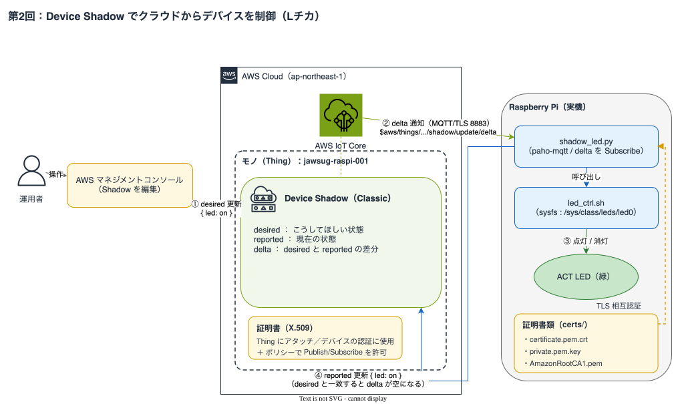

# 第2回：Device Shadow を使ってクラウドからデバイスを制御してみよう（Lチカ）

## ゴール

- Device Shadow の概念を理解する
- クラウド（マネジメントコンソール）から LED を ON/OFF する
- デバイスが状態変化を `reported` に反映する流れを体験する

MQTT では主にデバイス → クラウドへデータを「送る」ことができます。今回は Device Shadow（状態管理）を使って、クラウド → デバイスの「制御する」を学びます。通信の一歩先、状態の同期です。

---

## 進め方

今回は **Raspberry Pi（実機）** を使い、基板上の ACT LED（緑）を点灯・消灯します。

AWS 側の設定（Thing・証明書・Policy）から Raspberry Pi の実装まで、**この手順書だけで完結**します。第1回の受講は前提としません。

---

## 所要時間（目安）

| パート | 時間 |
|---|---|
| Wi-Fi 接続と SSH 接続（会場参加のみ） | 10分 |
| AWS 側設定（Thing・証明書・Policy） | 25分 |
| デバイス側実装（Shadow Subscribe + LED 制御） | 30分 |
| 動作確認（マネコンから LED 操作） | 20分 |
| 応用・質疑 | 5分 |
| **合計** | **90分** |

---

## 学習内容

### 双方向通信とは

MQTT では主にデバイス → クラウドの一方向でデータを送ります。今回はクラウド → デバイスの制御を加えた**双方向通信**を体験します。



### Device Shadow とは

Device Shadow は、デバイスの「あるべき状態（`desired`）」と「現在の状態（`reported`）」をクラウド上で管理する仕組みです。

```json
{
  "state": {
    "desired":  { "led": "on" },
    "reported": { "led": "on" },
    "delta":    {}
  }
}
```

| フィールド | 意味 |
|---|---|
| `desired` | クラウド側が「こうしてほしい」と指示する状態 |
| `reported` | デバイスが「現在こうなっている」と報告する状態 |
| `delta` | `desired` と `reported` の差分（デバイスへの指示として使う） |

### Device Shadow のメリット

- デバイスがオフラインでも `desired` を更新しておける
- デバイスが再接続したとき、`delta` を見て最新の指示を受け取れる
- 状態の同期が自動的に管理される

> Device Shadow は「単なる MQTT 通信」ではなく、デバイスの状態を管理する API です。クラウド側からは「状態を書く」、デバイス側からは「状態を読んで反映する」という設計思想で動いています。

### Device Shadow の Topic 構造

```
$aws/things/{thingName}/shadow/update           # Shadow更新（Publish）
$aws/things/{thingName}/shadow/update/accepted  # 更新成功（Subscribe）
$aws/things/{thingName}/shadow/update/rejected  # 更新失敗（Subscribe）
$aws/things/{thingName}/shadow/update/delta     # 差分通知（Subscribe）← 今回メインで使う
$aws/things/{thingName}/shadow/get              # Shadow取得（Publish）
$aws/things/{thingName}/shadow/get/accepted     # 取得成功（Subscribe）
```

> 今回は **Classic Shadow**（名前なしシャドウ）を使用します。上記の Topic はすべて Classic Shadow のものです。

---

## AWS 側設定

デバイスを AWS IoT Core に接続するため、**Thing（モノ）・証明書・Policy** を用意します。設定方法は2つあります。**CloudFormation を強く推奨します。手動ルートは AWS コンソールの操作を学びたい方向けです。**

| 方法 | 所要時間 | 向いている人 |
|---|---|---|
| **A. CloudFormation（推奨）** | 約5分 | **全員（特に初めての方）** |
| B. マネジメントコンソール（手動） | 約20分 | AWS コンソールの操作を一つひとつ学びたい方 |

---

### A. CloudFormation（推奨）

#### 1. テンプレートのダウンロード

[cfn/session-02/iot-setup.yaml](../../cfn/session-02/iot-setup.yaml) をダウンロードします。

> **リポジトリをクローン済みの場合はこの手順は不要です。** `cfn/session-02/iot-setup.yaml` をそのまま使用してください。

#### 2. スタックの作成

1. AWS マネジメントコンソール →（東京リージョン）→ **CloudFormation** →「スタックの作成」→「新しいリソースを使用」
2. 「テンプレートファイルのアップロード」→ `cfn/session-02/iot-setup.yaml` を選択
3. スタック名：`jawsug-iot-handson-s2-001`
4. パラメータを入力：
   - `DeviceId`：`raspi-001`（好きな番号で OK）
5. 「次へ」→「次へ」→「送信」
6. ステータスが `CREATE_COMPLETE` になるまで待つ（約1〜2分）

#### 3. 出力の確認

スタック →「出力」タブを開き、以下を控えておきます：

| キー | 内容 |
|---|---|
| `ThingName` | IoT コンソール上のモノの名前（`jawsug-raspi-001` 形式） |
| `ShadowDeltaTopic` | デバイスがサブスクライブする delta トピック（`$aws/things/jawsug-raspi-001/shadow/update/delta` 形式） |

> 控えておくのはこの2つで十分です。`NextStep` などその他の出力は使いません。

#### 4. 証明書の発行（手動・必須）

CloudFormation では秘密鍵を取得できないため、証明書だけ手動で発行します。

1. IoT Core →「管理」→「すべてのデバイス」→「モノ」→ `jawsug-{DeviceId}` を選択
2. 「証明書」タブ →「証明書を作成」
3. 「証明書とキーをダウンロード」ダイアログが表示される。**以下のファイルを必ずダウンロード**（後から再取得不可）

```
[OK] デバイス証明書     (xxxxx-certificate.pem.crt)
[OK] パブリックキー     (xxxxx-public.pem.key)
[OK] プライベートキー   (xxxxx-private.pem.key)
[OK] Amazon Root CA 1  (AmazonRootCA1.pem)
```

4. **ダイアログ内**の「デバイス証明書」行にある「証明書をアクティブ化」をクリック

> 💡 ダイアログを閉じてしまった場合：「証明書」タブの証明書 ID リンクをクリック → 証明書詳細ページの「アクション」→「有効化」

5. 「完了」をクリックしてダイアログを閉じる
6. `jawsug-{DeviceId}` の「証明書」タブに戻ると、作成した証明書が一覧に表示される。証明書 ID のリンクをクリックして**証明書の詳細ページ**を開く
7. 証明書詳細ページの「ポリシー」タブ →「ポリシーをアタッチ」→ `jawsug-handson-policy-{DeviceId}` を選択してアタッチ

> ⚠️ プライベートキーはこの画面でしかダウンロードできません。必ず保存してください。

> 🔒 証明書ファイルは画面共有しないでください。

#### 5. Endpoint の取得

1. IoT Core →「接続」→「ドメイン設定」
2. 一覧から「iot:Data-ATS」の「ドメイン名」をコピーして控えておく

```
例：xxxxxxxxxxxxxx-ats.iot.ap-northeast-1.amazonaws.com
```

---

### B. マネジメントコンソール（手動）

AWS コンソールの操作を一つひとつ学びたい方はこちらを進めてください。

#### 1. Thing の作成

1. AWS マネジメントコンソール → **AWS IoT Core** を開く（東京リージョン）
2. 左メニュー「管理」→「すべてのデバイス」→「モノ」を選択
3. 「モノを作成」→「一つのモノを作成」→「次へ」
4. Thing 名を入力：`jawsug-raspi-001`（末尾の番号は好きな値で OK）
5. Device Shadow は「無名のシャドウ (classic)」を選択
6. 「次へ」をクリック

#### 2. 証明書の発行

> 証明書はデバイスの「身分証」です。AWS IoT Core はこの証明書でデバイスを識別・認証します。

1. 「新しい証明書を自動生成（推奨）」を選択 →「次へ」
2. 「証明書にポリシーをアタッチ」画面に遷移します

#### 3. ポリシーのアタッチ

ポリシーがまだない場合は「ポリシーを作成」から作成してください：

1. ポリシー名：`jawsug-handson-policy`
2. 以下のポリシードキュメントを入力：

```json
{
  "Version": "2012-10-17",
  "Statement": [
    {
      "Effect": "Allow",
      "Action": [
        "iot:Connect",
        "iot:Publish",
        "iot:Subscribe",
        "iot:Receive"
      ],
      "Resource": "arn:aws:iot:ap-northeast-1:*:*"
    }
  ]
}
```

3. 「作成」→「証明書にポリシーをアタッチ」画面に戻ると、作成したポリシーが自動で選択されているので、そのまま「モノを作成」をクリック

#### 4. 証明書ファイルのダウンロード

「モノを作成」をクリックすると「証明書とキーをダウンロード」ダイアログが自動で開きます。**以下のファイルを必ずダウンロード**（後から再取得不可）

```
[OK] デバイス証明書     (xxxxx-certificate.pem.crt)
[OK] パブリックキー     (xxxxx-public.pem.key)
[OK] プライベートキー   (xxxxx-private.pem.key)
[OK] Amazon Root CA 1  (AmazonRootCA1.pem)
```

ダウンロード後、「完了」でダイアログを閉じます。証明書はすでにアクティブ化された状態で作成されます。

> ⚠️ プライベートキーはこの画面でしかダウンロードできません。必ず保存してください。

> 🔒 証明書ファイルは画面共有しないでください。

#### 5. Endpoint の取得

CloudShell を開いて以下を実行：

```bash
aws iot describe-endpoint --endpoint-type iot:Data-ATS --region ap-northeast-1
```

```
例：xxxxxxxxxxxxxx-ats.iot.ap-northeast-1.amazonaws.com
```

---

## Wi-Fi 接続と SSH 接続

> 会場参加（実機あり）の方のみ実施してください。

1. PC を専用 Wi-Fi（`JAWSUG-IoT-PC`）に接続します。
2. ラズパイの電源を入れます。
3. ラズパイに SSH で接続します。

```bash
# ホスト名で接続する場合（ラズパイ本体に記載の名前を使用）
ssh jawsug-user@ラズパイに記載の名前.local

# または IP アドレスで接続する場合（ラズパイ本体に記載の IP を使用）
ssh jawsug-user@ラズパイに記載のIP
```

ラズパイの Wi-Fi 接続は設定済みです（`JAWSUG-IoT-Pi`）。

---

## 実装（Raspberry Pi）

スクリプトは **PC 側（クローンしたリポジトリの `scripts/session-02/`）** で設定を書き換え、証明書とあわせて Raspberry Pi に転送してから実行します。

### Raspberry Pi の LED（ACT LED）について

今回は基板上の **ACT LED（緑色の LED）** を制御します。GPIO へのハンダ付けや外付け部品は不要です。

ACT LED は通常 SD カードアクセスに連動していますが、`sysfs`（`/sys/class/leds/` 以下の擬似ファイル）経由でトリガーを解除することで、自由に点灯・消灯できます。

- LED ON  … ACT LED の `brightness` に `1` を書き込む
- LED OFF … ACT LED の `brightness` に `0` を書き込む

`sysfs` 上の ACT LED のパスは Raspberry Pi OS のバージョンで異なります。

| Raspberry Pi OS | ACT LED の sysfs パス |
|---|---|
| 新しい OS（Bookworm 以降） | `/sys/class/leds/ACT` |
| 古い OS | `/sys/class/leds/led0` |

> 今回配布する Raspberry Pi は新しい OS のため `/sys/class/leds/ACT` を使います。`led_ctrl.sh` は両方のパスを自動判定するので、通常はそのまま動作します。LED の操作には `sudo` が必要です。

### ① PC 側での準備（証明書のリネームとスクリプトの設定）

> ここは **手元の PC**（SSH 先の Raspberry Pi ではありません）で、クローンしたリポジトリの `scripts/session-02/` ディレクトリを対象に作業します。

#### 証明書のリネームと配置

先ほどダウンロードした証明書を `scripts/session-02/certs/` に置き、スクリプトが参照する名前にリネームします。まず配置先ディレクトリを作成します。

```bash
# PC 側で実行（リポジトリのルートから）
cd scripts/session-02
mkdir -p certs
```

ダウンロードした4ファイルのうち3つを `certs/` に入れ、以下の名前にリネームします（パブリックキーは今回使いません）。

| ダウンロードしたファイル | リネーム後（`certs/` 内） |
|---|---|
| `xxxxx-certificate.pem.crt` | `certificate.pem.crt` |
| `xxxxx-private.pem.key` | `private.pem.key` |
| `AmazonRootCA1.pem` | `AmazonRootCA1.pem`（変更なし） |

#### shadow_led.py の設定

[scripts/session-02/shadow_led.py](../../scripts/session-02/shadow_led.py) の冒頭の設定値を、AWS 側設定で取得・作成した値に書き換えます。

```python
ENDPOINT  = "xxxxxx-ats.iot.ap-northeast-1.amazonaws.com"  # 取得した Endpoint に書き換える
DEVICE_ID = "raspi-001"  # 作成した Thing 名に合わせる（jawsug-<DEVICE_ID>）
```

> この書き換えは **scp でスクリプトを転送する前に** 済ませておきます（転送後に Raspberry Pi 側で書き換えても構いません）。

### ② Raspberry Pi へ転送（scp）

まず **Raspberry Pi 側（SSH 先のターミナル）** で、転送先ディレクトリを作成します。

```bash
# Raspberry Pi 側（SSH 接続したターミナル）で実行
mkdir -p ~/session-02/certs
```

次に **PC 側**（SSH 先ではなく手元の PC）で、スクリプトと証明書を転送します。

```bash
# PC 側で実行（raspi.local は Raspberry Pi のホスト名。環境に合わせて変更）
cd scripts/session-02
scp shadow_led.py led_ctrl.sh jawsug-user@raspi.local:~/session-02/
scp certs/* jawsug-user@raspi.local:~/session-02/certs/
```

> 💡 USB メモリを使う場合も、Raspberry Pi 側が同じ配置（`~/session-02/` にスクリプト、`~/session-02/certs/` に証明書）になるようにコピーしてください。

転送後、Raspberry Pi 側は以下の構成になります。

```
~/session-02/
├── shadow_led.py    # Shadow の delta を受信するメインスクリプト
├── led_ctrl.sh      # ACT LED を制御するシェルスクリプト
└── certs/
    ├── certificate.pem.crt
    ├── private.pem.key
    └── AmazonRootCA1.pem
```

### ③ Raspberry Pi 側でのセットアップ

以降は **SSH で接続した Raspberry Pi 側** のターミナルで実行します。まず作業ディレクトリに移動し、ライブラリをインストールします。

```bash
cd ~/session-02
python3 -m venv venv
source venv/bin/activate
pip install paho-mqtt  # または pip3
```

> 💡 最新の Raspberry Pi OS では `pip3 install` 実行時に `error: externally-managed-environment` が発生します。上記のように venv を使ってインストールしてください。

次に LED 制御スクリプトに実行権限を付与し、単体で動作を確認します。

```bash
chmod +x led_ctrl.sh
./led_ctrl.sh on    # ACT LED が点灯
./led_ctrl.sh off   # ACT LED が消灯
```

スクリプト全体は [scripts/session-02/led_ctrl.sh](../../scripts/session-02/led_ctrl.sh) を参照してください。

### ④ 実行

```bash
cd ~/session-02
# source venv/bin/activate  # まだ venv に入っていない場合
python3 shadow_led.py
```

出力例：

```
Waiting for Shadow delta...
[OK] Connected to AWS IoT Core
[SUB] Subscribed: $aws/things/jawsug-raspi-001/shadow/update/delta
```

この状態のまま、次の「[動作確認](#動作確認)」の手順に進み、マネジメントコンソールから `desired` を更新すると、`delta` を受信して LED が点灯・消灯します。

`Ctrl+C` で停止できます。

---

## マネジメントコンソールから LED を操作する

Raspberry Pi 側で `shadow_led.py` を起動したまま、以下を操作します。

1. AWS IoT Core →「管理」→「すべてのデバイス」→「モノ」→ 対象の Thing（`jawsug-raspi-001`）を選択
2. 「Device Shadow」タブを開く
   - Classic Shadow がまだ無い場合は「**Device Shadow を作成**」をクリック →「**名前のない (クラシック) シャドウ**」を選択 →「**作成**」をクリック
3. 一覧から「**Classic Shadow**」を選択
4. 「Shadow ドキュメント」の「**編集**」をクリックし、以下の JSON を入力して保存

**LED ON：**

```json
{
  "state": {
    "desired": { "led": "on" }
  }
}
```

保存すると Raspberry Pi 側のターミナルに以下が出力され、ACT LED（緑）が**点灯**します。

```
[RECV] Delta: {
  "version": 4,
  "timestamp": 1783606457,
  "state": {
    "led": "on"
  },
  "metadata": {
    "led": {
      "timestamp": 1783606457
    }
  }
}
[LED] ON
[SEND] Reported updated: led=on
```

**LED OFF：**

```json
{
  "state": {
    "desired": { "led": "off" }
  }
}
```

保存すると同様に以下が出力され、ACT LED が**消灯**します。

```
[RECV] Delta: {
  "version": 6,
  "timestamp": 1783606473,
  "state": {
    "led": "off"
  },
  "metadata": {
    "led": {
      "timestamp": 1783606473
    }
  }
}
[LED] OFF
[SEND] Reported updated: led=off
```

### 確認ポイント

- `desired` を更新 → デバイスが `delta` を受信 → LED 制御 → `reported` が更新される
- `desired` と `reported` が一致したら `delta` は空になる

---

## ハマりポイントと対処法

| 症状 | 原因 | 対処 |
|---|---|---|
| AWS IoT Core に接続できない | Endpoint のミス | 設定画面からコピーし直す |
| delta が届かない | Subscribe 未実装 or Topic ミス | `$aws/things/` のプレフィックスを確認 |
| JSON parse エラー | Shadow JSON の構造ミス | `state.led` のパスを確認 |
| reported が更新されない | update Topic への Publish 失敗 | Policy の `iot:Publish` 権限を確認 |
| LED が変わらない | `led_ctrl.sh` の実行権限なし | `chmod +x led_ctrl.sh` を実行 |
| LED が変わらない | `sudo` のパスワード要求 | `sudo visudo` で NOPASSWD を設定するか、講師に確認 |
| LED が変わらない | trigger が解除されていない | `./led_ctrl.sh on` を単体で実行して動作確認 |
| Thing 名のミス | コードと AWS の Thing 名が不一致 | `DEVICE_ID` 変数を確認 |
| 証明書エラー | ファイルパス・ファイル名のミス | `certs/` のパスと各ファイル名を確認 |
| 接続できるが操作が拒否される | 証明書の有効化・ポリシー未アタッチ | 証明書タブでステータスとポリシーを確認 |
| `paho-mqtt` のインポートエラー | ライブラリ未インストール、または venv 未アクティベート | `source venv/bin/activate` を実行してから `python3` を起動 |

---

## 発展課題（時間が余ったら）

- Shadow の `get` を使って起動時に最新状態を取得する
- ボタン入力で `reported` を更新してみる
- 温度データの Publish（デバイス → クラウドの送信）と組み合わせる

---

## 参考：このセッションで学んだこと

```
クラウド → desired更新 → delta通知 → デバイスが反映 → reported更新
```

Device Shadow を使うと、デバイスがオフラインの間に指示を出しておき、再接続時に自動で同期させることができます。これが IoT の「状態管理」の基本パターンです。

---

## 後片付け

ハンズオン終了後は以下の手順で AWS リソースを削除してください。

```bash
cd scripts/session-02
DEVICE_ID=raspi-001 bash teardown.sh
```

実行内容：

1. Thing にアタッチされた証明書を無効化・削除
2. CloudFormation スタック（`jawsug-iot-handson-s2-{番号}`）を削除
3. ローカルの `certs/` ディレクトリを削除

> 💡 実行前に `aws sts get-caller-identity` で AWS 認証が通っているか確認してください。

> 手動（B ルート）で作成した方は、マネジメントコンソールから Thing・証明書・Policy を削除してください。
