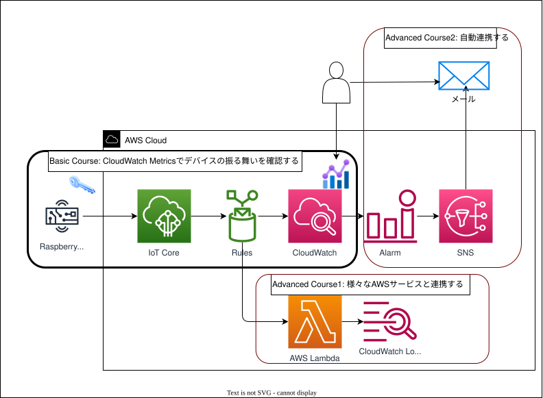

# 第3回：IoT Rules Engine で他の AWS サービスと連携し、データを自動処理・分析してみよう

> ## 🚧 執筆ステータス（公開前に必ずこのブロックを削除する）
>
> **UI 手順のドラフトです。** コンソールを実際に通しながら、画面名・ボタン名・順序を修正してください。
> 自信が持てなかった箇所には **🔎** を付けてあります（コンソールの表記は変わるため）。
>
> | セクション | 状態 |
> | --- | --- |
> | ゴール / 進め方 / 所要時間 / 学習内容 / 構成図 | ✅ 確定 |
> | AWS 側設定 | 🔎 **要ウォークスルー**（ルール確認・証明書・Endpoint）／スタック作成の「機能」チェックは **2026-08-13 に実地確認済み** |
> | 実装（Raspberry Pi） | 🔎 **要実機確認**（転送・venv・実行の出力例） |
> | 動作確認 / デバイス側での確認 | 🔎 **要実機＋コンソール確認**（実測値・スクリーンショット） |
> | Advanced Course1 / 2 | 🔎 **要ウォークスルー** |
> | ハマりポイント | 🚧 設計時の想定＋開発中に遭遇した分のみ。当日リハーサルで追記 |
>
> スクリーンショットは未挿入です。ウォークスルー時に取得し、`docs/session-03/images/` に置いて
> Markdown の画像記法で挿入してください。
>
> ⚠️ **スクリーンショットには AWS アカウント ID が写り込みます**（IAM ロールの ARN、右上のアカウント表示など）。
> 公開リポジトリにコミットする前に**該当箇所を塗りつぶしてください**（`verification-log.md` のマスキング規則と同じ扱い）。
> 特にルールのアクション詳細モーダルは IAM ロールの ARN が表示されます。

## ゴール

- Rules の構成要素（SQL ステートメント・トピックフィルター・アクション）を説明できる
- Rules から CloudWatch Metrics へデータを送り、グラフで可視化できる
- 1 つのメッセージを複数のアクションへ分岐できることを理解する
- （Advanced Course1）Rules から Lambda を起動し、CloudWatch Logs にログを残せる
- （Advanced Course2）CloudWatch Alarm → SNS → Email の通知経路を構築できる

第1回ではデバイスからクラウドへデータを「送り」、第2回では Device Shadow でクラウドからデバイスを「制御」しました。今回はその先、**届いたデータをクラウド側に連携する処理**部分を扱います。

主役は **Rules Engine（ルールエンジン）** です。SQL を書くだけで、コードを一行も書かずに他の AWS サービスへデータを流せます。

---

## 進め方

**参加者全員が会場で貸出 Raspberry Pi（実機）を操作します。**

Raspberry Pi から CPU 使用率とメモリ使用率を送信し、Rules 経由で CloudWatch Metrics に格納してグラフで可視化します。さらに負荷生成スクリプトで意図的に使用率を上下させ、**自分がかけた負荷がクラウドのグラフに現れる**ことを確認します。

AWS 側の設定はすべて**マネジメントコンソール**で進めます。第1回・第2回の受講は前提としません。

---

## 所要時間（目安）

| パート | 時間 |
|---|---|
| Wi-Fi 接続と SSH 接続 | 10分 |
| AWS 側設定（スタック作成・ルール確認・証明書・Endpoint） | 20分 |
| デバイス側実装（転送・セットアップ・実行） | 20分 |
| 動作確認（負荷生成・グラフ確認・値の突き合わせ） | 10分 |
| Advanced Course1（Lambda 連携） | 5分 |
| Advanced Course2（アラーム通知） | 5分 |
| Discussion Time | 15分 |
| 応用・質疑 | 5分 |
| **合計** | **90分** |

> **Basic Course**（AWS 側設定〜動作確認）だけで **60 分**で完結します。Advanced Course1・2 は時間に余裕がある方向けです。

---

## 学習内容

### Rules Engine とは

AWS IoT Core に届いた MQTT メッセージを **SQL で選別し、他の AWS サービスへ渡す**仕組みです。デバイスとクラウドサービスの間に立つ「振り分け係」と考えると分かりやすいです。

```
デバイス ──MQTT──▶ IoT Core ──▶ Rules ──▶ CloudWatch / Lambda / S3 / DynamoDB / ...
                                  ▲
                          ここで SQL で選別する
```

### Rules の 3 つの構成要素

| 要素 | 役割 | 今回の例 |
|---|---|---|
| **トピックフィルター** | どのトピックのメッセージを対象にするか | `jawsug/session-03/+/metrics` |
| **SQL ステートメント** | メッセージから何を取り出すか、どう絞り込むか | `SELECT * FROM 'jawsug/session-03/+/metrics'` |
| **アクション** | 取り出した結果をどこへ渡すか（1 ルールに最大 10 個） | `cloudwatchMetric` × 2 |

これに加えて、アクションが失敗したときの逃げ道として **エラーアクション**を設定できます。今回は CloudWatch Logs にエラーを記録します。

### トピックフィルターのワイルドカード

| 記号 | 意味 | 例 |
|---|---|---|
| `+` | 1 階層だけの任意一致 | `jawsug/session-03/+/metrics` は `.../raspi-001/metrics` にも `.../raspi-002/metrics` にもマッチ |
| `#` | 以降すべての階層に一致 | `jawsug/#` は `jawsug/` 配下すべてにマッチ |

今回は `+` を使い、**デバイス番号の部分だけをワイルドカードにします**。これで参加者全員が同じルール定義を使えます。

### 置換テンプレート

SQL やアクションの設定値の中では `${...}` の形で値を差し込めます。今回使うのは次の 2 つです。

| 書き方 | 意味 |
|---|---|
| `${topic(3)}` | トピックの 3 番目のセグメント。`jawsug/session-03/raspi-001/metrics` なら `raspi-001` |
| `${cast(cpu AS String)}` | ペイロードの `cpu` を文字列に変換 |

**デバイスの識別にペイロードの `deviceId` ではなくトピックを使う**のがポイントです。ペイロードは中身を書き換えられますが、トピックは IoT ポリシーで縛れるため、識別子として信頼できます。「トピック設計がそのまま識別子になる」という IoT の基本的な考え方です。

### 今回のコース構成

今回は 3 つのコースに分かれています。**Basic Course だけで完結**します。



| コース | ねらい | 経路 |
|---|---|---|
| **Basic Course** | CloudWatch Metrics でデバイスの振る舞いを確認する | Raspberry Pi → IoT Core → Rules → CloudWatch |
| **Advanced Course1** | 様々な AWS サービスと連携する | Rules → Lambda → CloudWatch Logs |
| **Advanced Course2** | 自動連携する | CloudWatch → Alarm → SNS → メール |

図の中心にある **Rules** が今回の主役です。ここから先を差し替えるだけで、CloudWatch にも Lambda にもつながることが図から読み取れます。Advanced Course1 と Advanced Course2 は、どちらも **Basic Course で作ったものをそのまま使い、Rules の先を増やしているだけ**です。

### この回の核心：アクションによって SQL の効き方が変わる

同じトピック・同じペイロードに対して、**2 本のルールを並走させます**。ここで面白いのは、アクションの種類によって SQL の `SELECT` の意味が変わることです。

| アクション | `SELECT` の内容が結果に影響するか |
|---|---|
| `cloudwatchMetric` | **しない**。どの列を選んでも、アクション側で指定した `MetricValue` などが使われる |
| `lambda` | **する**。`SELECT` の出力がそのまま Lambda のイベントになる |

だから Basic Course の SQL は `SELECT *` で十分ですが、Advanced Course1 では次のように整形します。

```sql
SELECT deviceId, cpu, memory, timestamp,
       topic() AS topic, timestamp() AS receivedAtMs
FROM 'jawsug/session-03/+/metrics'
```

「Rules は接続先を差し替えるだけで多様な AWS サービスと連携できる」ことと同時に、「アクションごとに作りが違う」ことも押さえておくと、実務で設計するときに迷いません。

### 知っておくと得する制約

#### CloudWatch メトリクスアクションは Dimension を指定できない

CloudWatch では通常、`DeviceId=raspi-001` のような **Dimension**（次元）でメトリクスを分類します。ところが Rules の `cloudwatchMetric` アクションは Dimension を指定できません。

そこで今回は **メトリクス名の末尾にデバイス名を入れて**分離します。

| 項目 | 値 |
|---|---|
| 名前空間 | `JAWSUG/IoTHandson`（全員共通） |
| メトリクス名 | `CpuUtilization-raspi-001` / `MemoryUtilization-raspi-001` |

> この制約のせいで、コンソールでメトリクスを探すときは「**ディメンションなし**」のグループを開くことになります（後述）。Dimension を使いたい場合は Lambda を経由して自分で `PutMetricData` を呼ぶ、という選択肢があります。これが Advanced Course1 のもう一つの動機です。

#### メトリクスは 60 秒粒度で保存される

`cloudwatchMetric` アクションは分解能を指定できないため、メトリクスは**標準分解能（60 秒粒度）**で保存されます。10 秒間隔で送信すると、1 分あたり 6 サンプルが同じ分に集約されます。

このため、グラフを見るときは **期間を 1 分に変更**してください。既定の 5 分のままだと負荷の変化が平均化されて埋もれてしまいます。

| 設定 | 値 | 理由 |
|---|---|---|
| 期間（Period） | **1 分** | 5 分では負荷区間が平均化される |
| 統計（Statistic） | 平均（Average） | 瞬間値を見たいときは最大（Maximum） |
| 負荷の継続時間 | **180 秒以上** | 1 分平均のデータポイントが 2〜3 点得られ、台形として見える |

---

## AWS 側設定

**Thing・IoT ポリシー・IAM ロール・ロググループ・IoT ルール**を作成します。すべて CloudFormation テンプレートに定義済みなので、**コンソールからアップロードするだけ**です。

> 秘密鍵は CloudFormation では取得できないため、**証明書だけは手動で発行**します（第2回と同じ）。

### 1. テンプレートのダウンロード

[cfn/session-03/iot-rules-cloudwatch.yaml](../../cfn/session-03/iot-rules-cloudwatch.yaml) をダウンロードします。

> **リポジトリをクローン済みの場合はこの手順は不要です。** `cfn/session-03/iot-rules-cloudwatch.yaml` をそのまま使用してください。

### 2. スタックの作成

1. AWS マネジメントコンソール →（**東京リージョン** `ap-northeast-1`）→ **CloudFormation** →「スタックの作成」→「新しいリソースを使用」
2. 「テンプレートファイルのアップロード」→ `cfn/session-03/iot-rules-cloudwatch.yaml` を選択
3. スタック名：`jawsug-iot-handson-s3-001`
4. パラメータを入力：
   - `DeviceNumber`：`001`（**割り当てられた 3 桁の番号**）
   - `MetricNamespace`：`JAWSUG/IoTHandson`（変更不要）
5. 「次へ」
6. **「スタックオプションの設定」画面**を下までスクロールし、「**機能**」セクションのチェックボックスにチェックを入れる

```
機能
  ⓘ The following resource(s) require capabilities: [AWS::IAM::Role]

  ☑ AWS CloudFormation によって IAM リソースがカスタム名で作成される場合があることを承認します。
```

> このテンプレートは IAM ロールを**名前を指定して**作成します（`jawsug-s3-iot-rule-role-raspi-001`）。
> 名前を固定しているのは、同じアカウントで複数の参加者が作業してもぶつからないようにするためです。
> 名前付きの IAM リソースを作るときは、この承認が必須になります。

7. 「次へ」→ 確認画面で「**送信**」
8. ステータスが `CREATE_COMPLETE` になるまで待つ（**1〜2 分**）

> ⚠️ `DeviceNumber` は**3 桁の数字**です（`001` など）。`raspi-001` のように文字を入れると、IoT ルール名に使えない文字が含まれてスタック作成が失敗します。

<details>
<summary>作成されるリソース（5 個）</summary>

| リソース | 名前 |
|---|---|
| IoT Thing | `jawsug-raspi-001` |
| IoT ポリシー | `jawsug-s3-policy-raspi-001` |
| IAM ロール（ルール用） | `jawsug-s3-iot-rule-role-raspi-001` |
| ロググループ（エラー用） | `/aws/iot/session-03/rule-errors-raspi-001` |
| IoT ルール | `jawsug_s3_metrics_to_cw_raspi_001` |

</details>

### 3. 出力の確認

スタック →「出力」タブを開き、以下を控えておきます。

| キー | 内容 |
|---|---|
| `ThingName` | モノの名前（`jawsug-raspi-001`） |
| `MetricsTopic` | デバイスが Publish するトピック（`jawsug/session-03/raspi-001/metrics`） |
| `CpuMetricName` / `MemoryMetricName` | あとで CloudWatch で探すメトリクス名 |
| `MetricsConsoleUrl` | CloudWatch メトリクス画面へのリンク |

### 4. 作られたルールを見てみる（今回の主役）

**ここが今回いちばん見てほしい画面です。** テンプレートが何を作ったのかを、自分の目で確認します。

1. **AWS IoT Core** →左メニュー「**メッセージのルーティング**」→「**ルール**」
2. `jawsug_s3_metrics_to_cw_raspi_001` を選択
3. 次の 3 点を確認します。

| 見るところ | 何が書かれているか |
|---|---|
| **SQL ステートメント** | `SELECT * FROM 'jawsug/session-03/+/metrics'`（`+` がワイルドカード） |
| **アクション** | `CloudWatch metric` が **2 つ**（CPU 用とメモリ用） |
| **エラーアクション** | `CloudWatch Logs`（アクションが失敗したときの記録先） |

4. 「アクション」タブでそれぞれの行を開くと、**CloudWatch metric** のモーダルが表示されます。
   **`${...}` がそのまま残っている**ことを確認してください。

**1 つ目（CPU 用）**

| 項目 | 値 |
|---|---|
| メトリクス名 | `CpuUtilization-${topic(3)}` |
| メトリクス名前空間 | `JAWSUG/IoTHandson` |
| 単位 | `Percent` |
| 値 | `${cast(cpu AS String)}` |
| タイムスタンプ - オプション | `${cast(timestamp AS String)}` |
| IAM ロール | `jawsug-s3-iot-rule-role-raspi-001` |

**2 つ目（メモリ用）**

| 項目 | 値 |
|---|---|
| メトリクス名 | `MemoryUtilization-${topic(3)}` |
| 値 | `${cast(memory AS String)}` |

> 違うのは**メトリクス名と値だけ**です。名前空間・単位・タイムスタンプ・IAM ロールは共通で、
> 同じルールの中に 2 つのアクションが並んでいます。

> この `${topic(3)}` が、メッセージが届いた瞬間に `raspi-001` へ置き換わります。**ルールを 1 本書けば、デバイスが何台に増えても同じ定義で動く**ということです。今の画面では置き換わる前の「設計図」が見えている状態です。

### 5. 証明書の発行（手動・必須）

CloudFormation では秘密鍵を取得できないため、証明書だけ手動で発行します。

1. **IoT Core** →「**管理**」→「**すべてのデバイス**」→「**モノ**」→ `jawsug-raspi-001` を選択
2. 「**証明書**」タブ →「**証明書を作成**」
3. 「証明書とキーをダウンロード」ダイアログが表示される。**以下のファイルを必ずダウンロード**（後から再取得不可）

```
[OK] デバイス証明書     (xxxxx-certificate.pem.crt)
[OK] パブリックキー     (xxxxx-public.pem.key)
[OK] プライベートキー   (xxxxx-private.pem.key)
[OK] Amazon Root CA 1  (AmazonRootCA1.pem)
```

4. **ダイアログ内**の「デバイス証明書」行にある「**証明書をアクティブ化**」をクリック

> 💡 ダイアログを閉じてしまった場合：「証明書」タブの証明書 ID リンクをクリック → 証明書詳細ページの「アクション」→「有効化」

5. 「完了」をクリックしてダイアログを閉じる
6. `jawsug-raspi-001` の「証明書」タブに戻り、作成した証明書の**証明書 ID のリンク**をクリックして詳細ページを開く
7. 証明書詳細ページの「**ポリシー**」タブ →「**ポリシーをアタッチ**」→ `jawsug-s3-policy-raspi-001` を選択してアタッチ

> ⚠️ プライベートキーはこの画面でしかダウンロードできません。必ず保存してください。

> ⚠️ **ポリシーのアタッチを忘れると、接続はできても Publish が拒否されます。** 手順 7 まで必ず実施してください。

> 🔒 証明書ファイルは画面共有しないでください。

### 6. Endpoint の取得

1. **IoT Core** →「**接続**」→「**ドメイン設定**」
2. 一覧から「**iot:Data-ATS**」の「ドメイン名」をコピーして控えておく

```
例：xxxxxxxxxxxxxx-ats.iot.ap-northeast-1.amazonaws.com
```

---

## Wi-Fi 接続と SSH 接続

1. PC を専用 Wi-Fi（`JAWSUG-IoT-PC`）に接続します。
2. ラズパイの電源を入れます。
3. ラズパイに SSH で接続します。

```bash
# ホスト名で接続する場合（ラズパイ本体に記載の名前を使用）
ssh jawsug-user@ラズパイに記載の名前.local

# または IP アドレスで接続する場合（ラズパイ本体に記載の IP を使用）
ssh jawsug-user@ラズパイに記載のIP
```

ラズパイの Wi-Fi 接続は設定済みです（`JAWSUG-IoT-Pi`）。

> 💡 このあと**ターミナルを 2〜3 枚使います**（送信・負荷生成・確認）。SSH のタブを複数開いておくと楽です。

---

## 実装（Raspberry Pi）

スクリプトは **PC 側（クローンしたリポジトリの `scripts/session-03/`）** で設定を書き換え、証明書とあわせて Raspberry Pi に転送してから実行します。

使用するファイル：

| ファイル | 役割 |
|---|---|
| [metrics_publisher.py](../../scripts/session-03/metrics_publisher.py) | CPU / メモリを 10 秒間隔で送信するメインスクリプト |
| [metrics.py](../../scripts/session-03/metrics.py) | 使用率の取得とペイロード組み立て（`metrics_publisher.py` が読み込む） |
| [load_gen.py](../../scripts/session-03/load_gen.py) | CPU / メモリに負荷をかける |
| [show_metrics.sh](../../scripts/session-03/show_metrics.sh) | デバイス側の実測値を表示する |

> ⚠️ `metrics_publisher.py` は `metrics.py` を読み込みます。**2 つセットで転送**してください。

### ① PC 側での準備（証明書のリネームとスクリプトの設定）

> ここは **手元の PC**（SSH 先の Raspberry Pi ではありません）で作業します。

#### 証明書のリネームと配置

ダウンロードした証明書を `scripts/session-03/certs/` に置き、スクリプトが参照する名前にリネームします。

```bash
# PC 側で実行（リポジトリのルートから）
cd scripts/session-03
mkdir -p certs
```

ダウンロードした 4 ファイルのうち 3 つを `certs/` に入れ、以下の名前にリネームします（パブリックキーは今回使いません）。

| ダウンロードしたファイル | リネーム後（`certs/` 内） |
|---|---|
| `xxxxx-certificate.pem.crt` | `certificate.pem.crt` |
| `xxxxx-private.pem.key` | `private.pem.key` |
| `AmazonRootCA1.pem` | `AmazonRootCA1.pem`（変更なし） |

#### metrics_publisher.py の設定

冒頭の設定値を、AWS 側設定で取得した値に書き換えます。

```python
ENDPOINT  = "xxxxxx-ats.iot.ap-northeast-1.amazonaws.com"  # 取得した Endpoint に書き換える
DEVICE_ID = "raspi-001"  # 割り当てられた番号に合わせる（jawsug-<DEVICE_ID> が Thing 名）
```

> ⚠️ `DEVICE_ID` は**スタックの `DeviceNumber` と一致させてください**。IoT ポリシーが接続元のクライアント ID とトピックを縛っているため、食い違うと接続または Publish が拒否されます。

### ② Raspberry Pi へ転送（scp）

まず **Raspberry Pi 側（SSH 先のターミナル）** で、転送先ディレクトリを作成します。

```bash
# Raspberry Pi 側で実行
mkdir -p ~/session-03/certs
```

次に **PC 側**で、スクリプトと証明書を転送します。

```bash
# PC 側で実行（raspi.local は Raspberry Pi のホスト名。環境に合わせて変更）
cd scripts/session-03
scp metrics.py metrics_publisher.py load_gen.py show_metrics.sh jawsug-user@raspi.local:~/session-03/
scp certs/* jawsug-user@raspi.local:~/session-03/certs/
```

転送後、Raspberry Pi 側は以下の構成になります。

```
~/session-03/
├── metrics_publisher.py   # 送信スクリプト（メイン）
├── metrics.py             # 取得・整形（publisher が読み込む）
├── load_gen.py            # 負荷生成
├── show_metrics.sh        # 実測値の表示
└── certs/
    ├── certificate.pem.crt
    ├── private.pem.key
    └── AmazonRootCA1.pem
```

### ③ Raspberry Pi 側でのセットアップ

以降は **SSH で接続した Raspberry Pi 側** のターミナルで実行します。

```bash
cd ~/session-03
python3 -m venv venv
source venv/bin/activate
pip install "paho-mqtt>=2.0" psutil
chmod +x show_metrics.sh
```

> 💡 最新の Raspberry Pi OS では `pip install` 実行時に `error: externally-managed-environment` が発生します。上記のように venv を使ってインストールしてください。

### 時刻とタイムゾーンの確認（重要）

時刻がずれているとメトリクスが正しい時刻に描画されないので、先に確認します。

```bash
timedatectl
```

次の 2 点を確認してください。

| 項目 | 期待する状態 |
|---|---|
| `System clock synchronized` | **`yes`**（NTP で同期できている） |
| `Time zone` | **`Asia/Tokyo (JST, +0900)`** |

タイムゾーンが `Asia/Tokyo` 以外（`Europe/London` など）になっていたら、変更します。

```bash
sudo timedatectl set-timezone Asia/Tokyo
timedatectl   # 変わったことを確認
```

出力例：

```
               Local time: Thu 2026-08-13 20:58:08 JST
           Universal time: Thu 2026-08-13 11:58:08 UTC
                 RTC time: n/a
                Time zone: Asia/Tokyo (JST, +0900)
System clock synchronized: yes
              NTP service: active
          RTC in local TZ: no
```

> 💡 `sudo raspi-config` →「Localisation Options」→「Timezone」→ Asia → Tokyo でも変更できます。

> **タイムゾーンがずれていても CloudWatch のデータ自体は正しく記録されます。** 送信しているのは
> タイムゾーンを持たない Unix エポック秒だからです。ずれるのは**画面に表示される時刻の見え方**で、
> あとで「デバイス側の実測値」と「CloudWatch のグラフ」を時刻で突き合わせるときに混乱します。
> だから先に揃えておきます。

### ④ 実行

```bash
cd ~/session-03
source venv/bin/activate   # まだ venv に入っていない場合
python3 metrics_publisher.py
```

出力例：

```
Connecting to xxxxxx-ats.iot.ap-northeast-1.amazonaws.com...
  Topic: jawsug/session-03/raspi-001/metrics
  Interval: 10s

[OK] Connected to AWS IoT Core
[SEND] 2026-08-13 21:00:25 JST cpu=1.5% memory=30.9%
[SEND] 2026-08-13 21:00:35 JST cpu=1.8% memory=30.9%
```

負荷をかけていないときの CPU は数 % 程度です。メモリは機体によって変わります（2GB モデルで 30% 前後）。

**この画面はそのまま出しっぱなしにしておきます。** ここに表示されている値が、あとで CloudWatch のグラフと突き合わせる「送信値」になります。

`Ctrl+C` で停止できます。

> 💡 送信間隔を変えたい場合は `SEND_INTERVAL=5 python3 metrics_publisher.py` のように環境変数で指定できます。

---

## 動作確認（CloudWatch でグラフを見る）

### 1. メトリクスを探す

1. マネジメントコンソール →（東京リージョン）→ **CloudWatch**
2. 左メニュー「**メトリクス**」→「**クラシックメトリクス**」

> 💡 CloudWatch のコンソールは 2026 年に刷新され、左メニューが「Query Studio」「**クラシックメトリクス**」
> 「エクスプローラー」「ストリーム」という構成になりました。従来の「すべてのメトリクス」に相当するのが
> **クラシックメトリクス**です。

3. 「**カスタム名前空間**」に `JAWSUG/IoTHandson` が現れるので選択（横の数字が `2` になっているはずです）

> ⏱ 送信開始から**最大 3 分ほど**かかることがあります。表示されないときは少し待ってからブラウザを更新してください。

4. 「**ディメンションなしのメトリクス**」を選択

画面上部のパンくずが次のようになります。

```
すべて  >  JAWSUG/IoTHandson  >  ディメンションなしのメトリクス
```

> ここが「ディメンションなしのメトリクス」になっているのは、学習内容で触れた `cloudwatchMetric` アクションの制約によるものです。だから**メトリクス名にデバイス名が入っています**。

5. 自分のメトリクスにチェックを入れます（`メトリクス名 2/2` と表示されます）。

```
CpuUtilization-raspi-001
MemoryUtilization-raspi-001
```

チェックを入れると上部にグラフが描画されます。

### 2. 期間を 1 分に変更する（重要）

グラフ下の「**グラフ化したメトリクス (2 個)**」タブを開きます。

タブの**右上にあるドロップダウン**で、2 つのメトリクスをまとめて設定できます。

| 設定 | 値 |
|---|---|
| **統計** | `平均` |
| **期間** | **`1 分`** |

メトリクスごとに変えたい場合は、表の「**統計**」列・「**期間**」列からも変更できます。

```
ラベル                        統計      期間
CpuUtilization-raspi-001      平均 ▼   1 分 ▼
MemoryUtilization-raspi-001   平均 ▼   1 分 ▼
```

> ⚠️ **グラフ右上にある `⟳ 1 分` と間違えないでください。** こちらは**グラフの自動更新間隔**で、メトリクスの集計期間ではありません。どちらも「1 分」と表示されるので紛らわしいのですが、変更したいのは「グラフ化したメトリクス」タブ側の**期間**です。

> ⚠️ 期間が `5 分`のままだと、**このあとの負荷の変化がグラフでほとんど見えません。** 3 分の負荷が 5 分平均で薄まってしまいます。

グラフ上部の時間範囲（`1時間` / `3時間` / `12時間` …）は **`1時間`** のままで十分です。負荷をかけた直後の数分間を見たいので、範囲を広げる必要はありません。

### 3. 負荷をかけてグラフを動かす

**別の SSH ターミナル**を開いて（送信スクリプトは止めない）、CPU に負荷をかけます。

```bash
cd ~/session-03
source venv/bin/activate
python3 load_gen.py cpu --target 90 --duration 180
```

出力例：

```
[CPU LOAD] 目標: 90.0%  コア数: 4  duty: 0.90
[CPU LOAD] 開始: 2026-08-13 21:08:29 JST
[CPU LOAD] 終了予定: 2026-08-13 21:11:29 JST
[CPU LOAD] 継続時間: 180秒

  [  38s / 180s] CPU: 90.2%
```

1〜2 分待ってから CloudWatch のグラフを更新すると、**CPU 使用率が台形に立ち上がっている**のが見えます。負荷が終わると元に戻ります。

グラフはこんな形になります（実測値）。

| 時刻 | 1 分平均 | 状態 |
|---|---|---|
| 21:07 | 1.7% | 平常時 |
| 21:08 | 50.5% | **立ち上がり**（負荷開始が 21:08:29 なので、この 1 分は前半が平常・後半が負荷） |
| 21:09 | 90.1% | 負荷が安定 |

> 💡 **立ち上がりの 1 分だけ中途半端な値になる**のは、1 分平均だからです。負荷開始が分の途中だと、その分は平常時と負荷時が混ざります。**値を突き合わせるときは、開始から 1 分以上たった安定区間**（上の例なら 21:09）を使ってください。

> 💡 `--target` は「負荷生成が作る分」の目標値です。実測はもともと動いていた分（ベースライン）を含みますが、ラズパイのアイドル時 CPU は 1〜2% 程度なので、**ほぼ目標どおりの値になります**（上の例では目標 90.0% に対して実測 90.2%）。

メモリにも負荷をかけられます。

```bash
python3 load_gen.py memory --target 70 --duration 180
```

> ⚠️ メモリは**総容量の 85% を上限にクランプ**されます（超える指定をすると警告が出ます）。ラズパイが応答しなくなるのを防ぐためです。

### 確認ポイント

- 負荷をかけた時刻と、グラフが立ち上がった時刻が対応している
- 平常時と負荷時で **30 ポイント以上**の差がある
- 試しに期間を **5 分**に戻すと、同じ負荷でも山が低く見える（＝平均化されている）

---

## デバイス側での確認

クラウド側のグラフだけを見ていると「本当にこの値が送られているのか」が分かりません。デバイス側でも実測値を確認し、両者を突き合わせます。

### 確認コマンド一覧

追加インストールなしで使えるものを主軸にします。

| 用途 | コマンド | 追加インストール |
|---|---|---|
| CPU / メモリをリアルタイム確認 | `top`（`1` でコア別表示、`q` で終了） | 不要 |
| メモリ使用量を人間可読で確認 | `free -h` / `free -m` | 不要 |
| CPU / メモリの推移を一定間隔で確認 | `vmstat 1` | 不要 |
| ロードアベレージ | `uptime` / `cat /proc/loadavg` | 不要 |
| CPU 使用率上位のプロセス | `ps aux --sort=-%cpu \| head` | 不要 |
| メモリ使用率上位のプロセス | `ps aux --sort=-%mem \| head` | 不要 |
| メモリの詳細内訳 | `cat /proc/meminfo` | 不要 |
| 送信中の値 | `metrics_publisher.py` の標準出力 | 不要 |
| 対話的な可視化 | `htop` | 必要（`sudo apt install htop`、任意） |
| CPU 使用率の統計 | `mpstat 1` | 必要（`sudo apt install sysstat`、任意） |

**`top`（CPU）** と **`free -m`（メモリ）** を主軸に使ってください。

### ⚠️ `free` の `used` と CloudWatch の値は一致しません

これは仕様です。定義が違います。

| 見ている場所 | 定義 |
|---|---|
| `metrics_publisher.py` が送る値 / CloudWatch | `(total − available) / total × 100` |
| `free` コマンドの `used` 列 | buff/cache を**除外**した使用量 |

`free -m` を見るときは **`available` 列**に注目してください。送信値と同じ定義の値を見たいときは `show_metrics.sh` を使います。

```bash
cd ~/session-03
./show_metrics.sh
```

出力例（負荷をかけていないとき）：

```
=== 2026-08-13 21:14:19 JST ===
CPU    : 1.7 %   (全コア平均、/proc/stat から計算)
Memory : 31.1 %   ((total - available) / total)
  total=1872 MB  available=1289 MB  used(free コマンド表記)=507 MB

※ free コマンドの used 列は buffers/cached を除外するため、上記の Memory と値が異なります
※ metrics_publisher.py が送信する値は上記 Memory と同じ定義です（D-7）
```

`total` と `available` の数字は機体のメモリ容量によって変わります。上の例は 2GB モデルです。

**`Memory` の値は手計算で確かめられます。**

```
(total − available) ÷ total × 100 = (1872 − 1289) ÷ 1872 × 100 = 31.1 %
```

一方 `used(free コマンド表記)` は 507 MB で、`total − available` の 583 MB と一致しません。この 76 MB の差が buffers/cached の扱いの違いです。**同じ「使用中メモリ」でも定義次第で数字が変わる**ことが、ここで具体的に見えます。

### 値を突き合わせる

**負荷をかけてから 1 分以上たった、値が安定している区間**で比べます。

| 取得元 | 見る値 |
|---|---|
| ① `show_metrics.sh` | デバイス側の実測値 |
| ② `metrics_publisher.py` の `[SEND]` 行 | 実際に送信した値 |
| ③ CloudWatch（期間 1 分・平均） | クラウドに届いた値 |

3 つが**おおむね一致**していれば、デバイスからクラウドまで値が素直に流れていることが確認できます。

> 💡 負荷の立ち上がり・立ち下がりの瞬間は、1 分平均の影響でズレます。**安定区間で比べる**のがコツです。

### 並行して作業する方法

送信・負荷生成・確認を同時に動かすには、次のいずれかを使ってください。

| 方法 | やり方 |
|---|---|
| SSH を複数開く（おすすめ） | ターミナルのタブを 2〜3 枚開いて、それぞれ `ssh` する |
| `tmux` | `tmux` → `Ctrl+B` `"` で画面分割、`Ctrl+B` `o` で移動 |
| バックグラウンド実行 | `nohup python3 metrics_publisher.py > publisher.log 2>&1 &` → `tail -f publisher.log` |

---

## Advanced Course1：様々な AWS サービスと連携する（Rules → Lambda）

**Basic Course のリソースはそのまま使います。** 同じトピックを購読する 2 本目のルールを足して、Lambda を起動します。

### 1. スタックの作成

1. **CloudFormation** →「スタックの作成」→「新しいリソースを使用」
2. [cfn/session-03/advanced-lambda.yaml](../../cfn/session-03/advanced-lambda.yaml) をアップロード
3. スタック名：`jawsug-iot-handson-s3-lambda-001`
4. パラメータ：`DeviceNumber` = `001`（Basic Course と同じ番号）
5. 「次へ」→「スタックオプションの設定」の「**機能**」で、Basic Course と同じチェックを入れる

```
☑ AWS CloudFormation によって IAM リソースがカスタム名で作成される場合があることを承認します。
```

6. 「次へ」→「**送信**」
7. `CREATE_COMPLETE` を待つ

### 2. 2 本目のルールを見てみる

**IoT Core** →「メッセージのルーティング」→「ルール」を開くと、ルールが **2 本**になっています。

| ルール | アクション | SQL |
|---|---|---|
| `jawsug_s3_metrics_to_cw_raspi_001` | CloudWatch メトリクス × 2 | `SELECT *` |
| `jawsug_s3_metrics_to_lambda_raspi_001` | Lambda | `SELECT deviceId, cpu, memory, timestamp, topic() ...` |

> **同じメッセージが 2 本のルールに届いています。** 学習内容で触れたとおり、Lambda アクションでは `SELECT` の出力がそのままイベントになるので、こちらは列を明示しています。

### 3. ログを確認する

送信スクリプトを動かしたまま、ログを見ます。

1. **CloudWatch** → 左メニュー「**ログ**」→「**ログ管理**」→ ロググループ
   `/aws/lambda/jawsug-s3-metrics-logger-raspi-001`
2. 最新のログストリームを開く

次のようなログイベントが並びます。

```
START RequestId: a14f6e26-2f37-453b-9466-b03a2abb3a0a Version: $LATEST
{
    "level": "INFO",
    "event": "metrics_received",
    "deviceId": "raspi-001",
    "cpu": 0.8,
    "memory": 29.2,
    "timestamp": 1786638150,
    "topic": "jawsug/session-03/raspi-001/metrics"
}
END RequestId: a14f6e26-2f37-453b-9466-b03a2abb3a0a
REPORT RequestId: a14f6e26-... Duration: 1.40 ms  Billed Duration: 2 ms  Memory Size: 128 MB  Max Memory Used: 36 MB
```

**確認ポイント**

| 見るところ | 分かること |
|---|---|
| `timestamp` が 10 ずつ増える | 10 秒間隔で届いている（`1786638150` → `160` → `170`） |
| `topic` | どのデバイスから来たか。Lambda では SQL で `topic()` を選んだのでイベントに入っている |
| `Duration: 1.40 ms` | 処理は 1〜2 ミリ秒。**課金は 2 ms**（1 ms 単位で切り上げ） |
| `Max Memory Used: 36 MB` | 128 MB 割り当てに対して実使用 36 MB。設定に余裕がある |

> 💡 Lambda のコードは `json.dumps()` で**1 行**の JSON を出力していますが、**コンソールが自動で整形して表示**します。生の 1 行のまま扱いたいときは次の「ログ分析」で検索します。

> 💡 この規模なら Lambda は**無料枠に収まります**。2 時間動かしても約 720 回 × 2 ms × 128 MB ＝ 0.18 GB-秒で、月 400,000 GB-秒の無料枠に対してごくわずかです。

### 4. ログ分析（Logs Insights）で検索する

1. **CloudWatch** → 左メニュー「**ログ**」→「**ログ分析**」（従来の Logs Insights）

> � 初回は「**新しい Log Analytics エクスペリエンスへようこそ**」という案内が出ます。「**OK**」で進めて問題ありません（従来の画面に戻したい場合は「オプトアウト」を選べます）。

2. 「**ロググループ**」から `/aws/lambda/jawsug-s3-metrics-logger-raspi-001` を選択

> ⚠️ ロググループを選ぶと、エディタの 1 行目に **`SOURCE "arn:aws:logs:..." START=-604800s END=0s |`** が**自動で入ります**。これは消さないでください。選んだロググループと検索範囲を表す行です。

3. その下に続けて、次のクエリを貼ります。

```
fields @timestamp, deviceId, cpu, memory
| filter event = "metrics_received"
| sort @timestamp desc
| limit 20
```

エディタ全体はこうなります（1 行目は自動挿入分）。

```
SOURCE "arn:aws:logs:ap-northeast-1:<アカウントID>:log-group:/aws/lambda/jawsug-s3-metrics-logger-raspi-001" START=-604800s END=0s |
fields @timestamp, deviceId, cpu, memory
| filter event = "metrics_received"
| sort @timestamp desc
| limit 20
```

4. 右下の「**実行**」をクリック

結果がテーブルで表示されます。

```
@timestamp                       deviceId    cpu   memory
2026-08-14T01:24:30.841+09:00    raspi-001   0.5   29.2
2026-08-14T01:24:20.818+09:00    raspi-001   1.3   29.2
2026-08-14T01:24:10.801+09:00    raspi-001   1.3   29.2
```

> 構造化ログ（JSON）で出力しておくと、こうして**フィールド名で検索・並べ替え・集計**できます。`print` で文字列を並べるのではなく JSON で出す価値がここに出ます。`deviceId` や `cpu` が独立した列になっているのは、Lambda が JSON でログを書いているからです。

> 💡 `limit 20` があるので最新 20 件までの表示です。画面下には「一致した N 件」「M レコードをスキャン」と出るので、どれだけのログを読んだかも分かります。

---

## Advanced Course2：自動連携する（Alarm → SNS → メール）

CPU 使用率がしきい値を超えたら、自分のメールに通知が届くようにします。

> ⚠️ **順番が大切です。** スタックを作る → **メールを承認する** → 承認済みを確認する → **そのあとで**負荷をかけます。承認前に負荷をかけると、アラームは鳴っているのにメールが来ない状態になり、原因の切り分けに時間を取られます。

### 1. スタックの作成

1. **CloudFormation** →「スタックの作成」→「新しいリソースを使用」
2. [cfn/session-03/advanced-alarm.yaml](../../cfn/session-03/advanced-alarm.yaml) をアップロード
3. スタック名：`jawsug-iot-handson-s3-alarm-001`
4. パラメータを入力：

| パラメータ | 値 |
|---|---|
| `DeviceNumber` | `001`（Basic Course と同じ番号） |
| `MetricNamespace` | `JAWSUG/IoTHandson`（変更不要） |
| `NotificationEmail` | **自分のメールアドレス** |
| `CpuAlarmThreshold` | `80` |
| `AlarmPeriodSeconds` | `60` |
| `AlarmEvaluationPeriods` | `1` |
| `EnableOkNotification` | `true`（復旧時にも通知する） |

5. 「次へ」→「次へ」→ 確認画面で「**送信**」

> 💡 このテンプレートは IAM リソースを作らないため、**「機能」のチェックボックスは出てきません**。
> Basic Course や Advanced Course1 と違う点なので、探して戸惑わないでください。

> 💡 会社支給のメールはフィルタで止まることがあります。**フィルタの緩いアドレス（個人の Gmail など）**をおすすめします。

> ⚠️ **CloudWatch アラームは月額課金の対象**です（1 個あたり月 $0.10 程度）。ハンズオン当日だけなら日割りで数円ですが、**後片付けで必ず削除**してください。

### 2. 確認メールを承認する（必須）

スタックを作成すると、**すぐに確認メールが届きます**。

| 項目 | 内容 |
|---|---|
| 差出人 | `no-reply@sns.amazonaws.com` |
| 件名 | `AWS Notification - Subscription Confirmation` |

メール内の「**Confirm subscription**」リンクをクリックしてください。

> ⚠️ **迷惑メールフォルダも確認してください。** ここでよく詰まります。

> ⚠️ **CloudFormation は承認を待たずに `CREATE_COMPLETE` になります。** スタックが成功していても、承認していなければ通知は届きません。

### 3. 承認できたか確認する

1. マネジメントコンソール → **Amazon SNS** →「**サブスクリプション**」
2. 自分のトピック `jawsug-s3-alarm-raspi-001` の行を見る
3. **ステータスが `確認済み`（Confirmed）** になっていることを確認

ここが `保留中の確認`（PendingConfirmation）のままなら、まだメールが届いていません。

### 4. アラームの状態を確認する

負荷をかける前に、いまの状態を見ておきます。

1. **CloudWatch** → 左メニュー「**アラーム**」→ `jawsug-s3-cpu-high-raspi-001`
2. 状態を確認します

作成直後は次の順に変わっていきます。

| 状態 | 意味 |
|---|---|
| **データ不足**（`INSUFFICIENT_DATA`） | 作成直後。まだ判定に使えるデータが揃っていない |
| **OK** | 送信されている CPU 使用率が しきい値 80% を下回っている |
| **アラーム状態**（`ALARM`） | しきい値を超えた |

> 💡 **作成直後は「データ不足」で正常です。** 送信スクリプトが動いていれば、1〜2 分で `OK` に変わります。`OK` になってから次に進むと、状態の変化が分かりやすくなります。

### 5. アラームを発火させる

送信スクリプトを動かしたまま、別のターミナルで負荷をかけます。

```bash
cd ~/session-03
source venv/bin/activate
python3 load_gen.py cpu --target 90 --duration 180
```

1. アラームの画面を開いたまま待つ
2. 状態が `OK` → **`アラーム状態`** に変わります
3. 「**履歴**」タブで状態遷移の記録を確認できます
4. メールが届きます（**実測で 2 分程度**）
5. 負荷が終わると `OK` に戻り、復旧通知が届きます

実際の状態遷移はこうなります（実測）。

| 時刻 | 遷移 | メール |
|---|---|---|
| 01:59:58 | `データ不足` → `OK` | 届く（下記の注意を参照） |
| 02:03:58 | `OK` → **`アラーム状態`** | 届く（これが本命） |
| 02:06:58 | `アラーム状態` → `OK` | 届く（復旧通知） |

メールには判定の根拠が書かれています。

```
- State Change:            OK -> ALARM
- Reason for State Change: Threshold Crossed: 1 datapoint [90.07 (...)]
                           was greater than the threshold (80.0).
- MetricName:              CpuUtilization-raspi-001
- Period:                  60 seconds
- Statistic:               Average
- TreatMissingData:        notBreaching
```

> 💡 **どのメトリクスが、どの値で、どの閾値を超えたか**がメールに全部書かれています。運用ではこの情報だけで一次判断できるように設計します。

> ⚠️ **負荷をかける前に 1 通目のメールが届きます。** `データ不足` → `OK` に変わったときの通知です（`EnableOkNotification` を `true` にしているため）。「まだ何もしていないのにメールが来た」と驚くかもしれませんが正常です。**本命は 2 通目の `OK -> ALARM`** です。

> 💡 **発火までに 2〜4 分ほどかかります。** 理由は 2 つあります。
> ① カスタムメトリクスが CloudWatch に反映されるまで 1〜2 分かかる。
> ② **負荷開始の 1 分間は平均がしきい値を超えないことがある**（動作確認のところで見たように、
> 負荷が分の途中で始まると、その 1 分は平常時と負荷時が混ざって 50% 前後になる）。
> 完全に負荷区間に入った次の 1 分で 90% になり、そこで発火します。

> 💡 送信スクリプトを止めている間にアラームが鳴らないよう、欠損データは「**不足**（`notBreaching`）」として扱う設定にしてあります。データが来ない＝異常ではない、という判断です。

### ⚠️ 通知が届かなくなったら（サブスクリプションの解除）

作業中に次のようなメールが届き、**通知が止まる**ことがあります。

```
Your subscription to the topic below has been deactivated:
  arn:aws:sns:ap-northeast-1:<アカウントID>:jawsug-s3-alarm-raspi-001

If this was in error or you wish to resubscribe, click or visit the link below:
  Resubscribe
```

自分で解除した覚えがなくても起きます。**SNS からのメールの末尾にある解除リンクは、クリックした瞬間に確認なしで解除される**仕組みのため、次のようなきっかけで解除されることがあります。

| 考えられるきっかけ |
|---|
| メールクライアントやセキュリティ製品が、リンクを**自動的に先読み（プリフェッチ）**した |
| プレビュー表示や転送の際にリンクが辿られた |
| 誤ってリンクをクリックした |

**復旧方法**

1. 解除メールの「**Resubscribe**」リンクをクリックする
2. 再度届く確認メール（`Subscription Confirmation`）を承認する
3. **SNS** →「サブスクリプション」でステータスが `確認済み` に戻ったことを確認する

> 💡 **予防策**：アラームメールの本文中のリンクは、必要がなければクリックしないでください。アラームの内容はマネジメントコンソールの「アラーム」画面で確認できます。

---

## ハマりポイントと対処法

| 症状 | 原因 | 対処 |
|---|---|---|
| メトリクスが表示されない | グラフの期間が既定の 5 分のまま | 期間を **1 分**に変更する |
| メトリクスが表示されない | 送信からまだ時間が経っていない | 最大 3 分ほど待って更新する |
| メトリクスが表示されない | ラズパイの時刻がずれている | `timedatectl` で `System clock synchronized: yes` を確認 |
| デバイス側の時刻と CloudWatch の時刻が数時間ずれる | ラズパイのタイムゾーンが `Asia/Tokyo` になっていない（初期値が `Europe/London` の機体がある） | `sudo timedatectl set-timezone Asia/Tokyo`。**データ自体は正しく記録されている**（送信値は Unix エポック秒）ので、送り直しは不要 |
| メトリクスが見つからない | 「ディメンションなしのメトリクス」を開いていない | 名前空間 → **ディメンションなしのメトリクス** → メトリクス名で探す |
| 期間を 1 分にしたのにグラフが変わらない | 右上の `⟳ 1 分`（**自動更新間隔**）を変えていた | 「**グラフ化したメトリクス**」タブの「**期間**」列を変更する |
| 左メニューに「すべてのメトリクス」が無い | CloudWatch コンソールが刷新され名称が変わった | **「クラシックメトリクス」**を開く。ログ系も「ログ管理」「ログ分析」に変わっています |
| 接続できるが Publish が拒否される | 証明書にポリシーが未アタッチ | 証明書詳細 →「ポリシー」タブでアタッチを確認 |
| 接続が拒否される | `DEVICE_ID` とスタックの `DeviceNumber` が食い違っている | ポリシーがクライアント ID を縛っている。両者を一致させる |
| 証明書エラー | ファイル名・パスのミス | `certs/` の 3 ファイル名を確認（`certificate.pem.crt` / `private.pem.key` / `AmazonRootCA1.pem`） |
| `ModuleNotFoundError: metrics` | `metrics.py` を転送していない | `metrics_publisher.py` と**セットで**転送する |
| `error: externally-managed-environment` | venv を使っていない | `python3 -m venv venv && source venv/bin/activate` |
| `free` の値と CloudWatch の値が合わない | 定義が違う（`used` は buff/cache を除外） | `available` 列を見る。`show_metrics.sh` で同じ定義の値を確認 |
| スタック作成が失敗（ルール名） | `DeviceNumber` に数字以外を入れた | IoT ルール名はハイフン不可。**3 桁の数字**を指定する |
| スタック作成が失敗（IAM） | 「機能」の承認にチェックしていない | **「スタックオプションの設定」画面**の「機能」セクションでチェックを入れて再実行（確認画面ではありません） |
| 「機能」のチェック欄が見つからない | Advanced Course2 は IAM リソースを作らないため表示されない | そのまま「次へ」で進めて問題ありません |
| アラームが「データ不足」のまま | 作成直後は正常な状態。判定に使うデータがまだ無い | 送信スクリプトを動かして 1〜2 分待つ。`OK` に変わる |
| 負荷をかけたのにアラームが鳴らない | メトリクス反映に 1〜2 分、さらに負荷開始の 1 分は平均が閾値を超えないことがある | **2〜4 分待つ**。`--duration 180` 以上にする |
| メールが届かない | サブスクリプション未承認 | SNS →サブスクリプションで `確認済み` か確認 |
| メールが届かない | 迷惑メールフォルダに入っている | 差出人 `no-reply@sns.amazonaws.com` で検索 |
| メールが届かない | スタックを作り直した | **再作成すると再承認が必要**。前回承認済みでも届かない |
| 途中から通知が届かなくなった | **サブスクリプションが解除された**（メール内の解除リンクがクライアントに先読みされた等） | 解除メールの「Resubscribe」→ 確認メールを承認 → SNS でステータスが `確認済み` か確認 |
| 負荷をかける前にメールが来た | `データ不足` → `OK` の遷移通知（正常） | 本命は 2 通目の `OK -> ALARM`。驚かなくて大丈夫 |
| グラフが平らなまま | 負荷の時間が短い | `--duration 180` 以上にする |

---

## 発展課題（時間が余ったら）

### SQL を書き換えてみる

ルールの SQL に `WHERE` を足すと、条件に合うメッセージだけを流せます。

```sql
SELECT * FROM 'jawsug/session-03/+/metrics' WHERE cpu > 50
```

> IoT Core →ルール →「編集」から変更できます。閾値を超えたときだけ記録する、といった使い分けができます。

### 他のサービスにつないでみる

今回扱った CloudWatch / Lambda / SNS 以外にも、Rules は多くのサービスへ連携できます。

| 連携先 | 用途の例 |
|---|---|
| S3 | 生データを長期保管する |
| DynamoDB | 最新値を高速に読み書きする |
| Kinesis Data Streams | 大量データをストリーム処理する |
| Timestream | 時系列データを分析する |
| SQS | 後続処理をキューで疎結合にする |

**アクションを差し替えるだけで連携先が変わる**ことを、今回の 2 本のルールで体験できたはずです。

---

## 後片付け

ハンズオン終了後は、作成した AWS リソースを削除してください。

### スクリプトで削除する

```bash
cd scripts/session-03
DEVICE_NUMBER=001 bash teardown.sh
```

削除対象の一覧が表示され、`y` を入力すると次の順で削除されます。

1. 証明書（デタッチ →無効化 →削除）
2. CloudFormation スタック（Advanced Course2 → Advanced Course1 → Basic Course の順）
3. ローカルの `certs/` ディレクトリ
4. 残存リソースの確認結果を表示

> 💡 実行前に `aws sts get-caller-identity` で AWS 認証が通っているか確認してください。

### コンソールで削除する

CLI を使わない場合は、次の順に削除します。

1. **IoT Core** →モノ → `jawsug-raspi-001` →「証明書」タブ →証明書を選択 →「アクション」→「**デタッチ**」
2. 同じ証明書を「アクション」→「**無効化**」→「**削除**」
3. **CloudFormation** →スタックを選択 →「削除」
   - `jawsug-iot-handson-s3-alarm-001`
   - `jawsug-iot-handson-s3-lambda-001`
   - `jawsug-iot-handson-s3-001`

> ⚠️ **証明書を先に外してください。** 証明書がアタッチされたままだと、モノやポリシーの削除でスタック削除が失敗します。

> 💡 **CloudWatch のカスタムメトリクスには削除 API がありません。** 保持期間の経過で自動的に消えます（送信を止めると 3 時間ほどで一覧から消え、データは 15 日後に期限切れ）。課金対象の CloudWatch アラームはスタック削除で消えるので、後片付けをすれば月額課金は止まります。
