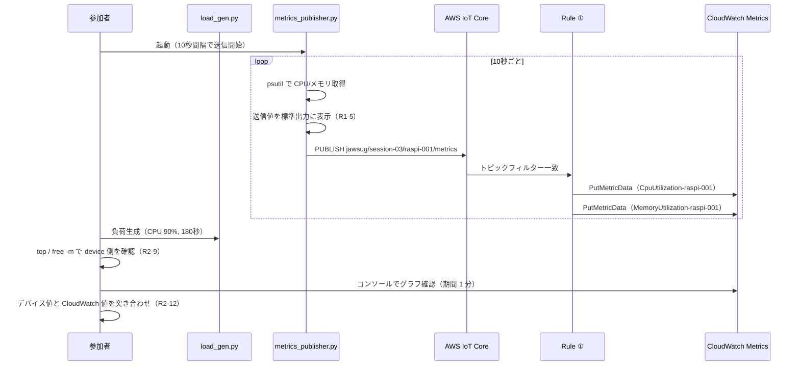
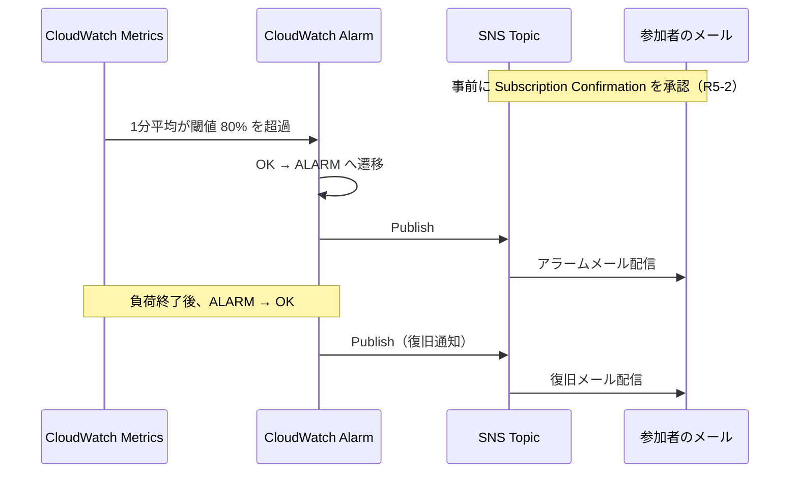

# 第3回ハンズオン 設計書（design.md）

- **プロジェクト**: JAWS-UG IoT 専門支部 IoT Core ハンズオン 2026 / 第3回
- **テーマ**: IoT Rules Engine で他の AWS サービスと連携し、データを自動処理・分析してみよう
- **配置先**: `scripts/session-03/specs/design.md`
- **前提文書**: `scripts/session-03/specs/requirements.md`
- **ステータス**: Draft（レビュー待ち）

---

## 1. Overview

本書は `requirements.md` の Requirement 1〜9 を実現するための技術設計を定義する。

対象は次の 3 系統である。

| 系統 | 経路 | 対応要件 |
| --- | --- | --- |
| 基本（必須） | Raspberry Pi → IoT Core → Rules → CloudWatch Metrics | R1・R2・R3 |
| アドバンス A | Raspberry Pi → IoT Core → Rules → Lambda → CloudWatch Logs | R4 |
| アドバンス B | CloudWatch Metrics → CloudWatch Alarm → SNS → Email | R5 |

設計の中心的な狙いは、**「Rules は SQL とアクションの組み合わせだけで連携先を差し替えられる」ことを、同一のトピック・同一のペイロードに対して 2 本のルールを並走させることで体感させる**点にある。

---

## 2. 設計方針と決定事項

`requirements.md` 第 7 章の未確定事項に対する回答を含む。

| ID | 決定事項 | 理由・根拠 |
| --- | --- | --- |
| **D-1** | メトリクスの名前空間は `JAWSUG/IoTHandson` に固定し、**デバイスの識別はメトリクス名の接尾辞**で行う（`CpuUtilization-raspi-001`）。**（Q1 の回答）** | `cloudwatchMetric` アクションは Dimension を指定できない。名前空間を分けるとコンソールで名前空間を切り替える手間が増え、複数デバイスを 1 グラフに重ねられない。メトリクス名で分ければ、名前空間 1 つの下でアルファベット順に `CpuUtilization-*` が並び、選択も比較も容易になる |
| **D-2** | デバイス識別子はペイロードではなく**トピックの第 3 セグメント `${topic(3)}`** から取得する | ペイロードは改変可能だがトピックは IoT ポリシーで縛れる。「トピック設計がそのまま識別子になる」という IoT の基本も伝えられる |
| **D-3** | `metricValue` は置換テンプレートで `${cast(cpu AS String)}` と明示的に文字列化する | `metricValue` は文字列型フィールドであり、数値のまま渡すと環境によってアクションが失敗する。明示キャストで安定化させる |
| **D-4** | CloudFormation テンプレートは**基本編 1 本＋アドバンス 2 本の計 3 本に分離**する。**（Q4 の回答）** | 基本編のみで完結させる要件（R6-3）を満たす。時間切れでアドバンスに進めなかった参加者がスタックを作らずに済み、後片付けも段階的に行える |
| **D-5** | テンプレート間で `Export` / `ImportValue` を**使わない**。アドバンス側は `DeviceNumber` をパラメータとして受け取り、リソース名を自力で組み立てる | クロススタック参照があると、参照されている側のスタックを先に削除できず、後片付けの順序制約が発生する。ハンズオンでは削除順を気にせず済むことを優先する |
| **D-6** | 送信間隔の既定値は **10 秒**、負荷生成の既定継続時間は **180 秒（3 分）** | CloudWatch のカスタムメトリクスは標準分解能（60 秒粒度）で保存される。1 分平均で見たときに負荷区間が明確な台形として現れ、かつ Alarm（期間 60 秒 × 1 回）が確実に発火する長さが必要（詳細は 4.3 節） |
| **D-7** | メモリ使用率の定義を `(total − available) / total × 100` に統一する | `psutil.virtual_memory().percent` はこの定義。`free` コマンドの `used` 列は buff/cache を除外するため値が一致しない。定義を明文化しないと R2-12（±5 ポイント一致）を満たせない（詳細は 9 章 K-2） |
| **D-8** | CloudFormation のパラメータは `DeviceId`（文字列）ではなく **`DeviceNumber`（3 桁数字、既定 `001`）** とする | IoT ルール名に使える文字は `[a-zA-Z0-9_]` のみでハイフンが使えない。`raspi-001` をそのままルール名に含められないため、数字部分をパラメータ化し、Thing 名は `jawsug-raspi-001`、ルール名は `jawsug_s3_..._raspi_001` と用途別に組み立てる（第2回の Thing 名表記は維持される） |
| **D-9** | デバイス側スクリプトは **I/O と純粋関数を分離**し、純粋関数側にロジックを寄せる | TDD（R7）で AWS・実機に依存しないユニットテストを成立させるため |
| **D-10** | Lambda のソースは `scripts/session-03/lambda/metrics_logger.py` を単一の正とし、CFN テンプレートへはインラインで埋め込む。両者の一致はテストで担保する | インラインなら S3 へのアップロードが不要で参加者の手順が 1 ステップ減る。一方でインラインコードは単体テストできないため、ソースファイルを正としてテストし、同期をテストで検証する |
| **D-11** | Alarm の対象は **CPU 使用率のみ**（メモリは任意設定） | メモリを 80% まで押し上げるのは OOM Killer のリスクがあり、貸出機で確実に再現しづらい。CPU なら 90% 以上を安全かつ再現性高く作れる |
| **D-12** | 参加者ごとの AWS アカウントは**個別を前提**とし、共有アカウントの場合も `DeviceNumber` で全リソース名が分離される設計とする。**（Q5 の回答）** | 個別・共有のどちらでも動作させるため、命名にデバイス番号を必ず含める（R6-6） |
| **D-13** | Email サブスクリプションの承認は**当日その場で実施**する。参加者は各自固有のメールアドレスを CFN パラメータで入力する。**（Q3 の回答）** | サブスクリプション作成時点で確認メールが送信されるため、スタック作成の待ち時間中に承認を済ませられる。ただし CloudFormation は承認を待たずに `CREATE_COMPLETE` になるため、「スタックは成功しているのに通知が来ない」状態が起こりうる。これを前提に手順書とハマりポイント表を組む（K-6） |

---

## 3. アーキテクチャ

### 3.1 全体構成

```
┌─────────────────────────┐
│ Raspberry Pi            │
│  metrics_publisher.py   │──┐
│  load_gen.py（負荷生成） │  │ MQTT/TLS 8883
│  show_metrics.sh（確認） │  │ topic: jawsug/session-03/raspi-001/metrics
└─────────────────────────┘  │
                             ▼
                 ┌───────────────────────┐
                 │ AWS IoT Core          │
                 │  Thing / Cert / Policy│
                 └───────────┬───────────┘
                             │ 同一トピックを 2 本のルールが購読
              ┌──────────────┴──────────────┐
              ▼                             ▼
  ┌───────────────────────┐     ┌───────────────────────┐
  │ Rule ①（基本）        │     │ Rule ②（アドバンス A）│
  │ cloudwatchMetric × 2  │     │ lambda                │
  └───────────┬───────────┘     └───────────┬───────────┘
              ▼                             ▼
  ┌───────────────────────┐     ┌───────────────────────┐
  │ CloudWatch Metrics    │     │ Lambda                │
  │ JAWSUG/IoTHandson     │     │ metrics_logger        │
  └───────────┬───────────┘     └───────────┬───────────┘
              ▼                             ▼
  ┌───────────────────────┐     ┌───────────────────────┐
  │ CloudWatch Alarm      │     │ CloudWatch Logs       │
  │（アドバンス B）        │     │（保持 3 日）          │
  └───────────┬───────────┘     └───────────────────────┘
              ▼
  ┌───────────────────────┐
  │ SNS Topic → Email     │──▶ 参加者のメール
  └───────────────────────┘

  ※ 両ルールの失敗は ErrorAction で
     CloudWatch Logs（/aws/iot/session-03/rule-errors）へ記録
```

### 3.2 データフロー（基本経路）



### 3.3 アドバンス B（Alarm → Email）



### 3.4 命名規約

`{n}` は `DeviceNumber` パラメータ（既定 `001`）。

| 対象 | 名前 | 備考 |
| --- | --- | --- |
| Thing 名 | `jawsug-raspi-{n}` | 第2回と同形式 |
| IoT ポリシー | `jawsug-s3-policy-raspi-{n}` | |
| MQTT トピック | `jawsug/session-03/raspi-{n}/metrics` | |
| トピックフィルター | `jawsug/session-03/+/metrics` | ワイルドカードで全デバイスを受ける |
| IoT ルール①（基本） | `jawsug_s3_metrics_to_cw_raspi_{n}` | **ハイフン不可** |
| IoT ルール②（Lambda） | `jawsug_s3_metrics_to_lambda_raspi_{n}` | 同上 |
| メトリクス名前空間 | `JAWSUG/IoTHandson` | 全デバイス共通（D-1） |
| メトリクス名 | `CpuUtilization-raspi-{n}` / `MemoryUtilization-raspi-{n}` | 置換テンプレートで生成 |
| Lambda 関数 | `jawsug-s3-metrics-logger-raspi-{n}` | |
| Lambda ロググループ | `/aws/lambda/jawsug-s3-metrics-logger-raspi-{n}` | 保持 3 日 |
| ルールエラーログ | `/aws/iot/session-03/rule-errors` | 保持 3 日 |
| SNS トピック | `jawsug-s3-alarm-raspi-{n}` | |
| CloudWatch Alarm | `jawsug-s3-cpu-high-raspi-{n}` | |
| IAM ロール | `jawsug-s3-iot-rule-role-raspi-{n}` 他 | |
| CFN スタック（基本） | `jawsug-iot-handson-s3-{n}` | |
| CFN スタック（アドバンス A） | `jawsug-iot-handson-s3-lambda-{n}` | |
| CFN スタック（アドバンス B） | `jawsug-iot-handson-s3-alarm-{n}` | |

---

## 4. データ設計

### 4.1 MQTT ペイロード（R1-4）

```json
{
  "deviceId": "raspi-001",
  "cpu": 92.4,
  "memory": 41.8,
  "timestamp": 1786280400
}
```

| フィールド | 型 | 範囲・単位 | 備考 |
| --- | --- | --- | --- |
| `deviceId` | string | — | Thing 名から `jawsug-` を除いた部分 |
| `cpu` | number | 0.0〜100.0（%） | 小数第 1 位に丸め |
| `memory` | number | 0.0〜100.0（%） | 小数第 1 位に丸め。定義は D-7 |
| `timestamp` | number | Unix epoch 秒 | UTC。デバイス時刻に依存（9 章 K-1） |

QoS は 0（メトリクスの欠損 1 件が学習に影響しないため）。ペイロードサイズは 100 バイト前後で、IoT Core の 128KB 上限に対して十分小さい。

### 4.2 CloudWatch Metrics 設計（R3-4）

| 属性 | 値 |
| --- | --- |
| Namespace | `JAWSUG/IoTHandson` |
| MetricName（CPU） | `CpuUtilization-${topic(3)}` → `CpuUtilization-raspi-001` |
| MetricName（メモリ） | `MemoryUtilization-${topic(3)}` → `MemoryUtilization-raspi-001` |
| Unit | `Percent` |
| Value | `${cast(cpu AS String)}` / `${cast(memory AS String)}` |
| Timestamp | `${cast(timestamp AS String)}`（Unix epoch 秒） |
| Dimensions | **なし**（アクションが非対応。コンソールでは「ディメンションなし」に表示される） |

Dimension が使えない点は制約であると同時に教材になる。「Dimension を付けたい場合は Lambda を経由して `PutMetricData` を自前で呼ぶ」という設計上の分岐が、そのままアドバンス A の動機づけになる（手順書で言及する）。

### 4.3 メトリクスの分解能と可視化期間（重要）

`cloudwatchMetric` アクションは `StorageResolution` を指定できないため、メトリクスは**標準分解能（60 秒粒度）**で保存される。送信間隔 10 秒なら 1 分あたり 6 サンプルが同一分に集約される。

この性質から次の設計が導かれる。

| 項目 | 設計値 | 理由 |
| --- | --- | --- |
| グラフの期間（Period） | **1 分** | 既定の 5 分では負荷区間が平均化され、デバイス側実測値との突き合わせ（R2-12、±5 ポイント）が成立しない |
| グラフの統計（Statistic） | **平均（Average）**。瞬間値を見たい場合は最大（Maximum） | 1 分内 6 サンプルの平均。定常負荷なら瞬間値とほぼ一致する |
| 負荷生成の継続時間 | **180 秒以上** | 1 分平均のデータポイントが 2〜3 点得られ、台形として視認できる。60 秒未満だと 1 点も明確に立たない可能性がある |
| Alarm の期間 | **60 秒**（標準分解能の下限） | 標準分解能メトリクスでは 60 秒未満の期間を指定できない |
| Alarm の評価回数 | **1** | 発火までの待ち時間を短縮し、ハンズオン時間内に収める |

> R2-12 の ±5 ポイント一致は、**負荷が定常状態にある区間**で比較することを前提とする。負荷の立ち上がり・立ち下がりの分は平均化の影響で乖離するため、手順書では「負荷開始から 1 分以上経過した時点で突き合わせる」と案内する。

---

## 5. コンポーネント設計

### 5.1 ディレクトリ構成

```
.
├── docs/
│   └── session-03/
│       ├── handson.md                    # 参加者向けハンズオン手順書（R8-1）
│       └── architecture.drawio.svg       # 構成図（3経路）（R8-2）
├── scripts/
│   └── session-03/
│       ├── specs/
│       │   ├── requirements.md
│       │   ├── design.md                 # 本書
│       │   ├── tasks.md
│       │   └── verification-log.md
│       ├── metrics.py                    # 純粋関数（取得・整形）
│       ├── metrics_publisher.py          # Raspberry Pi 用（MQTT 送信）
│       ├── simulator.py                  # 実機なし参加者用
│       ├── load_gen.py                   # 負荷生成（CPU / メモリ）
│       ├── show_metrics.sh               # デバイス側確認ヘルパー
│       ├── lambda/
│       │   └── metrics_logger.py         # Lambda ソース（単一の正）
│       ├── tests/
│       │   ├── test_metrics.py
│       │   ├── test_load_gen.py
│       │   ├── test_metrics_logger.py
│       │   ├── test_templates.py
│       │   └── test_lambda_inline_sync.py
│       ├── requirements-dev.txt          # pytest, cfn-lint 等
│       ├── evidence/                     # 検証証跡の保存先（R9-3）
│       └── teardown.sh
└── cfn/
    └── session-03/
        ├── iot-rules-cloudwatch.yaml     # 基本編
        ├── advanced-lambda.yaml          # アドバンス A
        └── advanced-alarm.yaml           # アドバンス B
```

### 5.2 デバイス側スクリプト

#### `metrics.py` — 純粋関数層（D-9）

```python
def read_cpu_percent(interval: float = 1.0) -> float:
    """CPU 使用率（全コア平均, %）を取得し小数第1位に丸める。"""

def read_memory_percent() -> float:
    """メモリ使用率 (total - available) / total * 100 を返す（D-7）。"""

def build_payload(device_id: str, cpu: float, memory: float, ts: int) -> dict:
    """MQTT ペイロード（4.1 節）を組み立てる。純粋関数。"""

def validate_percent(value: float) -> float:
    """0〜100 にクランプし小数第1位に丸める。範囲外は ValueError。"""

def format_stdout_line(payload: dict, tz: str = "Asia/Tokyo") -> str:
    """[SEND] 2026-08-08 21:34:10 JST cpu=92.4% memory=41.8% 形式の表示行を返す（R1-5）。"""
```

依存は `psutil`。`build_payload` / `validate_percent` / `format_stdout_line` は外部依存を持たないため、そのままユニットテスト対象になる。`read_*` は `psutil` をモックしてテストする。

#### `metrics_publisher.py` — MQTT 送信層

第1回・第2回と同様に `paho-mqtt` を使用し、冒頭の設定値を参加者が書き換える方式を踏襲する。

```python
ENDPOINT      = "xxxxxx-ats.iot.ap-northeast-1.amazonaws.com"
DEVICE_ID     = "raspi-001"
SEND_INTERVAL = int(os.environ.get("SEND_INTERVAL", "10"))  # 秒（R1-2）
```

| 振る舞い | 実装方針 | 対応要件 |
| --- | --- | --- |
| TLS 相互認証 | `certs/` の 3 ファイルを `tls_set()` に渡す。ポート 8883 | R1-1 |
| 定期送信 | `SEND_INTERVAL` ごとに収集して publish | R1-2 |
| 標準出力表示 | `format_stdout_line()` の結果を出力 | R1-5 |
| 取得失敗時 | 例外を捕捉して `[WARN]` を出力し、次周期へ | R1-6 |
| 再接続 | `reconnect_delay_set()` による自動再接続 | R1-7 |
| 終了処理 | `SIGINT` を捕捉し `disconnect()` → `[EXIT]` 出力 | R1-8 |

#### `simulator.py`（R1-9）

同一トピック・同一ペイロード形式で、CPU/メモリを疑似生成する。単調な乱数ではグラフが平坦になるため、**低め（10〜20%）の基準値に、コマンドライン引数で指定した区間だけ高い値（80〜95%）を重ねる**モードを持たせ、実機なしでもアドバンス B のアラーム発火まで到達できるようにする。

```
python3 simulator.py --spike-after 60 --spike-duration 180 --spike-level 90
```

#### `load_gen.py`（R2-1〜R2-8）

```
python3 load_gen.py cpu    --target 90 --duration 180
python3 load_gen.py memory --target 70 --duration 180
python3 load_gen.py memory --mb 1024   --duration 180
```

| 設計項目 | 方針 |
| --- | --- |
| CPU 負荷 | `os.cpu_count()` 個のワーカープロセスを `multiprocessing` で起動。各ワーカーは「ビジーループ × duty ＋ sleep × (1−duty)」の duty cycle 制御で目標使用率に近づける |
| メモリ負荷 | 目標% から必要バイト数を算出し、`bytearray` を確保して保持。ページを実際に触るため書き込みを行う（遅延割り当て回避） |
| 上限ガード（R2-6） | メモリは**総容量の 85% を超えない**ようクランプし、警告を表示。CPU の `--target` は 1〜100 に検証 |
| 進捗表示（R2-3） | 1 秒ごとに経過秒数と現在の実測使用率を表示 |
| 開始・終了時刻（R2-8） | JST で開始時刻・終了予定時刻・実終了時刻を表示 |
| クリーンアップ（R2-5） | `SIGINT` / `SIGTERM` / `finally` の三重で子プロセス終了とメモリ解放を保証 |
| 外部依存 | `stress-ng` 等は使わず Python 標準ライブラリ＋`psutil` のみ（追加インストールを増やさず、TDD 対象にできる） |

#### `show_metrics.sh`（R2-9・R2-10）

OS 標準コマンドでの確認を主軸としつつ、**publisher と完全に同じ定義（D-7）で値を表示するヘルパー**を用意し、`free` の見た目との差異で混乱しないようにする。

```bash
$ ./show_metrics.sh
=== 2026-08-08 21:34:10 JST ===
CPU    : 92.4 %   (top / vmstat と同じ定義：全コア平均)
Memory : 41.8 %   ((total - available) / total)
  total=3792 MB  available=2206 MB  used(free コマンド表記)=1310 MB
```

手順書では `top` → `free -m` → `show_metrics.sh` の順に案内し、最後に CloudWatch と突き合わせる（R2-13）。並行実行の手段（SSH 2 セッション / `tmux` / `nohup ... &`）も手順書に記載する（R2-14）。

### 5.3 CloudFormation テンプレート

#### `cfn/session-03/iot-rules-cloudwatch.yaml`（基本編）

**Parameters**

| 名前 | 型 | 既定値 | 制約 |
| --- | --- | --- | --- |
| `DeviceNumber` | String | `001` | `AllowedPattern: ^[0-9]{3}$`（D-8） |
| `MetricNamespace` | String | `JAWSUG/IoTHandson` | |

**Resources**

| 論理 ID | 型 | 役割 |
| --- | --- | --- |
| `IoTThing` | `AWS::IoT::Thing` | `jawsug-raspi-{n}` |
| `IoTPolicy` | `AWS::IoT::Policy` | Connect / Publish を自トピックに限定 |
| `RuleErrorLogGroup` | `AWS::Logs::LogGroup` | `/aws/iot/session-03/rule-errors`、保持 3 日 |
| `IoTRuleRole` | `AWS::IAM::Role` | `iot.amazonaws.com` を信頼、`cloudwatch:PutMetricData` と Logs 書き込み |
| `MetricsToCloudWatchRule` | `AWS::IoT::TopicRule` | 単一ルール内に `CloudwatchMetric` アクション 2 つ（R3-3） |

**ルール定義の要点**

```yaml
  MetricsToCloudWatchRule:
    Type: AWS::IoT::TopicRule
    Properties:
      RuleName: !Sub "jawsug_s3_metrics_to_cw_raspi_${DeviceNumber}"
      TopicRulePayload:
        AwsIotSqlVersion: "2016-03-23"        # R3-2
        RuleDisabled: false
        Sql: "SELECT * FROM 'jawsug/session-03/+/metrics'"
        Actions:
          - CloudwatchMetric:
              RoleArn: !GetAtt IoTRuleRole.Arn
              MetricNamespace: !Ref MetricNamespace
              MetricName: "CpuUtilization-${topic(3)}"       # !Sub を使わない（K-3）
              MetricUnit: "Percent"
              MetricValue: "${cast(cpu AS String)}"
              MetricTimestamp: "${cast(timestamp AS String)}"
          - CloudwatchMetric:
              RoleArn: !GetAtt IoTRuleRole.Arn
              MetricNamespace: !Ref MetricNamespace
              MetricName: "MemoryUtilization-${topic(3)}"
              MetricUnit: "Percent"
              MetricValue: "${cast(memory AS String)}"
              MetricTimestamp: "${cast(timestamp AS String)}"
        ErrorAction:                                          # R3-7
          CloudwatchLogs:
            RoleArn: !GetAtt IoTRuleRole.Arn
            LogGroupName: !Ref RuleErrorLogGroup
```

**Outputs**（R6-5）

| キー | 内容 |
| --- | --- |
| `ThingName` | `jawsug-raspi-001` |
| `MetricsTopic` | `jawsug/session-03/raspi-001/metrics` |
| `RuleName` | 作成されたルール名 |
| `MetricNamespace` | `JAWSUG/IoTHandson` |
| `CpuMetricName` / `MemoryMetricName` | コンソールで探すメトリクス名 |
| `MetricsConsoleUrl` | 該当メトリクスのコンソールへのディープリンク |
| `RuleErrorLogGroupName` | 失敗時に確認するロググループ |

証明書は第2回と同様に CloudFormation では発行できないため、手動発行＋ポリシーアタッチの手順を手順書に記載する（R6-8）。

#### `cfn/session-03/advanced-lambda.yaml`（アドバンス A）

| 論理 ID | 型 | 備考 |
| --- | --- | --- |
| `MetricsLoggerLogGroup` | `AWS::Logs::LogGroup` | 保持 3 日（R4-5）。関数より先に明示作成し、保持期間の取りこぼしを防ぐ |
| `MetricsLoggerRole` | `AWS::IAM::Role` | `AWSLambdaBasicExecutionRole` 相当のログ書き込みのみ（R4-7） |
| `MetricsLoggerFunction` | `AWS::Lambda::Function` | Python 3.13 / メモリ 128MB / タイムアウト 10 秒 / インラインコード（D-10） |
| `MetricsToLambdaRule` | `AWS::IoT::TopicRule` | `Lambda` アクション |
| `LambdaInvokePermission` | `AWS::Lambda::Permission` | `Principal: iot.amazonaws.com`、`SourceArn` にルール ARN |

> Lambda アクションは IoT ルール側の IAM ロールではなく、**Lambda 側のリソースベースポリシー**で権限を与える。ここは他アクションと作りが違うため、手順書でも一言触れる価値がある。

**SQL（Lambda に渡すイベントを SELECT で整形する）**

```sql
SELECT deviceId, cpu, memory, timestamp,
       topic() AS topic, timestamp() AS receivedAtMs
FROM 'jawsug/session-03/+/metrics'
```

`cloudwatchMetric` アクションでは SELECT の内容が結果に影響しないのに対し、Lambda アクションでは **SELECT の出力がそのままイベントになる**。この対比は「SQL がアクションによってどう効くか」の理解に直結するため、手順書で明示的に扱う。

**`lambda/metrics_logger.py`**

```python
def normalize_record(event: dict) -> dict:
    """イベントから deviceId/cpu/memory/timestamp を抽出し、欠落は None を入れる。"""

def has_required_fields(record: dict) -> bool:
    """必須フィールドが揃っているか判定する。"""

def handler(event, context):
    """構造化ログ（JSON 1 行）を出力する。欠落時は level=WARN で継続（R4-4）。"""
```

出力ログ形式（R4-2・R4-6）:

```json
{"level":"INFO","event":"metrics_received","deviceId":"raspi-001","cpu":92.4,"memory":41.8,"timestamp":1786280400,"topic":"jawsug/session-03/raspi-001/metrics"}
```

CloudWatch Logs Insights での確認例を手順書に載せる:

```
fields @timestamp, deviceId, cpu, memory
| filter event = "metrics_received"
| sort @timestamp desc
| limit 20
```

#### `cfn/session-03/advanced-alarm.yaml`（アドバンス B）

**Parameters**

| 名前 | 型 | 既定値 | 備考 |
| --- | --- | --- | --- |
| `DeviceNumber` | String | `001` | |
| `NotificationEmail` | String | （既定なし・必須） | 参加者が各自のアドレスを当日入力。リポジトリには残さない（NFR-7）。`AllowedPattern: ^[^\s@]+@[^\s@]+\.[^\s@]+$` で明らかな打ち間違いをスタック作成時に弾く。`NoEcho` は**使わない**（「メールが来ない」原因の大半が入力ミスであり、パラメータタブで実際の入力値を確認できることを優先する） |
| `CpuAlarmThreshold` | Number | `80` | R5-3 |
| `AlarmPeriodSeconds` | Number | `60` | 標準分解能の下限（4.3 節） |
| `AlarmEvaluationPeriods` | Number | `1` | |
| `EnableOkNotification` | String | `true` | `true` / `false`（R5-7） |

**Resources**

| 論理 ID | 型 | 備考 |
| --- | --- | --- |
| `AlarmTopic` | `AWS::SNS::Topic` | `DisplayName: JAWSUG-IoT-Handson` を設定する（Email プロトコルでは DisplayName が差出人表示名になるため、受信箱で見つけやすくなる） |
| `AlarmEmailSubscription` | `AWS::SNS::Subscription` | `Protocol: email`。**リソース作成時点で確認メールが送信される**。CloudFormation は承認を待たずに完了するため、承認漏れの検知は参加者側の確認に依存する（K-6） |
| `CpuHighAlarm` | `AWS::CloudWatch::Alarm` | 下記設定 |

**Email 承認フローの設計（D-13）**

| 項目 | 内容 |
| --- | --- |
| 確認メールの差出人 | `no-reply@sns.amazonaws.com` |
| 件名 | `AWS Notification - Subscription Confirmation` |
| 送信タイミング | サブスクリプションリソースの作成時（＝スタック作成中） |
| 確認リンクの有効期限 | 3 日間（当日中の承認なら問題にならない） |
| 承認前の状態 | サブスクリプションは `PendingConfirmation`。この状態では Alarm が発火しても**メールは届かない** |
| 承認状態の確認方法 | SNS コンソール → トピック → サブスクリプション一覧の「ステータス」列が `Confirmed` になっていること |
| スタック再作成時 | 旧サブスクリプションは削除されるため、**確認メールが再送され、再度の承認が必要**（「前回承認したから大丈夫」は成立しない） |

手順書には次の順序で組み込む。「アドバンス B のスタックを作成 → 作成完了を待つ間に受信箱（および迷惑メールフォルダ）を確認して承認 → SNS コンソールでステータスが `Confirmed` であることを確認 → 負荷生成でアラームを発火させる」。**負荷をかける前に `Confirmed` を確認させる**ことで、「アラームは鳴ったがメールが来ない」という不可解な状態を避ける。

```yaml
      Namespace: !Ref MetricNamespace
      MetricName: !Sub "CpuUtilization-raspi-${DeviceNumber}"
      Statistic: Average
      Period: !Ref AlarmPeriodSeconds
      EvaluationPeriods: !Ref AlarmEvaluationPeriods
      Threshold: !Ref CpuAlarmThreshold
      ComparisonOperator: GreaterThanThreshold
      TreatMissingData: notBreaching        # R5-6
      AlarmActions: [ !Ref AlarmTopic ]
      OKActions: [ ... ]                    # EnableOkNotification が true のときのみ（Condition）
```

`TreatMissingData: notBreaching` を選ぶ理由は、送信スクリプトを止めている間にアラームが発火して参加者を混乱させるのを防ぐため。`missing`（状態維持）や `breaching` との違いは手順書のコラムで触れる。

`EnableOkNotification` は `Conditions` と `Fn::If` で `OKActions` を切り替える。

**Outputs**: `AlarmTopicArn`、`AlarmName`、`AlarmConsoleUrl`、`ConfirmSubscriptionNote`（承認が必要である旨のリマインド文）。

### 5.4 `teardown.sh`（R8-8・R8-9）

第2回の `teardown.sh` を踏襲しつつ、3 スタック構成に対応させる。

```
DEVICE_NUMBER=001 bash teardown.sh
```

処理順序:

1. 削除対象の一覧を表示し、`y/N` で確認を取る（R8-9）
2. Thing にアタッチされた証明書をデタッチ → 無効化 → 削除
3. アドバンス B スタック削除 → アドバンス A スタック削除 → 基本スタック削除（存在するものだけ）
4. ローカルの `certs/` を削除
5. 残存確認：Thing・ルール・スタック・SNS トピックの存在チェック結果を表示（R8-9）

D-5 によりクロススタック参照がないため、削除順序に失敗しても個別にリトライできる。CloudWatch Metrics は削除 API が存在せず保持期間経過で消えるため、その旨を出力で明示する（参加者が「消え残っている」と誤解しないため）。

---

## 6. IAM / セキュリティ設計

### 6.1 IoT ポリシー（デバイス用）

第2回はリソースをワイルドカードにしていたが、本回は最小権限に絞る（NFR-6）。D-2 でトピックを識別子として使うため、トピックを縛ることが識別の信頼性にも効く。

```yaml
        Statement:
          - Effect: Allow
            Action: iot:Connect
            Resource: !Sub "arn:aws:iot:${AWS::Region}:${AWS::AccountId}:client/jawsug-raspi-${DeviceNumber}"
          - Effect: Allow
            Action: iot:Publish
            Resource: !Sub "arn:aws:iot:${AWS::Region}:${AWS::AccountId}:topic/jawsug/session-03/raspi-${DeviceNumber}/metrics"
```

### 6.2 IoT ルール用 IAM ロール

```yaml
        - Effect: Allow
          Action: cloudwatch:PutMetricData
          Resource: "*"
          Condition:
            StringEquals:
              cloudwatch:namespace: !Ref MetricNamespace
        - Effect: Allow
          Action: [ logs:CreateLogStream, logs:PutLogEvents ]
          Resource: !Sub "${RuleErrorLogGroup.Arn}:*"
```

`PutMetricData` はリソースレベル権限を持たないため `Resource: "*"` になるが、`cloudwatch:namespace` 条件キーで名前空間を限定できる。「ワイルドカードでも条件で絞れる」という実務的な小ネタとして手順書のコラム候補にする。

### 6.3 その他

| 項目 | 方針 |
| --- | --- |
| 証明書・秘密鍵 | `scripts/session-03/certs/` を `.gitignore` に追加。コミット禁止（NFR-6） |
| メールアドレス | CFN パラメータで当日入力。テンプレート・手順書・証跡に実アドレスを残さない（NFR-7、R9-7） |
| 証跡のマスキング | `evidence/` に保存する前に AWS アカウント ID・証明書 ID・メールアドレスをマスクする（R9-7） |
| Lambda 権限 | ログ書き込みのみ。VPC 非接続（R4-7） |
| ログ保持 | 全ロググループ 3 日（R4-5、NFR-5） |

---

## 7. エラーハンドリング設計

| 層 | 想定エラー | 挙動 | 対応要件 |
| --- | --- | --- | --- |
| デバイス | メトリクス取得失敗 | `[WARN]` を出力し次周期へ。プロセスは継続 | R1-6 |
| デバイス | MQTT 切断 | 自動再接続（指数バックオフ） | R1-7 |
| デバイス | 証明書パス誤り | 起動時に存在チェックし、期待するファイル名を添えて即座に終了 | — |
| デバイス | 負荷パラメータ超過 | 実行前に警告し、安全上限にクランプ or 中止 | R2-6 |
| デバイス | 実行中の中断 | シグナルハンドラでプロセス／メモリを解放 | R2-5 |
| Rules | アクション失敗 | `ErrorAction` で CloudWatch Logs に記録 | R3-7 |
| Rules | `metricValue` 型不正 | D-3 の明示キャストで予防。発生時は ErrorAction ログで検知 | R3-7 |
| Lambda | 必須フィールド欠落 | `level=WARN` で記録し正常終了（リトライを誘発させない） | R4-4 |
| Lambda | 想定外例外 | ログに記録して再スロー（IoT ルール側で ErrorAction が発火） | R4-8 |
| Alarm | データ欠損 | `TreatMissingData: notBreaching` | R5-6 |

ルール①と②は独立したルールリソースであり、一方のアクション失敗が他方の実行に影響しない（R4-8）。

---

## 8. テスト戦略（TDD / R7）

### 8.1 テスト一覧と要件対応

| テストファイル | ケース | 対応要件 |
| --- | --- | --- |
| `test_metrics.py` | `build_payload` が 4 フィールドを正しい型で返す | R1-4 |
| | `validate_percent` が 0〜100 にクランプし小数第 1 位に丸める | R1-4 |
| | `validate_percent` が範囲外・非数値で `ValueError` | R1-4 |
| | `read_cpu_percent` / `read_memory_percent` が `psutil` モックの値を D-7 の定義で返す | R1-2・D-7 |
| | `format_stdout_line` が JST 表記で cpu / memory を含む | R1-5 |
| `test_load_gen.py` | CPU の `--target` が 1〜100 外で `ValueError` | R2-6 |
| | メモリ目標が総容量の 85% を超える場合にクランプされ警告が出る | R2-6 |
| | `--duration` 経過後に確保メモリが解放される | R2-4 |
| | `SIGINT` 相当でクリーンアップ関数が呼ばれる | R2-5 |
| | 開始・終了時刻が JST で出力される | R2-8 |
| | duty cycle 計算が目標使用率に対して期待値を返す | R2-1 |
| `test_metrics_logger.py` | 正常イベントで `level=INFO` の JSON 1 行が出る | R4-2 |
| | `cpu` 欠落時に `level=WARN` で例外を出さない | R4-4 |
| | `cpu` が文字列など不正型でも異常終了しない | R7-5 |
| | 出力が Logs Insights でパース可能な JSON である | R4-6 |
| `test_templates.py` | 3 テンプレートが `cfn-lint` に合格する | R6-9・R7-7 |
| | 基本テンプレートのルールが `CloudwatchMetric` を 2 つ持つ | R3-3 |
| | `AwsIotSqlVersion` が `2016-03-23` | R3-2 |
| | ルール名が `^[a-zA-Z0-9_]+$` に適合する | K-4 |
| | `ErrorAction` が定義されている | R3-7 |
| | Alarm に `TreatMissingData` が明示されている | R5-6 |
| | 必須 Outputs が揃っている | R6-5 |
| `test_lambda_inline_sync.py` | テンプレートのインラインコードが `lambda/metrics_logger.py` と一致する | D-10 |

### 8.2 実行方法（R7-8）

```bash
cd scripts/session-03
python3 -m venv .venv && source .venv/bin/activate
pip install -r requirements-dev.txt   # pytest, cfn-lint, psutil
pytest                                 # 全ユニットテストを単一コマンドで実行
```

- AWS API に触るコードは `unittest.mock` でモックし、実アカウントへのアクセスなしで完結させる（R7-4）。`moto` は現設計では不要（デバイス側とテンプレート検証が中心のため）だが、`teardown.sh` の Python 化を行う場合に導入を検討する。
- `cfn-lint` は `pytest` から `subprocess` 経由で呼び出し、テストの一部として扱う（R7-7）。`aws cloudformation validate-template` は AWS 認証を要するため、CI ではなく手動検証（M2 以降）で実施する。
- 負荷生成のテストは**実際に負荷をかけない**。duty cycle 計算・パラメータ検証・クリーンアップ呼び出しの検証に限定し、ワーカー起動部分はモックする。

### 8.3 実環境結合検証（R7-10）

ユニットテストで担保できない次の項目は、実 AWS 環境で検証し `verification-log.md` に記録する。

| 検証項目 | 方法 | 対応要件 |
| --- | --- | --- |
| メトリクスの到達 | 送信後 3 分以内にコンソールでメトリクスが出現 | R3-6 |
| 置換テンプレートの評価 | メトリクス名が `CpuUtilization-raspi-001` になっている | D-1・D-2 |
| 値の突き合わせ（3 点セット） | デバイス実測値 / 送信値 / CloudWatch 値を同一時刻で比較 | R2-12・R9-4 |
| Lambda 連携 | Logs Insights でレコードを検索 | R4-6 |
| サブスクリプション承認 | 確認メールの受信 → 承認 → SNS コンソールで `Confirmed` を確認 | R5-2・D-13 |
| アラーム発火とメール受信 | 負荷生成後に ALARM 遷移とメール着信を確認 | R5-5・R5-8 |
| スタック作成時間 | `CREATE_COMPLETE` まで 5 分以内 | R6-7 |
| 通し実行 | 手順書どおりに実行し所要時間を測定 | R9-8 |

---

## 9. 既知の制約とリスク

| ID | 内容 | 影響 | 対策 |
| --- | --- | --- | --- |
| **K-1** | Raspberry Pi は RTC を持たず、NTP 同期に失敗すると時刻がずれる。`MetricTimestamp` にペイロードの時刻を使うため、ずれるとグラフの時間軸がずれる（CloudWatch は 2 時間以上未来／2 週間以上過去の時刻を拒否する） | メトリクスが表示されない、または見当違いの時刻に描画される | 手順書に `timedatectl` での同期確認を組み込む。ハマりポイント表にも記載。どうしても解消しない場合の回避策として `MetricTimestamp` を外して取り込み時刻を使う手順を用意 |
| **K-2** | `psutil` のメモリ使用率 `(total − available) / total` と `free` コマンドの `used` 列は定義が異なる（`used` は buff/cache を除外） | 参加者が「デバイスと CloudWatch の値が合わない」と誤解する | D-7 で定義を統一し、`show_metrics.sh` で同一定義の値を表示。手順書で `free -m` の `available` 列を見るよう明記 |
| **K-3** | CloudFormation の `!Sub` と IoT の置換テンプレートは、どちらも `${...}` 構文を使うため衝突する | `MetricName` に `${topic(3)}` を使うと `!Sub` 併用時に CFN 側が解決を試みて失敗する | 置換テンプレートを含む文字列では `!Sub` を使わない。併用が必要な場合は `${!topic(3)}` でエスケープする。テストでテンプレート文字列を検証 |
| **K-4** | IoT ルール名に使える文字は `[a-zA-Z0-9_]` のみ（ハイフン不可） | `raspi-001` をそのままルール名に使うとスタック作成が失敗する | D-8 のとおり `DeviceNumber` パラメータ化。`test_templates.py` でルール名の文字種を検証 |
| **K-5** | `cloudwatchMetric` アクションは Dimension・`StorageResolution` を指定できない | デバイス別の分離をメトリクス名で行う必要があり、分解能は 60 秒固定 | D-1 と 4.3 節の設計。制約自体を教材として扱う |
| **K-6** | SNS の Email サブスクリプションは承認されるまで通知が届かない。かつ **CloudFormation は承認を待たずに `CREATE_COMPLETE` になる**ため、スタックが成功していても通知経路が未完成という状態が起こる | アドバンス B で「アラームは ALARM になったがメールが来ない」が発生し、原因の切り分けに時間を取られる | ①負荷をかける前に SNS コンソールでステータス `Confirmed` を確認させる ②迷惑メールフォルダの確認を手順に明記（差出人 `no-reply@sns.amazonaws.com`） ③`AllowedPattern` でアドレスの打ち間違いを作成時に弾く ④Outputs に承認が必要である旨のリマインドを出す ⑤スタック再作成時は再承認が必要である旨をハマりポイント表に記載 |
| **K-10** | 会社支給端末・企業メールでは、外部からの確認メールがフィルタで隔離されることがある | 承認できず、アドバンス B に到達できない | 手順書で「フィルタの緩いアドレス（個人の Gmail 等）を推奨」と案内する。到達しない場合の代替として、Alarm の状態遷移をコンソールの「履歴」タブで確認する迂回手順を用意する |
| **K-7** | 負荷区間が短いと 1 分平均に埋もれる | グラフが立たない、アラームが発火しない | 既定継続時間 180 秒（D-6）。手順書でも 3 分以上を推奨 |
| **K-8** | 会場の Wi-Fi 帯域・NAT 制約で 8883 が通らない可能性 | 送信できない | 第1回・第2回と同じ経路のため既知。ハマりポイント表に記載し、代替として PC からの `simulator.py` を案内 |
| **K-9** | メモリ負荷が高すぎると OOM Killer が SSH や publisher を落とす | 実習中断 | 総容量 85% 上限クランプ（R2-6）。Alarm 対象は CPU のみ（D-11） |

---

## 10. コスト見積り（NFR-5、参加者 1 名・当日 2 時間想定）

| サービス | 数量の目安 | 概算 |
| --- | --- | --- |
| IoT Core メッセージ | 10 秒間隔 × 2 時間 ＝ 約 720 件 | ほぼ 0 |
| IoT Rules アクション | 720 件 × 3 アクション ＝ 約 2,160 | ほぼ 0 |
| CloudWatch カスタムメトリクス | 2 メトリクス（月額課金の日割り） | 数円 |
| CloudWatch Alarm | 1 個（月額課金の日割り） | 数円 |
| Lambda | 720 回 × 128MB × 数十ミリ秒 | 無料枠内 |
| CloudWatch Logs | 数 MB・保持 3 日 | ほぼ 0 |
| SNS Email | 数通 | 無料枠内 |

合計で参加者 1 名あたり十数円規模。**カスタムメトリクスと Alarm は月額課金**であるため、後片付けで Alarm を削除することの意味を手順書で触れる（メトリクス自体は削除 API がなく保持期間経過で消える）。

---

## 11. マイルストーンと設計要素の対応

| マイルストーン | 本書の該当箇所 | 主な成果物 |
| --- | --- | --- |
| M0 Spec 確定 | 全体 | `requirements.md` / `design.md` / `tasks.md` / `verification-log.md` |
| M1 デバイス側実装 | 5.2、8.1 | `metrics.py` / `metrics_publisher.py` / `simulator.py` / `load_gen.py` / `show_metrics.sh` ＋テスト |
| M2 基本経路構築 | 4.2、4.3、5.3、6 | `iot-rules-cloudwatch.yaml` |
| M3 アドバンス A | 5.3、8.1 | `advanced-lambda.yaml` / `lambda/metrics_logger.py` ＋テスト |
| M4 アドバンス B | 5.3、9（K-6） | `advanced-alarm.yaml` |
| M5 ドキュメント・リハーサル | 3.1、5.4、9 | `docs/session-03/handson.md` / `architecture.drawio.svg` / ルート `README.md` / `teardown.sh` |

---

## 12. 未確定事項の解消状況

| ID | 内容 | 状況 |
| --- | --- | --- |
| Q1 | メトリクスの命名・デバイス分離方法 | **解消**（D-1・D-2） |
| Q2 | Alarm のしきい値・評価期間の既定値 | **暫定確定**（80% / 60 秒 / 1 回、D-6・4.3）。M4 のリハーサルで最終確認 |
| Q3 | Email 承認を事前案内にするか当日実施か | **解消**（D-13。当日その場で承認。参加者は各自固有のアドレスを使用） |
| Q4 | テンプレートの分割方針 | **解消**（D-4・D-5、3 本構成） |
| Q5 | AWS アカウントが共有か個別か | **解消**（D-12。個別前提、共有でも命名で分離） |
| Q6 | CPU / メモリを 1 ルールにまとめるか | **解消**（1 ルール 2 アクション、R3-3） |
| **Q7（新規）** | `docs/session-03/architecture.drawio.svg` を新規作成するか、session-02 の図を流用改変するか | tasks.md で決定 |
| **Q8（新規）** | Lambda ランタイムを Python 3.13 とするか（当日時点の Lambda サポート状況に依存） | M3 着手時に確認 |

---

## 13. 参考

- AWS IoT Core: ルールアクション（CloudWatch メトリクス／Lambda／CloudWatch Logs）
- AWS IoT SQL リファレンス（`topic()`、`timestamp()`、`cast()`、置換テンプレート）
- Amazon CloudWatch: カスタムメトリクスの分解能と `PutMetricData`
- Amazon CloudWatch Alarm: `TreatMissingData` の挙動
- `docs/session-02/handson.md`（手順書の構成・トーンの参照元）
