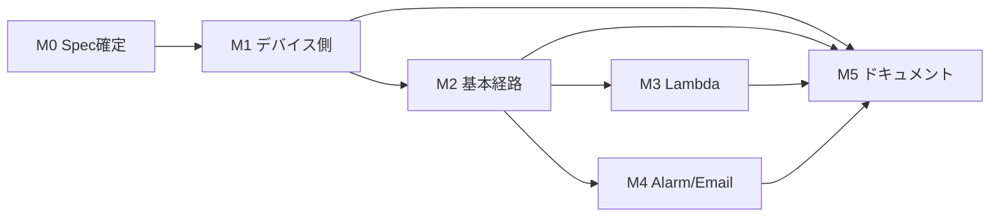

# 第3回ハンズオン 実装計画（tasks.md）

- **プロジェクト**: JAWS-UG IoT 専門支部 IoT Core ハンズオン 2026 / 第3回
- **配置先**: `scripts/session-03/specs/tasks.md`
- **前提文書**: `requirements.md`（R1〜R9）、`design.md`（D-1〜D-13、K-1〜K-10）
- **証跡**: `scripts/session-03/specs/verification-log.md`
- **ステータス**: Draft（レビュー待ち）

---

## 1. 進め方のルール

### 1.1 TDD サイクル（R7-1）

各実装タスクは以下の順で進める。タスクのチェックを付けられるのは Refactor まで終わった時点。

| フェーズ | やること |
| --- | --- |
| **Red** | 期待する振る舞いのテストを書き、**失敗することを確認**する（失敗内容もログに残す） |
| **Green** | テストが通る最小限の実装を書く |
| **Refactor** | 重複排除・命名整理。テストが通り続けることを確認 |

Red の失敗ログは M1・M3 の代表タスクについて `verification-log.md` に記録する（TDD で進めた証跡そのものになるため）。

### 1.2 記録のタイミング（R9）

`verification-log.md` への記録は**タスクの一部**として行う。後追いでまとめて書かない。

- ユニットテストで完結するタスク … マイルストーン単位で `pytest` 実行結果を 1 エントリ記録
- 実 AWS 環境を伴うタスク … **タスクごとに 1 エントリ**記録（実行コマンド・期待結果・実際の結果・判定・証跡パス）
- 証跡ファイルは `scripts/session-03/evidence/{マイルストーン}/` に保存し、AWS アカウント ID・証明書 ID・メールアドレスをマスクしてからコミット（R9-7）

### 1.3 ブランチ・コミット

- ブランチ: `feature/session-03`（マイルストーン単位で PR を切ってもよい）
- コミットメッセージ: `feat(session-03): ...` / `test(session-03): ...` / `docs(session-03): ...` / `fix(session-03): ...`
- Red 用のテストコミットと Green 用の実装コミットは分ける（TDD の履歴が追えるようにする）

### 1.4 マイルストーン概要

| ID | 内容 | 依存 | 規模目安 |
| --- | --- | --- | --- |
| M0 | Spec 確定・作業環境準備 | — | S |
| M1 | デバイス側の実装 | M0 | L |
| M2 | 基本経路の構築（Rules → CloudWatch Metrics） | M1 | M |
| M3 | アドバンス A（Lambda → CloudWatch Logs） | M2 | M |
| M4 | アドバンス B（Alarm → SNS → Email） | M2 | S |
| M5 | ドキュメント・リハーサル | M1〜M4 | L |

M3 と M4 は M2 完了後に並行実施可能。

---

## 2. タスク一覧

### M0：Spec 確定・作業環境準備

- [x] **0.1** `requirements.md` を作成し、レビュー指摘（CPU/メモリを 1 ルールに集約、デバイス側での状態確認）を反映する
  - _Requirements: R1〜R9 全体_
- [x] **0.2** `design.md` を作成し、未確定事項 Q1・Q3・Q4・Q5・Q6 を解消する
  - _Design: D-1〜D-13_
- [x] **0.3** `tasks.md`（本書）を作成し、全タスクをマイルストーンと要件に紐付ける
  - _Requirements: R9-1_
- [ ] **0.4** `verification-log.md` の雛形を作成する
  - エントリ形式（実施日時 JST / マイルストーン ID / タスク ID / 要件 ID / 実行コマンド / 期待結果 / 実際の結果 / 判定 / 証跡パス）をテンプレート化する
  - マイルストーンごとの受け入れ基準チェックリスト欄を用意する
  - Fail 時の再検証記録欄を用意する
  - _Requirements: R9-2, R9-3, R9-4, R9-5_
- [ ] **0.5** ディレクトリと開発環境を用意する
  - `scripts/session-03/{specs,tests,lambda,evidence}/`、`cfn/session-03/`、`docs/session-03/` を作成
  - `requirements-dev.txt` に `pytest` / `psutil` / `cfn-lint` / `pyyaml` を記載
  - ルート `.gitignore` に `scripts/session-03/certs/` と `.venv/` を追加
  - `pytest` が「テストが 0 件」で正常終了することを確認
  - _Requirements: R7-2, R7-8, NFR-6_
- [ ] **0.6** 残る未確定事項を決定する
  - **Q7**: `architecture.drawio.svg` を新規作成するか、`docs/session-02/architecture.drawio.svg` を流用改変するか → 3 経路を描く必要があるため**新規作成**を推奨。決定を本書に追記
  - **Q8**: Lambda ランタイムのバージョン（`design.md` は Python 3.13 を想定）を、着手時点の Lambda サポート状況で確認して確定
  - _Design: Q7, Q8_

**M0 の Definition of Done**
- 4 ドキュメント（requirements / design / tasks / verification-log）が揃い、要件 ID とタスク ID の対応が取れている（R9-1）
- `pytest` と `cfn-lint` が実行できる状態になっている

---

### M1：デバイス側の実装

#### metrics.py（純粋関数層）

- [ ] **1.1** `validate_percent()` を TDD で実装する
  - Red: 0〜100 のクランプ、小数第 1 位への丸め、範囲外・非数値で `ValueError` の 3 ケース
  - _Requirements: R1-4_ / _Design: 5.2_
- [ ] **1.2** `build_payload()` を TDD で実装する
  - Red: `deviceId` / `cpu` / `memory` / `timestamp` の 4 フィールドが期待する型で返ることを検証
  - 余計なフィールドを含まないことも検証（ペイロード仕様 4.1 節の固定）
  - _Requirements: R1-4_ / _Design: 4.1_
- [ ] **1.3** `read_cpu_percent()` を TDD で実装する
  - Red: `psutil.cpu_percent` をモックし、全コア平均が小数第 1 位に丸められて返ることを検証
  - _Requirements: R1-2_
- [ ] **1.4** `read_memory_percent()` を TDD で実装する
  - Red: `psutil.virtual_memory` をモックし、**`(total − available) / total × 100`** の定義で計算されることを検証（D-7）
  - `free` の `used` 定義との差異をコード内コメントに明記する（K-2）
  - _Requirements: R1-2_ / _Design: D-7, K-2_
- [ ] **1.5** `format_stdout_line()` を TDD で実装する
  - Red: JST 表記の時刻・`cpu=` / `memory=` を含む 1 行が返ることを検証
  - _Requirements: R1-5_

#### metrics_publisher.py（MQTT 送信層）

- [ ] **1.6** MQTT 接続と定期送信を実装する
  - 冒頭の `ENDPOINT` / `DEVICE_ID` を参加者が書き換える形式（第1回・第2回を踏襲）
  - `certs/` の 3 ファイルで TLS 相互認証、ポート 8883
  - `SEND_INTERVAL`（環境変数、既定 10）ごとに収集・送信・標準出力表示
  - 起動時に証明書ファイルの存在チェックを行い、無ければ期待するファイル名を示して終了
  - _Requirements: R1-1, R1-2, R1-3, R1-5_ / _Design: 5.2, D-6_
- [ ] **1.7** 異常系と終了処理を実装する
  - 取得失敗時は `[WARN]` を出して次周期へ（プロセス継続）
  - `reconnect_delay_set()` による自動再接続
  - `SIGINT` で `disconnect()` → `[EXIT]` 出力
  - _Requirements: R1-6, R1-7, R1-8_
- [ ] **1.8** `simulator.py` を実装する
  - 同一トピック・同一ペイロード形式
  - `--spike-after` / `--spike-duration` / `--spike-level` で高負荷区間を再現し、実機なしでもアドバンス B まで到達できるようにする
  - _Requirements: R1-9_ / _Design: 5.2_

#### load_gen.py（負荷生成）

- [ ] **1.9** パラメータ検証と上限クランプを TDD で実装する
  - Red: CPU `--target` が 1〜100 外で `ValueError`
  - Red: メモリ目標が総容量の 85% を超える場合にクランプされ、警告が出る
  - _Requirements: R2-6_ / _Design: 5.2, K-9_
- [ ] **1.10** duty cycle 計算を TDD で実装する
  - Red: 目標使用率とコア数から算出される duty 値が期待値になることを検証
  - _Requirements: R2-1_
- [ ] **1.11** CPU 負荷ワーカーを実装する
  - `multiprocessing` で `os.cpu_count()` 個のワーカーを起動し duty cycle 制御
  - テストではワーカー起動をモックし、**実際に負荷はかけない**（R7 の方針）
  - _Requirements: R2-1_ / _Design: 8.2_
- [ ] **1.12** メモリ負荷と解放を TDD で実装する
  - Red: `--duration` 経過後に確保済みバッファが解放されることを検証
  - 遅延割り当てを避けるため確保後に実際に書き込む
  - _Requirements: R2-2, R2-4_
- [ ] **1.13** 進捗表示・時刻表示・クリーンアップを TDD で実装する
  - Red: `SIGINT` 相当でクリーンアップ関数が呼ばれることを検証
  - Red: 開始時刻・終了予定時刻・実終了時刻が JST で出力されることを検証
  - 1 秒ごとに経過秒数と実測使用率を表示
  - `SIGINT` / `SIGTERM` / `finally` の三重で解放を保証
  - 既定 `--duration` を 180 秒にする（D-6）
  - _Requirements: R2-3, R2-5, R2-8_ / _Design: D-6_

#### デバイス側確認

- [ ] **1.14** `show_metrics.sh` を実装する
  - publisher と同一定義（D-7）で CPU / メモリを表示
  - `total` / `available` / `used`（free 表記）を併記し、定義の違いが目で分かるようにする
  - _Requirements: R2-9, R2-10_ / _Design: 5.2, K-2_
- [ ] **1.15** 実機で M1 の動作を確認し、証跡を記録する
  - `pytest` 全件成功のログを取得
  - 負荷生成中に `top` / `free -m` / `show_metrics.sh` / publisher 標準出力の 4 者を比較し、±10 ポイント以内で一致することを確認
  - `timedatectl` で時刻同期状態を確認（K-1 の前提確認）
  - **記録**: `verification-log.md` に M1 エントリを作成
  - _Requirements: R2-11, R7-9, R9-3_ / _Design: K-1, K-2_

**M1 の Definition of Done**
- R1・R2 に対応するユニットテストが全件成功（R7-9）
- 実機で 4 者の値が ±10 ポイント以内で一致することを確認済み
- `verification-log.md` に M1 エントリ（Red の失敗ログを含む）が記録済み

---

### M2：基本経路の構築（Rules → CloudWatch Metrics）

- [ ] **2.1** `test_templates.py` の骨格を作る（Red）
  - `cfn-lint` を `subprocess` 経由で呼ぶテストを書き、テンプレート未作成の状態で失敗することを確認
  - _Requirements: R6-9, R7-7_
- [ ] **2.2** `iot-rules-cloudwatch.yaml` に Thing・Policy・IAM ロールを実装する
  - `DeviceNumber`（`^[0-9]{3}$`、既定 `001`）と `MetricNamespace` をパラメータ化（D-8）
  - IoT ポリシーは `iot:Connect`（自 client ID）と `iot:Publish`（自トピック）に限定
  - IoT ルール用ロールは `cloudwatch:PutMetricData`（`cloudwatch:namespace` 条件付き）と Logs 書き込みのみ
  - ルールエラー用ロググループ（保持 3 日）を作成
  - _Requirements: R6-1, R6-2, R6-4, R6-6, R6-8, R3-8, NFR-6_ / _Design: 5.3, 6.1, 6.2, D-8_
- [ ] **2.3** TopicRule を実装する
  - `AwsIotSqlVersion: 2016-03-23`、`Sql: SELECT * FROM 'jawsug/session-03/+/metrics'`
  - **単一ルール内に `CloudwatchMetric` アクションを 2 つ**（CPU / メモリ）
  - `MetricName` は `CpuUtilization-${topic(3)}` 形式。**この文字列に `!Sub` を使わない**（K-3）
  - `MetricValue` は `${cast(cpu AS String)}` で明示キャスト（D-3）
  - `MetricTimestamp` は `${cast(timestamp AS String)}`
  - `ErrorAction` に `CloudwatchLogs` を設定
  - ルール名が `^[a-zA-Z0-9_]+$` を満たすこと（K-4）
  - _Requirements: R3-1, R3-2, R3-3, R3-4, R3-5, R3-7_ / _Design: 4.2, D-1, D-2, D-3, K-3, K-4_
- [ ] **2.4** Outputs を実装する
  - `ThingName` / `MetricsTopic` / `RuleName` / `MetricNamespace` / `CpuMetricName` / `MemoryMetricName` / `MetricsConsoleUrl` / `RuleErrorLogGroupName`
  - _Requirements: R6-5_ / _Design: 5.3_
- [ ] **2.5** テンプレート検証テストを追加して Green にする
  - `cfn-lint` 合格 / アクション数 2 / SQL バージョン / ルール名の文字種 / `ErrorAction` の存在 / 必須 Outputs の存在
  - _Requirements: R3-2, R3-3, R3-7, R6-5, R6-9, R7-7_
- [ ] **2.6** 実環境にデプロイし、証明書を発行する
  - `aws cloudformation validate-template` を実行
  - スタック作成が 5 分以内に `CREATE_COMPLETE` になることを計測
  - 証明書を手動発行し、ポリシーをアタッチ（第2回と同じ制約）
  - **記録**: verification-log に 1 エントリ
  - _Requirements: R6-7, R6-8_
- [ ] **2.7** メトリクスの到達を確認する
  - `metrics_publisher.py` を起動し、送信から 3 分以内にコンソールでメトリクスが出現することを確認
  - メトリクス名が `CpuUtilization-raspi-001` になっていること（置換テンプレートの評価確認）
  - `MetricValue` の明示キャストが機能していること（ErrorAction ログが空であること）
  - **記録**: verification-log に 1 エントリ
  - _Requirements: R3-6_ / _Design: D-1, D-2, D-3_
- [ ] **2.8** 負荷生成でグラフの変化を確認する
  - `load_gen.py cpu --target 90 --duration 180` を実行
  - グラフの期間を **1 分**、統計を平均に設定し、台形の変化が視認できることを確認
  - 平常値との差が 30 ポイント以上あることを確認
  - **記録**: verification-log に 1 エントリ（グラフのスクリーンショットを `evidence/m2/` に保存）
  - _Requirements: R2-7_ / _Design: 4.3, D-6_
- [ ] **2.9** 3 点セットの突き合わせを行う
  - 負荷開始から 1 分以上経過した定常区間で、**デバイス実測値（`show_metrics.sh`）／publisher 送信値／CloudWatch 値**を同一時刻で比較
  - 差分が ±5 ポイント以内であることを確認
  - **記録**: verification-log に 3 点セットの表として記録
  - _Requirements: R2-12, R9-4_ / _Design: 4.3_
- [ ] **2.10** スタック削除が正常に完了することを確認する
  - 証明書のデタッチ・無効化・削除 → スタック削除の順で実行できることを確認（`teardown.sh` の元ネタになる）
  - **記録**: verification-log に 1 エントリ
  - _Requirements: R8-8_

**M2 の Definition of Done**
- R3・R6 のテンプレート検証テストが全件成功
- CloudWatch グラフに負荷の変化が描画され、3 点セットが ±5 ポイント以内で一致
- スタックの作成と削除が両方成功
- verification-log に M2 の全エントリ（2.6〜2.10）が記録済み

---

### M3：アドバンス A（Lambda → CloudWatch Logs）

- [ ] **3.1** `test_metrics_logger.py` を書く（Red）
  - 正常イベントで `level=INFO` の JSON 1 行
  - `cpu` 欠落時に `level=WARN` で例外を出さない
  - `cpu` が文字列など不正型でも異常終了しない
  - 出力が `json.loads()` でパースできる
  - _Requirements: R4-2, R4-4, R4-6, R7-5_
- [ ] **3.2** `lambda/metrics_logger.py` を実装して Green にする
  - `normalize_record()` / `has_required_fields()` / `handler()`
  - 構造化ログ形式は `design.md` 5.3 節の JSON に従う
  - 想定外例外はログに記録して再スロー（ErrorAction を発火させる）
  - _Requirements: R4-2, R4-4_ / _Design: 5.3, 7_
- [ ] **3.3** `advanced-lambda.yaml` を実装する
  - ロググループを明示作成（保持 3 日）→ 関数 → ルール → `AWS::Lambda::Permission` の順で定義
  - **Lambda アクションの権限は IoT ルールのロールではなく Lambda のリソースベースポリシー**で与える（`Principal: iot.amazonaws.com`、`SourceArn` にルール ARN）
  - SQL は `SELECT deviceId, cpu, memory, timestamp, topic() AS topic, timestamp() AS receivedAtMs FROM 'jawsug/session-03/+/metrics'`
  - ランタイムは Q8 の決定に従う
  - Lambda 実行ロールはログ書き込みのみ
  - `Export` / `ImportValue` を使わず `DeviceNumber` パラメータで名前を組み立てる（D-5）
  - _Requirements: R4-1, R4-3, R4-5, R4-7, R6-1, R6-2_ / _Design: 5.3, D-5, D-10_
- [ ] **3.4** `test_lambda_inline_sync.py` を実装する
  - テンプレートのインラインコードが `lambda/metrics_logger.py` と一致することを検証（D-10）
  - `cfn-lint` 合格をテストに追加
  - _Requirements: R6-9, R7-7_ / _Design: D-10_
- [ ] **3.5** 実環境にデプロイして Logs を確認する
  - スタック作成 → 送信 → CloudWatch Logs にレコードが出ることを確認
  - Logs Insights のクエリ（`design.md` 5.3 節）でレコードを検索できることを確認
  - ロググループの保持期間が 3 日になっていることを確認
  - **記録**: verification-log に 1 エントリ
  - _Requirements: R4-3, R4-5, R4-6_
- [ ] **3.6** 2 本のルールが独立に動作することを確認する
  - 基本ルールと Lambda ルールが同一メッセージに対して両方発火していることを確認
  - Lambda を意図的に失敗させ（例：一時的に権限を外す）、基本ルール側の CloudWatch Metrics 送信が継続することを確認
  - **記録**: verification-log に 1 エントリ
  - _Requirements: R4-8_ / _Design: 7_
- [ ] **3.7** 欠落フィールドの挙動を実環境で確認する
  - `cpu` を含まないメッセージを手動 publish（MQTT テストクライアント）し、Lambda が `WARN` で継続することを確認
  - **記録**: verification-log に 1 エントリ
  - _Requirements: R4-4_

**M3 の Definition of Done**
- R4 のユニットテストとインライン同期テストが全件成功
- Logs Insights でレコードを検索できる
- 2 本のルールの独立動作を確認済み
- verification-log に M3 の全エントリが記録済み

---

### M4：アドバンス B（Alarm → SNS → Email）

- [ ] **4.1** `advanced-alarm.yaml` を実装する
  - パラメータ: `DeviceNumber` / `NotificationEmail`（`AllowedPattern` でメール形式を検証、`NoEcho` は使わない）/ `CpuAlarmThreshold`（80）/ `AlarmPeriodSeconds`（60）/ `AlarmEvaluationPeriods`（1）/ `EnableOkNotification`（true）
  - SNS トピックに `DisplayName: JAWSUG-IoT-Handson` を設定
  - Alarm は `CpuUtilization-raspi-{n}` を対象、統計は平均、`TreatMissingData: notBreaching`
  - `Conditions` + `Fn::If` で `OKActions` を切り替え
  - Outputs に `AlarmTopicArn` / `AlarmName` / `AlarmConsoleUrl` / 承認リマインド
  - _Requirements: R5-1, R5-3, R5-6, R5-7, R6-4, R6-5, NFR-7_ / _Design: 5.3, D-11, D-13_
- [ ] **4.2** テンプレート検証テストを追加する
  - `cfn-lint` 合格 / `TreatMissingData` の明示 / `Period` が 60 以上 / メールの `AllowedPattern` の存在 / 必須 Outputs
  - _Requirements: R5-6, R6-5, R6-9, R7-7_ / _Design: 4.3_
- [ ] **4.3** デプロイしてサブスクリプションを承認する
  - スタック作成中に確認メールが届くことを確認（差出人 `no-reply@sns.amazonaws.com`、迷惑メールフォルダも確認）
  - 承認後、SNS コンソールでステータスが `Confirmed` になることを確認
  - **CloudFormation が承認を待たずに `CREATE_COMPLETE` になる**ことを実際に確認し、記録に残す（K-6 の裏付け）
  - **記録**: verification-log に 1 エントリ（メールアドレスはマスク）
  - _Requirements: R5-2, R9-7_ / _Design: D-13, K-6_
- [ ] **4.4** アラーム発火とメール受信を確認する
  - `load_gen.py cpu --target 90 --duration 180` を実行
  - Alarm が `OK` → `ALARM` に遷移することを確認（履歴タブ）
  - 5 分以内にメールが届くことを確認
  - 負荷終了後に `ALARM` → `OK` へ戻り、復旧通知が届くことを確認
  - **記録**: verification-log に 1 エントリ（発火までの所要時間を計測）
  - _Requirements: R5-4, R5-5, R5-7, R5-8_
- [ ] **4.5** しきい値・期間の既定値を最終確定する（Q2）
  - 4.4 の実測をもとに、確実に発火し誤発火しない値を確定
  - 送信を止めた状態で誤発火しないこと（`TreatMissingData: notBreaching` の効果）を確認
  - 必要なら `design.md` と `requirements.md` R5-3 の既定値を更新
  - **記録**: verification-log に 1 エントリ
  - _Requirements: R5-3, R5-6, R5-8_ / _Design: Q2, 4.3_
- [ ] **4.6** スタック再作成時の再承認を確認する
  - スタックを削除して再作成し、確認メールが再送されて再承認が必要になることを確認
  - ハマりポイント表に載せる文言を確定
  - **記録**: verification-log に 1 エントリ
  - _Design: K-6_

**M4 の Definition of Done**
- R5 のテンプレート検証テストが全件成功
- 実際にメールが届き、復旧通知も確認済み
- しきい値・期間の既定値が実測に基づいて確定
- verification-log に M4 の全エントリが記録済み

---

### M5：ドキュメント・リハーサル

- [ ] **5.1** `docs/session-03/architecture.drawio.svg` を作成する（Q7）
  - 基本・アドバンス A・アドバンス B の 3 経路を 1 枚で表現
  - 図中の番号（①②③…）を手順書の記述と対応させる（第2回と同じ方式）
  - _Requirements: R8-2_ / _Design: 3.1, Q7_
- [ ] **5.2** `handson.md` の骨格を作る
  - 第2回の構成（ゴール／進め方／所要時間／学習内容／AWS 側設定／実装／動作確認／ハマりポイント／発展課題／後片付け）に準拠
  - 所要時間の内訳と合計 90 分を記載
  - 東京リージョン前提で統一
  - _Requirements: R8-1, R8-3, R8-5_
- [ ] **5.3** 学習内容セクションを書く
  - Rules の構成要素（SQL・トピックフィルター・アクション）
  - **`cloudwatchMetric` では SELECT の内容が結果に影響しないが、Lambda アクションでは SELECT の出力がそのままイベントになる**という対比（Rules 理解の核心）
  - Dimension が使えない制約と、その回避策として Lambda 経由がある、というつなぎ
  - _Requirements: G1, G3, R8-1_ / _Design: 4.2, 5.3_
- [ ] **5.4** 基本編の手順を書く
  - CloudFormation でのスタック作成、証明書の手動発行、Endpoint 取得
  - スクリプトの設定書き換え、scp での転送、venv セットアップ、実行
  - CloudWatch でのメトリクス確認（**期間を 1 分に変更する操作を明示**）
  - _Requirements: R8-1, R6-8_ / _Design: 4.3, 5.3_
- [ ] **5.5** 「デバイス側での確認」セクションを独立した節として書く
  - `requirements.md` の確認コマンド一覧を掲載（追加インストール不要／任意を区別）
  - `top` と `free -m` を主軸、`show_metrics.sh` で定義の差を解消
  - **`free` の `used` と `available` の違い**を説明（K-2）
  - 「負荷をかける → デバイス側で確認 → CloudWatch で確認 → 突き合わせる」の流れで記述
  - 並行実行の手段（SSH 2 セッション / `tmux` / `nohup ... &`）を記載
  - _Requirements: R2-9, R2-10, R2-13, R2-14, R8-6_ / _Design: 5.2, K-2_
- [ ] **5.6** アドバンス A / B の手順を書く
  - A: スタック作成 → 送信 → Logs Insights でのクエリ
  - B: スタック作成 → **承認 → `Confirmed` 確認 → その後に負荷生成**の順序を厳守して記述（K-6）
  - 企業メールのフィルタ注意と個人アドレス推奨（K-10）
  - _Requirements: R4-6, R5-2, R8-1_ / _Design: D-13, K-6, K-10_
- [ ] **5.7** ハマりポイント表を作る
  - 症状・原因・対処の 3 列
  - M1〜M4 で実際に遭遇した事象を必ず反映する
  - 最低限含める項目: 時刻ずれ（K-1）／`free` と CloudWatch の値が合わない（K-2）／ルール名にハイフン（K-4）／メトリクスが表示されない（期間 5 分のまま）／メールが来ない（未承認・迷惑メール・打ち間違い・再作成後の再承認）／`externally-managed-environment`／証明書パス誤り／ポリシー未アタッチ
  - _Requirements: R8-4_ / _Design: 9_
- [ ] **5.8** `teardown.sh` を実装し、後片付けセクションを書く
  - 削除対象の一覧表示と `y/N` 確認
  - 証明書デタッチ・無効化・削除 → アドバンス B → アドバンス A → 基本の順でスタック削除（存在するものだけ）
  - ローカル `certs/` 削除
  - 残存確認結果の表示
  - **CloudWatch Metrics には削除 API がなく保持期間経過で消える**ことを出力で明示
  - `DEVICE_NUMBER=001 bash teardown.sh` で実行できることを確認
  - _Requirements: R8-7, R8-8, R8-9_ / _Design: 5.4_
- [ ] **5.9** ルート `README.md` を更新する
  - 第3回の行を `T.B.D.` から `docs/session-03/handson.md` へのリンクに変更
  - ディレクトリ構成図に session-03 配下の各ファイルを追記
  - connpass のイベントページ URL が確定していれば反映
  - _Requirements: R8-6（README 部分）_
- [ ] **5.10** 通し実行リハーサルを行う
  - 手順書だけを見て、まっさらな状態から基本編＋アドバンス編を通し実行
  - パートごとの所要時間を計測し、90 分に収まるか確認
  - 詰まった箇所を手順書とハマりポイント表に反映
  - `teardown.sh` で全リソースが消えることを確認
  - **記録**: verification-log に M5 エントリ（所要時間の内訳表を含む）
  - _Requirements: NFR-4, R9-8_
- [ ] **5.11** 最終確認
  - `pytest` 全件成功、`cfn-lint` 全テンプレート合格
  - `verification-log.md` の全マイルストーンが Pass で埋まっている
  - `evidence/` 内の証跡にアカウント ID・証明書 ID・メールアドレスが残っていないことを確認
  - `certs/` がコミットされていないことを確認
  - _Requirements: R7-9, R9-5, R9-7, NFR-6, NFR-12_

**M5 の Definition of Done**
- 手順書・構成図・README が揃い、通し実行が 90 分以内で完了
- `teardown.sh` で全リソースが削除できる
- `verification-log.md` の全エントリが Pass、機微情報のマスキング済み

---

## 3. タスク⇔要件トレーサビリティ

| 要件 | 対応タスク |
| --- | --- |
| R1 デバイス送信 | 1.1〜1.8 |
| R2 負荷生成／デバイス側確認 | 1.9〜1.15、2.8、2.9、5.5 |
| R3 Rules → CloudWatch Metrics | 2.1〜2.9 |
| R4 Rules → Lambda → Logs | 3.1〜3.7、5.6 |
| R5 Alarm → SNS → Email | 4.1〜4.6、5.6 |
| R6 CloudFormation | 2.2〜2.6、3.3、3.4、4.1、4.2 |
| R7 TDD | 0.5、1.1〜1.13、2.1、2.5、3.1、3.4、4.2、5.11 |
| R8 ドキュメント | 5.1〜5.9 |
| R9 マイルストーン・証跡 | 0.3、0.4、1.15、2.6〜2.10、3.5〜3.7、4.3〜4.6、5.10、5.11 |
| NFR-4 所要時間 | 5.10 |
| NFR-5 コスト | 2.2（保持期間）、3.3（保持期間）、5.8（teardown） |
| NFR-6 / NFR-7 セキュリティ | 0.5、2.2、4.1、5.11 |
| NFR-12 品質 | 5.11 |

---

## 4. 依存関係

クリティカルパスは **M0 → M1 → M2 → M5**。M3 と M4 は M2 完了後に並行できるため、時間が押した場合はここを圧縮する。

---

## 5. リスクと対応（進行上のもの）

| リスク | 兆候 | 対応 |
| --- | --- | --- |
| 置換テンプレートが期待どおり評価されない（D-3・K-3） | 2.7 でメトリクスが出ない、ErrorAction ログにエラー | 手動で `aws iot-data publish` して切り分け。最終手段として `MetricName` を `!Sub` による静的名に切り替え（デバイス分離は `DeviceNumber` で担保） |
| Raspberry Pi の時刻ずれ（K-1） | メトリクスが表示されない、時間軸がずれる | `MetricTimestamp` を外して取り込み時刻を使う手順を代替として用意しておく |
| 3 点セットが ±5 ポイントに収まらない（2.9） | 定常区間でも乖離 | 統計を最大に変更、または許容差を実測に基づいて `requirements.md` R2-12 側で見直す（設計の破綻ではなく閾値の調整と切り分ける） |
| 通し実行が 90 分を超える（5.10） | リハーサルで超過 | アドバンス A / B を「発展課題（時間が余ったら）」扱いに落とし、基本編 60 分を死守する |
| Lambda ランタイムのサポート状況変化（Q8） | 3.3 でデプロイ失敗 | 着手時に Lambda のサポート状況を確認して確定 |

---

## 6. 決定待ち事項

| ID | 内容 | 期限 |
| --- | --- | --- |
| Q7 | 構成図を新規作成するか流用改変するか（新規作成を推奨） | 0.6 |
| Q8 | Lambda ランタイムのバージョン | 0.6 / 3.3 着手時 |
| — | connpass イベントページ URL | 5.9 |
