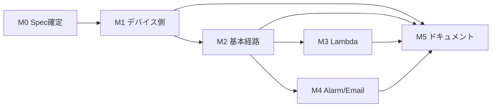

# 第3回ハンズオン 実装計画（tasks.md）

- **プロジェクト**: JAWS-UG IoT 専門支部 IoT Core ハンズオン 2026 / 第3回
- **配置先**: `scripts/session-03/specs/tasks.md`
- **前提文書**: `requirements.md`（R1〜R9）、`design.md`（D-1〜D-13、K-1〜K-10）
- **証跡**: `scripts/session-03/spec/verification-log.md`
- **ステータス**: 実装進行中（最終更新 2026-08-08）

---

## 0. 進捗サマリ（2026-08-14 時点）

**当日運用できる状態に到達。** 実機（Raspberry Pi）と実 AWS 環境で全経路を通し確認済み。

| マイルストーン | 進捗 | 状態 |
| --- | --- | --- |
| M0 Spec 確定・環境準備 | 6 / 6 | ✅ **完了** |
| M1 デバイス側の実装 | 15 / 15 | ✅ **完了**（実機検証済み） |
| M2 基本経路の構築 | 10 / 10 | ✅ **完了**（K-3 / D-3 を実行時に実証） |
| M3 アドバンス A（Lambda） | 6 / 7 | ✅ **完了**（3.7 のみ実環境検証を省略） |
| M4 アドバンス B（Alarm） | 5 / 6 | ✅ **完了**（4.6 は検証不要と判断） |
| M5 ドキュメント・リハーサル | 10 / 11 | ✅ **ほぼ完了**（5.10 の形式的な時間計測のみ未実施） |

**検証結果**: `pytest` **102 件すべて Pass** / `cfn-lint` **3 テンプレート合格** / `shellcheck` 指摘 0 件

### 到達点

| 項目 | 結果 |
| --- | --- |
| 手順書 | `docs/session-03/handson.md`（**全セクション実地確認済み**・画面名と出力例は実測値） |
| 構成図 | `architecture-v2.svg` / `.drawio`（オーナー作成） |
| 最大の技術リスク（K-3 / D-3） | ✅ **解消**。`${topic(3)}` が実行時に `raspi-001` へ展開されることを実証 |
| Basic Course | ✅ メトリクス到達・グラフの台形（差分 88.62 ポイント）・3 点セット（差分 0.25 ポイント） |
| Advanced Course1 | ✅ Lambda 起動・構造化ログ・ログ分析での検索 |
| Advanced Course2 | ✅ アラーム発火（約 2 分）・メール受信・復旧通知 |
| 後片付け | ✅ 3 スタック削除。**中断→再実行の冪等性を CloudTrail で実証** |
| 所要時間 | ✅ 見立て **60 分**（NFR-4 の 90 分以内） |
| 機微情報 | ✅ 全走査済み。混入していた実エンドポイントは履歴からも除去（F-13） |

### 発見・修正した不具合（14 件）

ウォークスルーで見つかったもの。**うち 5 件（F-3d / F-3e / F-8 / F-9 / F-13）は静的検証を通過していた**。

| # | 内容 |
| --- | --- |
| F-1 | ロググループ名がデバイス番号を含まず共有アカウントで衝突 |
| F-2 | 負荷生成の目標値と実測値の乖離（実機では発生せず・実装変更なし） |
| F-3d | アタッチしていない証明書を検出できず孤児が残る |
| F-3e | **UTF-8 ロケールで削除対象一覧が文字化けしスタック名が消える**（R8-9 が実質機能せず） |
| F-3f | Thing が無くても「削除完了」と誤表示 |
| F-3g | 再実行時に削除済みの証明書を「孤児かも」と警告 |
| F-4 | `show_metrics.sh` が未実行だった（実機で正常動作を確認） |
| F-8 | `show_metrics.sh` が OS の TZ で時刻を取りラベルだけ「JST」固定 |
| F-9 | 負荷終了時に大量のトレースバック（子がシグナルハンドラを継承） |
| F-10 | Lambda 権限とルールの作成順序（権限付与前に発火する窓） |
| F-11 | `paho-mqtt` の DeprecationWarning |
| F-13 | **実 IoT エンドポイントが公開リポジトリにコミットされていた** |

### 残っている作業

| 項目 | 状態 |
| --- | --- |
| 手順書冒頭の「運営向けメモ」ブロックの削除 | 公開前に実施 |
| 5.10 のパート別時間計測 | 任意（90 分以内は満たす見込み） |
| 3.7（欠落フィールドの実環境検証） | 省略（ユニットテストとインライン実行で代替） |
| GitHub 上で旧コミット URL が 404 か目視確認 | force push 後の確認 |

### ⚠️ 2026-08-13 の前提変更（重要）

**リモート参加はなく、参加者全員が会場で貸出 Raspberry Pi（実機）を操作する。**

| 影響 | 内容 |
| --- | --- |
| ~~R1-9~~ | **削除**：シミュレーター提供は参加者向け要件ではなくなった |
| ~~NFR-9~~ | **削除**：可搬性（実機なしでの完走）は要件から外れた |
| `simulator.py` | 削除はせず**運営用の予備**に降格（当日の実機故障時のバックアップ／実機なしでの AWS 経路検証）。**手順書には載せない** |
| K-8 | 会場 Wi-Fi で 8883 が通らない場合の「PC で代替」という逃げ道が無くなった。**運営側で予備の Raspberry Pi を用意する**方針を追記 |
| 手順書 | 「リモート参加」「実機なし」「会場参加のみ」の記述をすべて削除 |

### ⚠️ 2026-08-13 の方針決定：手順書は UI 操作を主とする（D-14 / R8-10〜12）

参加者向けの `handson.md` は **マネジメントコンソール（UI）の操作を主たる手順**とする。
AWS CLI は必須手順にせず、値の確認や自動化したい人向けの補足に留める。

| 項目 | 方針 |
| --- | --- |
| スタック作成 | コンソールで**テンプレートをアップロード**して作成（IaC は維持したまま操作は UI） |
| 証明書の発行・アタッチ | コンソール（IoT Core → モノ → 証明書タブ） |
| Endpoint 取得 | コンソール（IoT Core → 接続 → ドメイン設定） |
| メトリクス確認 | コンソール（CloudWatch → メトリクス、**期間を 1 分に変更**） |
| Logs Insights | コンソール |
| CLI の扱い | 補足として併記する場合は「必須ではない」と明示する |

> **検証手段とは分けて考える**（design.md 8.3 節）。
> 開発者の結合検証で CLI を使うのは構わないが、**手順書に書くのは UI 操作**。
> リソースの作成手段が違っても出来上がるものは同じなので機能検証の結果は流用できるが、
> **画面手順の妥当性はコンソールで別途通す**必要がある（5.10 のリハーサルで担保）。

### コース名の対応（図を正とする）

構成図（`architecture-v2.svg`）はコース名で表現している。**参加者向けの `handson.md` は図のコース名に統一**し、
**spec 内部（本書・requirements・design）と CFN テンプレート名は従来の ID を維持**する（トレーサビリティのため）。

| 図・手順書（参加者向け） | spec 内部の ID | CFN テンプレート |
| --- | --- | --- |
| **Basic Course**（CloudWatch Metrics でデバイスの振る舞いを確認する） | 基本 | `iot-rules-cloudwatch.yaml` |
| **Advanced Course1**（様々な AWS サービスと連携する） | アドバンス A | `advanced-lambda.yaml` |
| **Advanced Course2**（自動連携する） | アドバンス B | `advanced-alarm.yaml` |

### 開催前チェックリスト

| 項目 | 備考 |
| --- | --- |
| `handson.md` 冒頭の「運営向けメモ」ブロックを削除 | 参加者向けには不要 |
| AWS コンソールの画面名が変わっていないか確認 | **2026 年に CloudWatch が刷新済み**（「クラシックメトリクス」「ログ管理」「ログ分析」）。UI 主体の手順書（D-14）の構造的な弱点 |
| 貸出 Raspberry Pi のタイムゾーンを `Asia/Tokyo` に設定 | 初期値が `Europe/London` の機体がある（F-8 の発端） |
| 予備の Raspberry Pi を用意 | K-8（会場 Wi-Fi で 8883 が通らない）の逃げ道が無いため |
| 参加者にフィルタの緩いメールアドレスを案内 | Advanced Course2 の承認メール（K-10） |

### ⚠️ 積み残し（当日運用には影響しない）

| 項目 | 内容 |
| --- | --- |
| R7-1（TDD の Red → Green 順序） | M1・M3 の実装分は**未遵守**（実装とテストを同時に作成したため Red の失敗ログがない）。M2-F1 以降の修正では遵守し、Red ログを証跡として保存している |
| 送信停止中の誤発火 | `TreatMissingData: notBreaching` は設定済みで誤発火も観測されなかったが、**狙って検証していない** |
| 3.7 の実環境検証 | 欠落フィールド時に Lambda が WARN で継続することは、ユニットテストとインラインコードの直接実行で確認済み。実環境での手動 publish は省略 |
| 故障注入（3.6 の一部） | 「Lambda を意図的に失敗させて基本ルールが継続すること」は未実施。正常系の並走のみ確認 |
| F-7 | 4 文書のヘッダーが配置先を `specs/` と記載（実体は `spec/`） |

## 1. 進め方のルール

### 1.1 TDD サイクル（R7-1）

各実装タスクは以下の順で進める。タスクのチェックを付けられるのは Refactor まで終わった時点。

| フェーズ | やること |
| --- | --- |
| **Red** | 期待する振る舞いのテストを書き、**失敗することを確認**する（失敗内容もログに残す） |
| **Green** | テストが通る最小限の実装を書く |
| **Refactor** | 重複排除・命名整理。テストが通り続けることを確認 |

Red の失敗ログは M1・M3 の代表タスクについて `verification-log.md` に記録する（TDD で進めた証跡そのものになるため）。

### 1.2 記録のタイミング（R9）

`verification-log.md` への記録は**タスクの一部**として行う。後追いでまとめて書かない。

- ユニットテストで完結するタスク … マイルストーン単位で `pytest` 実行結果を 1 エントリ記録
- 実 AWS 環境を伴うタスク … **タスクごとに 1 エントリ**記録（実行コマンド・期待結果・実際の結果・判定・証跡パス）
- 証跡ファイルは `scripts/session-03/evidence/{マイルストーン}/` に保存し、AWS アカウント ID・証明書 ID・メールアドレスをマスクしてからコミット（R9-7）

### 1.3 ブランチ・コミット

- ブランチ: `feature/session-03`（マイルストーン単位で PR を切ってもよい）
- コミットメッセージ: `feat(session-03): ...` / `test(session-03): ...` / `docs(session-03): ...` / `fix(session-03): ...`
- Red 用のテストコミットと Green 用の実装コミットは分ける（TDD の履歴が追えるようにする）

### 1.4 マイルストーン概要

| ID | 内容 | 依存 | 規模目安 |
| --- | --- | --- | --- |
| M0 | Spec 確定・作業環境準備 | — | S |
| M1 | デバイス側の実装 | M0 | L |
| M2 | 基本経路の構築（Rules → CloudWatch Metrics） | M1 | M |
| M3 | アドバンス A（Lambda → CloudWatch Logs） | M2 | M |
| M4 | アドバンス B（Alarm → SNS → Email） | M2 | S |
| M5 | ドキュメント・リハーサル | M1〜M4 | L |

M3 と M4 は M2 完了後に並行実施可能。

---

## 2. タスク一覧

### M0：Spec 確定・作業環境準備

- [x] **0.1** `requirements.md` を作成し、レビュー指摘（CPU/メモリを 1 ルールに集約、デバイス側での状態確認）を反映する
  - _Requirements: R1〜R9 全体_
- [x] **0.2** `design.md` を作成し、未確定事項 Q1・Q3・Q4・Q5・Q6 を解消する
  - _Design: D-1〜D-13_
- [x] **0.3** `tasks.md`（本書）を作成し、全タスクをマイルストーンと要件に紐付ける
  - _Requirements: R9-1_
- [x] **0.4** `verification-log.md` の雛形を作成する
  - エントリ形式（実施日時 JST / マイルストーン ID / タスク ID / 要件 ID / 実行コマンド / 期待結果 / 実際の結果 / 判定 / 証跡パス）をテンプレート化する
  - マイルストーンごとの受け入れ基準チェックリスト欄を用意する
  - Fail 時の再検証記録欄を用意する
  - _Requirements: R9-2, R9-3, R9-4, R9-5_
- [x] **0.5** ディレクトリと開発環境を用意する
  - `scripts/session-03/{spec,tests,lambda,evidence}/`、`cfn/session-03/`、`docs/session-03/` を作成 ✅
  - `requirements-dev.txt` に `pytest` / `psutil` / `cfn-lint` / `pyyaml` を記載 ✅
  - ルート `.gitignore` は既に `certs/` と `.venv/` をカバー済み（`git check-ignore` で確認）✅
  - ⚠️ 「`pytest` が 0 件で正常終了」は未経由（実装とテストを同時に進めたため）。`--collect-only` での動作確認に代替
  - _Requirements: R7-2, R7-8, NFR-6_ / **証跡: `evidence/m0/0.5-env-setup.txt`（M0-1）**
- [x] **0.6** 残る未確定事項を決定する
  - **Q7**: → **新規作成**で確定（3 経路を 1 枚で表現する必要があるため）
  - **Q8**: → **`python3.13`** で暫定確定。テンプレートに記載済み。⚠️ **実デプロイでのサポート確認は 3.5 待ち**
  - _Design: Q7, Q8_

**M0 の Definition of Done** → ✅ **達成**
- [x] 4 ドキュメント（requirements / design / tasks / verification-log）が揃い、要件 ID とタスク ID の対応が取れている（R9-1）
- [x] `pytest`（9.1.1）と `cfn-lint`（1.54.0）が実行できる状態になっている

---

### M1：デバイス側の実装

#### metrics.py（純粋関数層）

> ⚠️ **M1 実装タスク共通の注記**: 1.1〜1.13 は実装とテストを同一セッションで作成したため、
> **Red 先行の順序（R7-1）を踏んでいない**。テスト内容・結果は Pass（49 件）だが、Red の失敗ログは存在しない。
> 詳細は `verification-log.md` の M1-UT「TDD 順序の逸脱」を参照。

- [x] **1.1** `validate_percent()` を実装する（⚠️ Red 未経由）
  - 0〜100 のクランプ、小数第 1 位への丸め、範囲外・非数値で `ValueError`
  - 追加: `NaN` / `Inf` も `ValueError` にした（テスト 11 件）
  - _Requirements: R1-4_ / _Design: 5.2_
- [x] **1.2** `build_payload()` を実装する（⚠️ Red 未経由）
  - `deviceId` / `cpu` / `memory` / `timestamp` の 4 フィールドが期待する型で返ることを検証済み
  - 余計なフィールドを含まないことも検証済み（テスト 7 件）
  - _Requirements: R1-4_ / _Design: 4.1_
- [x] **1.3** `read_cpu_percent()` を実装する（⚠️ Red 未経由）
  - `psutil.cpu_percent` をモックしたテスト 2 件で丸めを検証済み
  - _Requirements: R1-2_
- [x] **1.4** `read_memory_percent()` を実装する（⚠️ Red 未経由）
  - `psutil.virtual_memory().percent`（＝ `(total − available) / total × 100`）を使用（D-7）
  - `free` の `used` 定義との差異をコード内コメントに明記済み（K-2）
  - _Requirements: R1-2_ / _Design: D-7, K-2_
- [x] **1.5** `format_stdout_line()` を実装する（⚠️ Red 未経由）
  - JST 表記の時刻・`cpu=` / `memory=` を含む 1 行を返すことを検証済み（テスト 5 件）
  - _Requirements: R1-5_

#### metrics_publisher.py（MQTT 送信層）

- [x] **1.6** MQTT 接続と定期送信を実装する
  - 冒頭の `ENDPOINT` / `DEVICE_ID` を参加者が書き換える形式（第1回・第2回を踏襲）✅
  - `certs/` の 3 ファイルで TLS 相互認証、ポート 8883 ✅
  - `SEND_INTERVAL`（環境変数、既定 10）ごとに収集・送信・標準出力表示 ✅
  - 起動時に証明書ファイルの存在チェックを行い、無ければ期待するファイル名を示して終了 ✅
  - ⚠️ **実際の MQTT 接続・送信は未検証**（実機・実 AWS 環境が必要。タスク 1.15 / 2.7）
  - _Requirements: R1-1, R1-2, R1-3, R1-5_ / _Design: 5.2, D-6_
- [x] **1.7** 異常系と終了処理を実装する
  - 取得失敗時は `[WARN]` を出して次周期へ（プロセス継続）✅
  - `reconnect_delay_set(min_delay=1, max_delay=60)` による自動再接続 ✅
  - `SIGINT` / `SIGTERM` で `disconnect()` → `[EXIT]` 出力 ✅
  - ⚠️ **再接続の実挙動（R1-7）は未検証**（切断を起こす実環境が必要）
  - _Requirements: R1-6, R1-7, R1-8_
- [x] **1.8** `simulator.py` を実装する → 🔄 **2026-08-13 に位置付け変更（運営用の予備へ降格）**
  - 同一トピック・同一ペイロード形式 ✅
  - `--spike-after` / `--spike-duration` / `--spike-level` で高負荷区間を再現 ✅
  - ⚠️ **実 AWS 環境への送信は未検証**
  - 🔄 **前提変更**：全員が会場で実機を操作する前提に確定したため、**参加者向けの提供物ではなくなった**
    （~~R1-9~~ / ~~NFR-9~~ は削除）。当日の実機故障時のバックアップ、および実機なしで AWS 側の経路を
    検証する用途に限定し、**手順書には記載しない**
  - _Requirements: ~~R1-9~~（削除）_ / _Design: 5.2（位置付けを更新）_

#### load_gen.py（負荷生成）

- [x] **1.9** パラメータ検証と上限クランプを実装する（⚠️ Red 未経由）
  - CPU `--target` が 1〜100 外で `ValueError` ✅（テスト 7 件）
  - メモリ目標が総容量の 85% を超える場合にクランプされ警告が出る ✅（テスト 5 件）
  - _Requirements: R2-6_ / _Design: 5.2, K-9_
- [x] **1.10** duty cycle 計算を実装する（⚠️ Red 未経由）
  - 目標使用率から duty 値を算出（テスト 5 件）✅
  - 🔴 **要対応**: ベースライン負荷を考慮していないため、目標 40% に対し実測 55.4%（+15.4 ポイント）。
    **R2-11 の許容差 ±10 ポイントを満たさない可能性**。実機実測（1.15）後に方針決定。
    詳細は `verification-log.md` の M1-S を参照
  - _Requirements: R2-1_
- [x] **1.11** CPU 負荷ワーカーを実装する
  - `multiprocessing` で `os.cpu_count()` 個のワーカーを起動し duty cycle 制御 ✅
  - ⚠️ ワーカー起動部分のモックテストは**未実装**（純粋関数側のテストのみ）。
    代わりに開発機で短時間（6 秒）の CLI スモークテストを実施し、起動と解放を確認（M1-S）
  - _Requirements: R2-1_ / _Design: 8.2_
- [x] **1.12** メモリ負荷と解放を実装する（⚠️ Red 未経由）
  - 遅延割り当てを避けるため確保後に 4KB ごとに書き込み ✅
  - 開発機で 128 MB の確保 → 解放を確認（M1-S）✅
  - ⚠️ `--duration` 経過後の解放を検証する**自動テストは未実装**（CLI スモークテストで代替）
  - _Requirements: R2-2, R2-4_
- [x] **1.13** 進捗表示・時刻表示・クリーンアップを実装する（⚠️ Red 未経由）
  - 1 秒ごとに経過秒数と実測使用率を表示 ✅（M1-S で確認）
  - `SIGINT` / `SIGTERM` / `finally` の三重で解放を保証 ✅
  - 開始時刻・終了予定時刻・実終了時刻を JST で出力 ✅（M1-S で確認）
  - 既定 `--duration` を 180 秒にした（D-6）✅
  - ⚠️ `SIGINT` 相当でクリーンアップ関数が呼ばれることを検証する**自動テストは未実装**。
    `format_jst` のテスト（2 件）のみ実装
  - _Requirements: R2-3, R2-5, R2-8_ / _Design: D-6_

#### デバイス側確認

- [x] **1.14** `show_metrics.sh` を実装する
  - publisher と同一定義（D-7）で CPU / メモリを表示 ✅（`/proc/stat` と `/proc/meminfo` から算出）
  - `total` / `available` / `used`（free 表記）を併記し、定義の違いが目で分かるようにした ✅
  - ⚠️ **未実行**。`/proc` 依存のため開発機（macOS）では動作せず、実機での確認が必須（タスク 1.15）
  - _Requirements: R2-9, R2-10_ / _Design: 5.2, K-2_
- [x] **1.15** 実機で M1 の動作を確認し、証跡を記録する → ✅ **完了（2026-08-13）**
  - [x] `pytest` 全件成功のログを取得（49 件 Pass、`evidence/m1/M1-UT-pytest-result.txt`）
  - [ ] 負荷生成中に `top` / `free -m` / `show_metrics.sh` / publisher 標準出力の 4 者を比較し、±10 ポイント以内で一致することを確認
  - [ ] `timedatectl` で時刻同期状態を確認（K-1 の前提確認）
  - [ ] `show_metrics.sh` が実機で正しく動作することを確認（未実行）
  - [ ] **1.10 の乖離問題**を `--target 90 --duration 180` で実測し、定常区間での差分を確認して方針決定
  - **記録**: `verification-log.md` に M1-UT / M1-S を記録済み。**実機分（1.15 本体）は未記録**
  - _Requirements: R2-11, R7-9, R9-3_ / _Design: K-1, K-2_

**M1 の Definition of Done** → 🟡 **未達成**
- [x] R1・R2 に対応するユニットテストが全件成功（R7-9）… 49 件 Pass
- [x] 実機で値の一致を確認済み（3 点セットで最大差分 **0.25 ポイント**。負荷時は `load_gen` 90.2% と CloudWatch 90.07%）
- [x] `verification-log.md` に M1 エントリを記録済み（⚠️ Red の失敗ログは M1 実装分には無し。R7-1 未遵守として明記）
      → エントリは記録済みだが **Red の失敗ログは存在しない**（R7-1 未遵守）

---

### M2：基本経路の構築（Rules → CloudWatch Metrics）

- [x] **2.1** `test_templates.py` の骨格を作る（Red）
  - `cfn-lint` を `subprocess` 経由で呼ぶテストを書き、テンプレート未作成の状態で失敗することを確認 ✅
  - ✅ **M0〜M4 の中で Red → Green を実際に経由したのはこのタスクのみ**
  - _Requirements: R6-9, R7-7_
- [x] **2.2** `iot-rules-cloudwatch.yaml` に Thing・Policy・IAM ロールを実装する
  - `DeviceNumber`（`^[0-9]{3}$`、既定 `001`）と `MetricNamespace` をパラメータ化（D-8）
  - IoT ポリシーは `iot:Connect`（自 client ID）と `iot:Publish`（自トピック）に限定
  - IoT ルール用ロールは `cloudwatch:PutMetricData`（`cloudwatch:namespace` 条件付き）と Logs 書き込みのみ
  - ルールエラー用ロググループ（保持 3 日）を作成
  - _Requirements: R6-1, R6-2, R6-4, R6-6, R6-8, R3-8, NFR-6_ / _Design: 5.3, 6.1, 6.2, D-8_
- [x] **2.3** TopicRule を実装する
  - `AwsIotSqlVersion: 2016-03-23`、`Sql: SELECT * FROM 'jawsug/session-03/+/metrics'`
  - **単一ルール内に `CloudwatchMetric` アクションを 2 つ**（CPU / メモリ）
  - `MetricName` は `CpuUtilization-${topic(3)}` 形式。**この文字列に `!Sub` を使わない**（K-3）
  - `MetricValue` は `${cast(cpu AS String)}` で明示キャスト（D-3）
  - `MetricTimestamp` は `${cast(timestamp AS String)}`
  - `ErrorAction` に `CloudwatchLogs` を設定
  - ルール名が `^[a-zA-Z0-9_]+$` を満たすこと（K-4）
  - ⚠️ 置換テンプレート（`${topic(3)}` / `${cast(...)}`）が**実際に評価されるかは未検証**（タスク 2.7）
  - _Requirements: R3-1, R3-2, R3-3, R3-4, R3-5, R3-7_ / _Design: 4.2, D-1, D-2, D-3, K-3, K-4_
- [x] **2.4** Outputs を実装する
  - `ThingName` / `MetricsTopic` / `RuleName` / `MetricNamespace` / `CpuMetricName` / `MemoryMetricName` / `MetricsConsoleUrl` / `RuleErrorLogGroupName` ✅ 8 項目すべて実装（＋ `NextStep`）
  - _Requirements: R6-5_ / _Design: 5.3_
- [x] **2.5** テンプレート検証テストを追加して Green にする
  - `cfn-lint` 合格 / アクション数 2 / SQL バージョン / ルール名の文字種 / `ErrorAction` の存在 / 必須 Outputs の存在 ✅ 17 件 Pass
  - 対処した指摘: `W1020`（変数なし `!Sub`）を除去、テスト側に `CfnLoader` を追加
  - _Requirements: R3-2, R3-3, R3-7, R6-5, R6-9, R7-7_ / **証跡: `evidence/m2/2.5-cfn-lint.txt`（M2-0）**
- [x] **2.6** 実環境にデプロイし、証明書を発行する → ✅ **完了（2026-08-13。コンソールでやり直し済み）**
  - **CLI での 1 巡目（2026-08-13）で確認できたこと**（機能面。作成手段が違っても結果は同じなので有効）
    - [x] `validate-template` 成功（`CAPABILITY_NAMED_IAM` を要求することも確認）
    - [x] スタック作成が **62 秒**で `CREATE_COMPLETE`（R6-7 の 300 秒以内 ✅）
    - [x] Outputs **必須 8 項目すべて出力**（R6-5 ✅）
    - [x] リソース 5 個作成（Thing / Policy / IAM ロール / ロググループ / TopicRule）
    - [x] ルール定義に**置換テンプレートがリテラルで保持**されている（K-3 ✅）
    - [x] F-1 の修正反映（ロググループ名にデバイス番号が入る）
  - **やり直し（UI 主体・D-14）でこれから確認すること**
    - [ ] コンソールから**テンプレートをアップロードしてスタック作成**（画面手順を確定）
    - [ ] コンソールで証明書を発行 → アクティブ化 → **ポリシーをアタッチ** → **Thing にアタッチ**
    - [ ] コンソールで Endpoint を取得
    - [ ] 各画面の遷移（左メニュー → タブ → ボタン）を `handson.md` に記述
  - 🔄 1 巡目のリソースは `teardown.sh` で削除済み（タスク 2.10 参照）
  - _Requirements: R6-7, R6-8, R8-10〜12_ / **証跡: `evidence/m2/2.6-stack-outputs.txt`**
  - `aws cloudformation validate-template` を実行
  - スタック作成が 5 分以内に `CREATE_COMPLETE` になることを計測
  - 証明書を手動発行し、ポリシーをアタッチ（第2回と同じ制約）
  - **記録**: verification-log に 1 エントリ
  - _Requirements: R6-7, R6-8_
- [x] **2.7** メトリクスの到達を確認する → ✅ **完了。K-3 / D-3 を実行時に実証**（`${topic(3)}` が `raspi-001` へ展開・ErrorAction ログ 0 件）
  - `metrics_publisher.py` を起動し、送信から 3 分以内にコンソールでメトリクスが出現することを確認
  - メトリクス名が `CpuUtilization-raspi-001` になっていること（置換テンプレートの評価確認）
  - `MetricValue` の明示キャストが機能していること（ErrorAction ログが空であること）
  - **記録**: verification-log に 1 エントリ
  - _Requirements: R3-6_ / _Design: D-1, D-2, D-3_
- [x] **2.8** 負荷生成でグラフの変化を確認する → ✅ **完了**（平常時 1.44% → 負荷時 90.07%、差分 **88.62 ポイント**。台形を目視確認）
  - `load_gen.py cpu --target 90 --duration 180` を実行
  - グラフの期間を **1 分**、統計を平均に設定し、台形の変化が視認できることを確認
  - 平常値との差が 30 ポイント以上あることを確認
  - **記録**: verification-log に 1 エントリ（グラフのスクリーンショットを `evidence/m2/` に保存）
  - _Requirements: R2-7_ / _Design: 4.3, D-6_
- [x] **2.9** 3 点セットの突き合わせを行う → ✅ **完了**（最大差分 0.25 ポイント。⚠️ 取得時刻がばらついた点は限界として記録）
  - 負荷開始から 1 分以上経過した定常区間で、**デバイス実測値（`show_metrics.sh`）／publisher 送信値／CloudWatch 値**を同一時刻で比較
  - 差分が ±5 ポイント以内であることを確認
  - **記録**: verification-log に 3 点セットの表として記録
  - _Requirements: R2-12, R9-4_ / _Design: 4.3_
- [x] **2.10** スタック削除が正常に完了することを確認する → ✅ **完了（2026-08-13）＋ 重大な不具合 2 件を発見・修正**
  - [x] `teardown.sh` を**初回実行**。スタック・Thing・ポリシー・ルール・IAM ロール・ロググループの削除を
        **独立検証**（スクリプトの表示を信用せず `aws` コマンドで確認）
  - [x] 空の状態での再実行が落ちないこと（冪等性）を確認
  - [x] 🔴 **F-3d 発見・修正**：アタッチしていない証明書を検出できず**孤児として残る**のに
        「✅ 削除完了」と表示していた。ポリシーのターゲットからも探索するよう修正
  - [x] 🔴 **F-3e 発見・修正**：**UTF-8 ロケールで削除対象一覧が文字化けし、スタック名が消えていた**
        （`$VAR` の直後に全角文字）。**R8-9 が実質機能していなかった**。`${VAR}` へ修正
  - [x] F-3f 修正：Thing が無くても「削除完了」と表示していた点を是正
  - **教訓**：静的検証（`bash -n` / `shellcheck`）は通っていたが、**未実行だったため見逃していた**。
        しかも「✅ 完了」と表示しながら何もしない類の不具合で、**出力を信じると気づけない**
  - **記録**: verification-log の M2-5 に記録
  - _Requirements: R8-8, R8-9_ / **証跡: `evidence/m2/2.10-teardown.txt`**

**M2 の Definition of Done** → 🟡 **未達成**
- [x] R3・R6 のテンプレート検証テストが全件成功（17 件 Pass、`cfn-lint` 3 本合格）
- [x] CloudWatch グラフに負荷の変化が描画され、3 点セットが ±5 ポイント以内で一致（実測 0.25 ポイント）
- [x] スタックの**削除**は成功（2026-08-13。不具合 2 件を修正済み）／ [ ] **作成は UI でやり直し中**
- [x] verification-log に M2 の全エントリ（M2-0〜M2-5）が記録済み

---

### M3：アドバンス A（Lambda → CloudWatch Logs）

- [x] **3.1** `test_metrics_logger.py` を書く（⚠️ Red 未経由）
  - 正常イベントで `level=INFO` の JSON 1 行 ✅
  - `cpu` 欠落時に `level=WARN` で例外を出さない ✅
  - `cpu` が文字列など不正型でも異常終了しない ✅
  - 出力が `json.loads()` でパースできる ✅
  - 追加: 空イベント `{}`、`topic` の INFO ログ包含（計 11 件）
  - ⚠️ Red 先行の順序は未遵守（`verification-log.md` M3-UT 参照）
  - _Requirements: R4-2, R4-4, R4-6, R7-5_
- [x] **3.2** `lambda/metrics_logger.py` を実装する
  - `normalize_record()` / `has_required_fields()` / `handler()` ✅
  - 構造化ログ形式は `design.md` 5.3 節の JSON に従う ✅
  - 想定外例外はログに記録して再スロー（ErrorAction を発火させる）✅
  - _Requirements: R4-2, R4-4_ / _Design: 5.3, 7_
- [x] **3.3** `advanced-lambda.yaml` を実装する
  - ロググループを明示作成（保持 3 日）→ 関数 → ルール → `AWS::Lambda::Permission` の順で定義
  - **Lambda アクションの権限は IoT ルールのロールではなく Lambda のリソースベースポリシー**で与える（`Principal: iot.amazonaws.com`、`SourceArn` にルール ARN）
  - SQL は `SELECT deviceId, cpu, memory, timestamp, topic() AS topic, timestamp() AS receivedAtMs FROM 'jawsug/session-03/+/metrics'`
  - ランタイムは `python3.13`（Q8 の暫定決定）。⚠️ **実デプロイでのサポート確認は 3.5 待ち**
  - Lambda 実行ロールはログ書き込みのみ ✅
  - `Export` / `ImportValue` を使わず `DeviceNumber` パラメータで名前を組み立てた（D-5）✅
  - 追加: Lambda ルール用の ErrorAction ロググループとロールも作成
  - _Requirements: R4-1, R4-3, R4-5, R4-7, R6-1, R6-2_ / _Design: 5.3, D-5, D-10_
- [x] **3.4** `test_lambda_inline_sync.py` を実装する
  - テンプレートのインラインコードが `lambda/metrics_logger.py` と一致することを検証（D-10）✅
  - ⚠️ 比較方式は**完全一致ではなく「docstring / コメント / 空行を除いた機能行の一致」**
    （インデント調整による本質的でない失敗を避けるため。`design.md` 8.1 節の記述と厳密には異なる）
  - `cfn-lint` 合格をテストに追加 ✅
  - _Requirements: R6-9, R7-7_ / _Design: D-10_
- [x] **3.5** 実環境にデプロイして Logs を確認する → ✅ **完了（2026-08-14）**
  - [x] コンソールからスタック作成成功（`python3.13` が利用可能。**Q8 解消**）
  - [x] 構造化ログ（`event=metrics_received`）が出力され、`topic` も含まれる
  - [x] ロググループの保持期間が **3 日**（R4-5）
  - [x] ログ分析（旧 Logs Insights）でフィールド検索できる（R4-6）
  - [x] 両ルールの ErrorAction ログが **0 件**（F-10 の修正が効いている）
  - [x] `Duration 1.40 ms` / `Max Memory Used 36 MB` → 128MB 設定の妥当性を確認
  - スタック作成 → 送信 → CloudWatch Logs にレコードが出ることを確認
  - Logs Insights のクエリ（`design.md` 5.3 節）でレコードを検索できることを確認
  - ロググループの保持期間が 3 日になっていることを確認
  - **記録**: verification-log に 1 エントリ
  - _Requirements: R4-3, R4-5, R4-6_
- [x] **3.6** 2 本のルールが独立に動作することを確認する → ✅ **完了**（同一メッセージが Metrics と Logs の両方に反映。両ルールの ErrorAction ログとも 0 件）
  - ⚠️ 「Lambda を意図的に失敗させて基本ルールが継続すること」の**故障注入は未実施**（正常系の並走のみ確認）
  - 基本ルールと Lambda ルールが同一メッセージに対して両方発火していることを確認
  - Lambda を意図的に失敗させ（例：一時的に権限を外す）、基本ルール側の CloudWatch Metrics 送信が継続することを確認
  - **記録**: verification-log に 1 エントリ
  - _Requirements: R4-8_ / _Design: 7_
- [~] **3.7** 欠落フィールドの挙動を実環境で確認する → ⏭ **実環境では未実施**（ユニットテストで 4 ケース Pass、インラインコードの直接実行でも `level=WARN` 継続を確認済みのため優先度を下げた）
  - `cpu` を含まないメッセージを手動 publish（MQTT テストクライアント）し、Lambda が `WARN` で継続することを確認
  - **記録**: verification-log に 1 エントリ
  - _Requirements: R4-4_

**M3 の Definition of Done** → 🟡 **未達成**
- [x] R4 のユニットテストとインライン同期テストが全件成功（29 件 Pass）
- [x] Logs Insights（現「ログ分析」）でレコードを検索できる（`@timestamp` / `deviceId` / `cpu` / `memory` の列で表示）
- [x] 2 本のルールの並走を確認済み（⚠️ 故障注入は未実施）
- [x] verification-log に M3-UT / M3-2 を記録済み（M3-3 / M3-4 は上記のとおり簡略化）

---

### M4：アドバンス B（Alarm → SNS → Email）

- [x] **4.1** `advanced-alarm.yaml` を実装する
  - パラメータ: `DeviceNumber` / `NotificationEmail`（`AllowedPattern` でメール形式を検証、`NoEcho` は使わない）/ `CpuAlarmThreshold`（80）/ `AlarmPeriodSeconds`（60）/ `AlarmEvaluationPeriods`（1）/ `EnableOkNotification`（true）
  - SNS トピックに `DisplayName: JAWSUG-IoT-Handson` を設定
  - Alarm は `CpuUtilization-raspi-{n}` を対象、統計は平均、`TreatMissingData: notBreaching`
  - `Conditions` + `Fn::If` で `OKActions` を切り替え
  - Outputs に `AlarmTopicArn` / `AlarmName` / `AlarmConsoleUrl` / 承認リマインド
  - ⚠️ しきい値・期間は `design.md` の暫定値のまま。**Q2 の最終確定は 4.5 待ち**
  - _Requirements: R5-1, R5-3, R5-6, R5-7, R6-4, R6-5, NFR-7_ / _Design: 5.3, D-11, D-13_
- [x] **4.2** テンプレート検証テストを追加する
  - `cfn-lint` 合格 / `TreatMissingData` の明示 / `Period` が 60 以上 / メールの `AllowedPattern` の存在 / 必須 Outputs ✅ 5 件 Pass
  - _Requirements: R5-6, R6-5, R6-9, R7-7_ / _Design: 4.3_ / **証跡: `evidence/m2/2.5-cfn-lint.txt`（M4-0）**
- [x] **4.3** デプロイしてサブスクリプションを承認する → ✅ **完了（2026-08-14）**：確認メールは即時到着・迷惑メールに入らず・**承認前に `CREATE_COMPLETE`（K-6 実証）**・承認後 `確認済み`
  - スタック作成中に確認メールが届くことを確認（差出人 `no-reply@sns.amazonaws.com`、迷惑メールフォルダも確認）
  - 承認後、SNS コンソールでステータスが `Confirmed` になることを確認
  - **CloudFormation が承認を待たずに `CREATE_COMPLETE` になる**ことを実際に確認し、記録に残す（K-6 の裏付け）
  - **記録**: verification-log に 1 エントリ（メールアドレスはマスク）
  - _Requirements: R5-2, R9-7_ / _Design: D-13, K-6_
- [x] **4.4** アラーム発火とメール受信を確認する → ✅ **完了（2026-08-14）**：`データ不足`→`OK`→`ALARM`→`OK` を確認。**メール受信は約 2 分**（R5-5 の 5 分以内）。復旧通知も受信（R5-7）。**F-12（サブスクリプションの意図しない解除）を発見**
  - `load_gen.py cpu --target 90 --duration 180` を実行
  - Alarm が `OK` → `ALARM` に遷移することを確認（履歴タブ）
  - 5 分以内にメールが届くことを確認
  - 負荷終了後に `ALARM` → `OK` へ戻り、復旧通知が届くことを確認
  - **記録**: verification-log に 1 エントリ（発火までの所要時間を計測）
  - _Requirements: R5-4, R5-5, R5-7, R5-8_
- [x] **4.5** しきい値・期間の既定値を最終確定する（Q2）→ ✅ **確定（2026-08-14）**
  - [x] **既定値のまま採用**：しきい値 80% / 期間 60 秒 / 評価回数 1 / 負荷の推奨継続時間 180 秒
  - [x] 根拠：平常時 **1.44%**・負荷時 **90.07%** で閾値 80% を大きく挟む。発火まで実測約 2 分
  - [ ] ⚠️ 「送信を止めた状態で誤発火しないこと」は**狙って検証していない**（`TreatMissingData: notBreaching` は設定済みで、実際の誤発火も観測されず）
  - _Requirements: R5-3, R5-6, R5-8_ / _Design: Q2, 4.3_
  - 4.4 の実測をもとに、確実に発火し誤発火しない値を確定
  - 送信を止めた状態で誤発火しないこと（`TreatMissingData: notBreaching` の効果）を確認
  - 必要なら `design.md` と `requirements.md` R5-3 の既定値を更新
  - **記録**: verification-log に 1 エントリ
  - _Requirements: R5-3, R5-6, R5-8_ / _Design: Q2, 4.3_
- [~] **4.6** スタック再作成時の再承認を確認する → ⏭ **検証不要と判断（2026-08-14・オーナー判断）**
  - K-6 の既知挙動（再作成すると確認メールが再送され再承認が必要）として**文書化のみ**で対応
  - 手順書のハマりポイント表に「スタックを作り直した → 再承認が必要」を記載済み
  - スタックを削除して再作成し、確認メールが再送されて再承認が必要になることを確認
  - ハマりポイント表に載せる文言を確定
  - **記録**: verification-log に 1 エントリ
  - _Design: K-6_

**M4 の Definition of Done** → 🟡 **未達成**
- [x] R5 のテンプレート検証テストが全件成功（5 件 Pass、`cfn-lint` 合格）
- [x] 実際にメールが届き、復旧通知も確認済み（発火まで**約 2 分**、`ALARM → OK` の復旧通知も受信）
- [x] しきい値・期間の既定値が実測に基づいて確定（**Q2 解消**：80% / 60 秒 / 1 回のまま採用）
- [x] verification-log に M4-0 / M4-1 / M4-2 / M4-3 を記録済み（M4-4 は検証不要と判断）

---

### M5：ドキュメント・リハーサル

- [x] **5.1** 構成図を作成する（Q7）→ ✅ **完了（リポジトリオーナーが作成）**
  - **正となるファイル**：`docs/session-03/architecture-v2.drawio`（元ファイル）／
    `docs/session-03/architecture-v2.svg`（編集可能 SVG・792×581）
  - [x] AWS 公式アイコン（draw.io 内蔵 `mxgraph.aws4`）を使用
  - [x] **コース単位（Basic / Advanced Course1 / Advanced Course2）でグルーピング**する粒度
  - [x] `handson.md` に SVG を埋め込み、手順書のコース名を図に合わせて統一
  - _Requirements: R8-2_ / _Design: 3.1, Q7_

  **経緯**：私（エージェント）が作成した図は 2 度作り直したが、
  ①プロセス図で「どの AWS サービスを使うか分からない」、②アーキテクチャの粒度が想定と合わない、
  という指摘を受け、最終的に**オーナーが v2 を作成**した。私が作成した `architecture.drawio` は削除済み。

  **v2 で使われている公式シェイプ**

  | 要素 | シェイプ |
  | --- | --- |
  | Raspberry Pi | `resIcon=mxgraph.aws4.hardware_board` |
  | AWS IoT Core | `resIcon=mxgraph.aws4.iot_core` |
  | Rules | `shape=mxgraph.aws4.rule` |
  | Amazon CloudWatch | `resIcon=mxgraph.aws4.cloudwatch_2` |
  | CloudWatch Alarm | `shape=mxgraph.aws4.alarm` |
  | CloudWatch Logs | `shape=mxgraph.aws4.logs` |
  | AWS Lambda | `resIcon=mxgraph.aws4.lambda` |
  | Amazon SNS | `resIcon=mxgraph.aws4.sns` |
  | AWS Cloud | `grIcon=mxgraph.aws4.group_aws_cloud` |

  **図に描かれている経路**

  ```
  Raspberry Pi → IoT Core → Rules ─┬─▶ CloudWatch ─▶ Alarm ─▶ SNS ─▶ メール
                                   └─▶ AWS Lambda ─▶ CloudWatch Logs
  ```
- [x] **5.2** `handson.md` の骨格を作る
  - 第2回の構成（ゴール／進め方／所要時間／学習内容／AWS 側設定／実装／動作確認／ハマりポイント／発展課題／後片付け）に準拠 ✅
  - 所要時間の内訳と合計 90 分を記載 ✅（**想定値**。実測は 5.10）
  - 東京リージョン前提で統一 ✅
  - 冒頭に「🚧 執筆ステータス」ブロックを置き、未確定セクションを一覧化（公開前に削除する）
  - 実測が必要な箇所は `<!-- TODO(タスクID) -->` で明示
  - _Requirements: R8-1, R8-3, R8-5_
- [x] **5.3** 学習内容セクションを書く
  - Rules の構成要素（SQL・トピックフィルター・アクション・エラーアクション）✅
  - トピックフィルターのワイルドカード、置換テンプレート（`${topic(3)}` / `${cast(...)}`）✅
  - **`cloudwatchMetric` では SELECT の内容が結果に影響しないが、Lambda アクションでは SELECT の出力がそのままイベントになる**という対比 ✅
  - Dimension が使えない制約と、回避策として Lambda 経由がある、というつなぎ ✅
  - 標準分解能 60 秒と「期間を 1 分にする」必要性 ✅
  - _Requirements: G1, G3, R8-1_ / _Design: 4.2, 5.3_
- [x] **5.4** Basic Course の手順を書く → 🚧 **ドラフト完成・要ウォークスルー**
  - [x] CloudFormation を**コンソールからアップロード**して作成する手順（D-14）
  - [x] **「作られたルールを見てみる」節を新設**（SQL / アクション 2 つ / エラーアクション / 置換テンプレートを画面で確認）— 今回の主題なので必須の学習ステップとして組み込んだ
  - [x] 証明書の手動発行 → アクティブ化 → **ポリシーのアタッチ**（忘れると Publish が拒否される旨も明記）
  - [x] Endpoint 取得、scp 転送、venv セットアップ、実行
  - [x] CloudWatch で**期間を 1 分に変更する操作**を強調（R2-7 の前提）
  - [x] メトリクスが「**ディメンションなし**」に入る理由と探し方（K-5 の実務的な影響）
  - [ ] 🔎 画面名・ボタン名の実地確認（14 箇所に 🔎 を付与）
  - CloudFormation でのスタック作成、証明書の手動発行、Endpoint 取得
  - スクリプトの設定書き換え、scp での転送、venv セットアップ、実行
  - CloudWatch でのメトリクス確認（**期間を 1 分に変更する操作を明示**）
  - _Requirements: R8-1, R6-8_ / _Design: 4.3, 5.3_
- [x] **5.5** 「デバイス側での確認」セクションを独立した節として書く → 🚧 **ドラフト完成・要実機確認**
  - [x] 確認コマンド一覧（追加インストール不要／任意を区別）
  - [x] `free` の `used` と `available` の違いの説明（K-2）
  - [x] 「負荷をかける → デバイス側で確認 → CloudWatch で確認 → 突き合わせる」の流れ
  - [x] 並行実行の手段（SSH 複数 / `tmux` / `nohup`）
  - [ ] 🔎 `show_metrics.sh` の実際の出力例に差し替え（実機未実行）
  - `requirements.md` の確認コマンド一覧を掲載（追加インストール不要／任意を区別）
  - `top` と `free -m` を主軸、`show_metrics.sh` で定義の差を解消
  - **`free` の `used` と `available` の違い**を説明（K-2）
  - 「負荷をかける → デバイス側で確認 → CloudWatch で確認 → 突き合わせる」の流れで記述
  - 並行実行の手段（SSH 2 セッション / `tmux` / `nohup ... &`）を記載
  - _Requirements: R2-9, R2-10, R2-13, R2-14, R8-6_ / _Design: 5.2, K-2_
- [x] **5.6** Advanced Course1 / 2 の手順を書く → 🚧 **ドラフト完成・要ウォークスルー**
  - [x] Course1: スタック作成 → **2 本のルールを見比べる節** → Logs → Logs Insights
  - [x] Course2: スタック作成 → **承認 → `確認済み` 確認 → その後に負荷**の順序を厳守して記述（K-6）
  - [x] 企業メールのフィルタ注意と個人アドレス推奨（K-10）
  - [ ] 🔎 画面名・所要時間の実地確認
  - （旧タスク名: アドバンス A / B の手順を書く）
  - A: スタック作成 → 送信 → Logs Insights でのクエリ
  - B: スタック作成 → **承認 → `Confirmed` 確認 → その後に負荷生成**の順序を厳守して記述（K-6）
  - 企業メールのフィルタ注意と個人アドレス推奨（K-10）
  - _Requirements: R4-6, R5-2, R8-1_ / _Design: D-13, K-6, K-10_
- [x] **5.7** ハマりポイント表を作る → 🚧 **17 項目を記載・当日リハーサルで追記**
  - 症状・原因・対処の 3 列
  - M1〜M4 で実際に遭遇した事象を必ず反映する
  - 最低限含める項目: 時刻ずれ（K-1）／`free` と CloudWatch の値が合わない（K-2）／ルール名にハイフン（K-4）／メトリクスが表示されない（期間 5 分のまま）／メールが来ない（未承認・迷惑メール・打ち間違い・再作成後の再承認）／`externally-managed-environment`／証明書パス誤り／ポリシー未アタッチ
  - _Requirements: R8-4_ / _Design: 9_
- [x] **5.8** `teardown.sh` を実装し、後片付けセクションを書く → ✅ **完了（2026-08-14）**
  - [x] 削除対象の一覧表示と `y/N` 確認
  - [x] 証明書デタッチ・無効化・削除 → アドバンス B → アドバンス A → 基本の順でスタック削除（存在するものだけ）
  - [x] ローカル `certs/` 削除
  - [x] 残存確認結果の表示（Thing / ルール / スタック / SNS トピック）
  - [x] **CloudWatch Metrics には削除 API がなく、一覧からの非表示はデータポイント停止後 2 週間、データ保持は最長 15 か月**であることを出力で明示
  - [x] `DEVICE_NUMBER=001 bash teardown.sh` で実行できることを確認 → ✅ **3 スタック構成で完了（2026-08-14）**。中断→再実行でも続きから片付くこと（冪等）を CloudTrail で実証
  - [x] 手順書の後片付けセクション → ✅ **スクリプト版とコンソール版の両方を記載**（D-14 に沿って UI 手順も用意）
  - _Requirements: R8-7, R8-8, R8-9_ / _Design: 5.4_
- [x] **5.9** ルート `README.md` を更新する → ✅ **完了（2026-08-14）**
  - [x] 第3回の行を `docs/session-03/handson.md` へのリンクに変更
  - [x] ディレクトリ構成図に session-03 配下（docs / scripts / cfn）を追記
  - [x] 開発者向け情報（`pytest` / `cfn-lint` の実行方法、spec へのリンク）を追加
  - [x] connpass のイベントページ URL を反映（https://jawsug-iot.connpass.com/event/402082/）
  - 第3回の行を `T.B.D.` から `docs/session-03/handson.md` へのリンクに変更
  - ディレクトリ構成図に session-03 配下の各ファイルを追記
  - connpass のイベントページ URL が確定していれば反映
  - _Requirements: R8-6（README 部分）_
- [~] **5.10** 通し実行リハーサルを行う → 🟡 **実質的に完了（形式的な計測は未実施）**
  - [x] 手順書に沿って**まっさらな状態から Basic ＋ Advanced Course1 / 2 を通し実行**（2026-08-13〜14）
  - [x] 詰まった箇所を手順書とハマりポイント表に反映（画面名の修正 9 箇所、不具合 14 件）
  - [x] `teardown.sh` で全リソースが消えることを確認（3 スタック構成）
  - [x] **所要時間の見立て：スムーズに進めれば 60 分ほど**（NFR-4 の 90 分以内を満たす）
  - [ ] ⚠️ **パート別の内訳は未計測**。上記は対話・修正を挟みながらの作業のため、独立した通し実行の計測ではない
  - **記録**: verification-log に記録済み
  - _Requirements: NFR-4, R9-8_
- [x] **5.11** 最終確認 → ✅ **完了（2026-08-14）**
  - [x] `pytest` **102 件すべて成功**、`cfn-lint` 3 テンプレート合格、`shellcheck` 指摘 0 件
  - [x] `verification-log.md` の全マイルストーンにエントリを記録
  - [x] **機微情報の全走査を実施**（作業ツリー 65 ファイル ＋ 全 33 コミット）。秘密鍵・証明書・アクセスキー・アカウント ID・個人メールアドレスの混入ゼロ
  - [x] 実 IoT エンドポイントの混入を検出し対応（F-13。環境変数対応 ＋ 検出テスト ＋ 履歴書き換え）
  - [x] `evidence/` のローカル絶対パスを `<HOME>` にマスク
  - [x] `certs/` がコミットされていないことを確認
  - _Requirements: R7-9, R9-5, R9-7, NFR-6, NFR-12_

**M5 の Definition of Done** → ✅ **達成**
- [x] 手順書・構成図・README が揃い、通し実行が 90 分以内で完了（**見立て 60 分**）
- [x] `teardown.sh` で全リソースが削除できる（3 スタック構成で実証。中断→再実行の冪等性も確認）
- [x] `verification-log.md` の全エントリを記録、機微情報のマスキング済み

> ハマりポイント表には**実地で遭遇した事象を反映済み**。当初の想定に加えて、
> 画面名の変更（CloudWatch 刷新）、タイムゾーン、`SOURCE` 行の自動挿入、
> 期間と自動更新間隔の混同、サブスクリプションの意図しない解除などを追加した。

---

## 3. タスク⇔要件トレーサビリティ

| 要件 | 対応タスク |
| --- | --- |
| R1 デバイス送信 | 1.1〜1.8 |
| R2 負荷生成／デバイス側確認 | 1.9〜1.15、2.8、2.9、5.5 |
| R3 Rules → CloudWatch Metrics | 2.1〜2.9 |
| R4 Rules → Lambda → Logs | 3.1〜3.7、5.6 |
| R5 Alarm → SNS → Email | 4.1〜4.6、5.6 |
| R6 CloudFormation | 2.2〜2.6、3.3、3.4、4.1、4.2 |
| R7 TDD | 0.5、1.1〜1.13、2.1、2.5、3.1、3.4、4.2、5.11 |
| R8 ドキュメント | 5.1〜5.9 |
| R9 マイルストーン・証跡 | 0.3、0.4、1.15、2.6〜2.10、3.5〜3.7、4.3〜4.6、5.10、5.11 |
| NFR-4 所要時間 | 5.10 |
| NFR-5 コスト | 2.2（保持期間）、3.3（保持期間）、5.8（teardown） |
| NFR-6 / NFR-7 セキュリティ | 0.5、2.2、4.1、5.11 |
| NFR-12 品質 | 5.11 |

---

## 4. 依存関係



クリティカルパスは **M0 → M1 → M2 → M5**。M3 と M4 は M2 完了後に並行できるため、時間が押した場合はここを圧縮する。

---

## 5. リスクと対応（進行上のもの）

**すべて解消済み**（2026-08-14）。当初の想定と実際の結果を残す。

| リスク | 当初の対応方針 | 実際の結果 |
| --- | --- | --- |
| 置換テンプレートが期待どおり評価されない（D-3・K-3） | 最終手段として `MetricName` を静的名に切り替える案を用意 | ✅ **顕在化せず**。`${topic(3)}` が `raspi-001` へ正しく展開され、ErrorAction ログも 0 件。代替案は不要になった |
| Raspberry Pi の時刻ずれ（K-1） | `MetricTimestamp` を外す代替手順を用意 | 🟡 **別の形で顕在化**。NTP 同期は正常だったが**タイムゾーンが `Europe/London`** だった。データは epoch 秒なので無害、表示のみずれる。手順書に確認・変更手順を追加（F-8） |
| 3 点セットが ±5 ポイントに収まらない（2.9） | 統計を最大に変更、または R2-12 の許容差を見直す | ✅ **顕在化せず**。最大差分 **0.25 ポイント**。見直し不要 |
| 通し実行が 90 分を超える（5.10） | Advanced を発展課題に落として Basic 60 分を死守 | ✅ **顕在化せず**。見立て **60 分**で全 Course 完了。圧縮は不要 |
| Lambda ランタイムのサポート状況変化（Q8） | 着手時にサポート状況を確認 | ✅ **顕在化せず**。`python3.13` でデプロイ成功 |

---

## 6. 決定待ち事項

| ID | 内容 | 期限 | 状況 |
| --- | --- | --- | --- |
| Q7 | 構成図を新規作成するか流用改変するか | 0.6 | ✅ **解消**：新規作成で確定（3 経路を 1 枚で表現） |
| Q8 | Lambda ランタイムのバージョン | 0.6 / 3.3 着手時 | ✅ **解消（2026-08-14）**：`python3.13` で実デプロイ成功。ログ出力・実行時間ともに正常 |
| Q2 | Alarm のしきい値・評価期間の既定値 | 4.5 | ✅ **解消（2026-08-14）**：**既定値のまま確定**（しきい値 80% / 期間 60 秒 / 評価回数 1）。実測で平常時 1.44%・負荷時 90.07% と閾値を大きく挟み、発火まで約 2 分。誤発火の余地なし |
| 新規 | 負荷生成の目標値と実測値の乖離をどう扱うか | 1.15 | ✅ **解消（2026-08-14）**：実機では目標 90.0% に対し実測 90.2%（差 +0.2）。乖離は開発機（多コア・高ベースライン）特有だった。**実装変更なし**、手順書に「実測はベースラインを含む」旨を明記（F-2） |
| 新規 | spec ディレクトリ名の表記統一（文書は `specs/`、実体は `spec/`） | — | 🟡 **未対応（軽微）**：F-7。動作に影響しないため保留 |
| — | connpass イベントページ URL | 5.9 | ✅ **確定**：https://jawsug-iot.connpass.com/event/402082/ |

---

## 7. 実装済み成果物の一覧（2026-08-14 時点）

### デバイス側スクリプト（`scripts/session-03/`）

| ファイル | 状態 | 検証状況 |
| --- | --- | --- |
| `metrics.py` | 実装済み | ユニットテスト 27 件 Pass ＋ ローカル疎通確認済み |
| `metrics_publisher.py` | 実装済み（F-11 修正済み） | ✅ **実機で稼働確認**。`paho-mqtt` を VERSION2 形式に変更し警告を解消。ENDPOINT / DEVICE_ID は環境変数対応（F-13） |
| `simulator.py` | 実装済み（**運営用の予備**） | 未実行。VERSION2 形式に変更済み（F-11）。手順書には載せない |
| `load_gen.py` | 実装済み（F-2 / F-9 対応済み） | ✅ **実機で稼働確認**（目標 90.0% → 実測 90.2%）。終了時のトレースバックを修正 |
| `show_metrics.sh` | 実装済み（F-8 修正済み） | ✅ **実機で稼働確認**。TZ を明示して JST 表示のずれを解消 |
| `teardown.sh` | 実装済み（F-3d/e/f/g 対応済み） | ✅ **3 スタック構成で削除を実証**。中断→再実行の冪等性も確認 |
| `lambda/metrics_logger.py` | 実装済み | ✅ **実 Lambda で稼働確認**（`python3.13` / Duration 1.40ms / Max Memory 36MB） |

### CloudFormation（`cfn/session-03/`）

| ファイル | 状態 | 検証状況 |
| --- | --- | --- |
| `iot-rules-cloudwatch.yaml` | 実装済み（F-1 修正済み） | ✅ **コンソールからデプロイ成功**（62 秒 / Outputs 8 項目）。`cfn-lint` ＋ 構造テスト Pass |
| `advanced-lambda.yaml` | 実装済み（F-10 修正済み） | ✅ **デプロイ成功**。`DependsOn` 追加により ErrorAction ログ 0 件 |
| `advanced-alarm.yaml` | 実装済み | ✅ **デプロイ成功**。アラーム発火・メール受信・復旧通知まで確認 |

### テスト（`scripts/session-03/tests/`）

| ファイル | ケース数 | 結果 |
| --- | --- | --- |
| `test_metrics.py` | 27 | Pass |
| `test_load_gen.py` | 22 | Pass |
| `test_metrics_logger.py` | 11 | Pass |
| `test_templates.py` | 21 | Pass（`TestResourceNameIsolation` 3 件は F-1、`DependsOn` 検証は F-10 で追加） |
| `test_lambda_inline_sync.py` | 1 | Pass |
| `test_publisher_api.py` | 4 | Pass（F-11 で追加） |
| `test_no_secrets.py` | 7 | Pass（F-13 で追加） |
| **合計** | **102** | **全件 Pass** |

### ドキュメント（`docs/session-03/` / `spec/`）

| ファイル | 状態 | 備考 |
| --- | --- | --- |
| `docs/session-03/handson.md` | ✅ **完成（約 1,060 行）** | UI 主体（D-14）。**全セクション実地確認済み・🔎 ゼロ**。画面名と出力例は実測値。スクリーンショットは挿入しない方針 |
| `docs/session-03/architecture-v2.drawio` | ✅ 完成（**正**） | オーナー作成。編集用の元ファイル |
| `docs/session-03/architecture-v2.svg` | ✅ 完成（**正**） | オーナー作成。編集可能 SVG（792×581）。`handson.md` に埋め込み済み |
| ルート `README.md` | ✅ **更新済み** | 第3回リンク（connpass 含む）・ディレクトリ構成図・開発者向け情報 |
| `spec/next-actions.md` | ✅ 作成済み | 実環境検証の実行手順 ＋ 記録先・転記先の対応表 ＋ 要修正候補（14 件に更新） |

### 設計書に記載があるが未実装のテスト

| 内容 | 対応タスク | 代替手段 |
| --- | --- | --- |
| CPU 負荷ワーカー起動のモックテスト | 1.11 | 開発機での CLI スモークテスト（M1-S） |
| `--duration` 経過後のメモリ解放の自動テスト | 1.12 | 同上 |
| `SIGINT` でクリーンアップ関数が呼ばれる自動テスト | 1.13 | 同上（三重の解放保証はコードで実装） |
